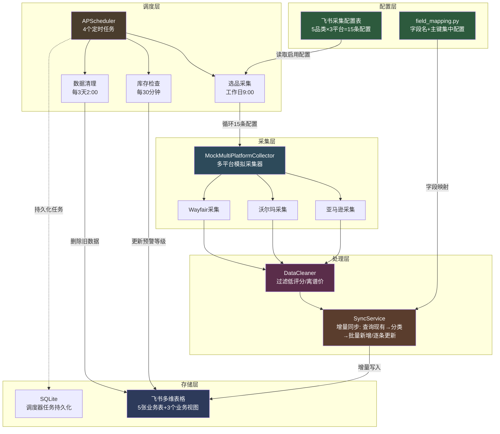
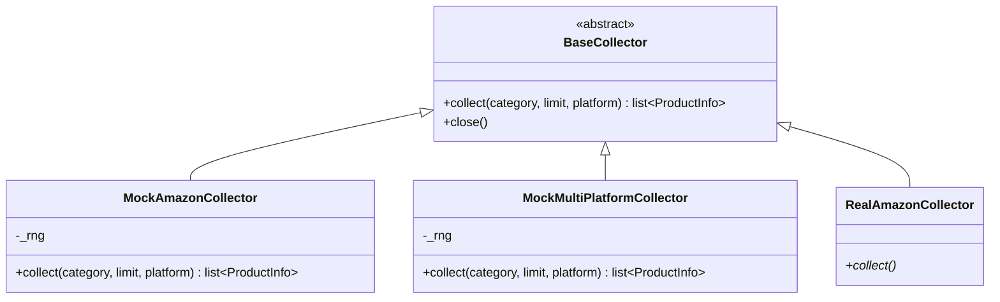
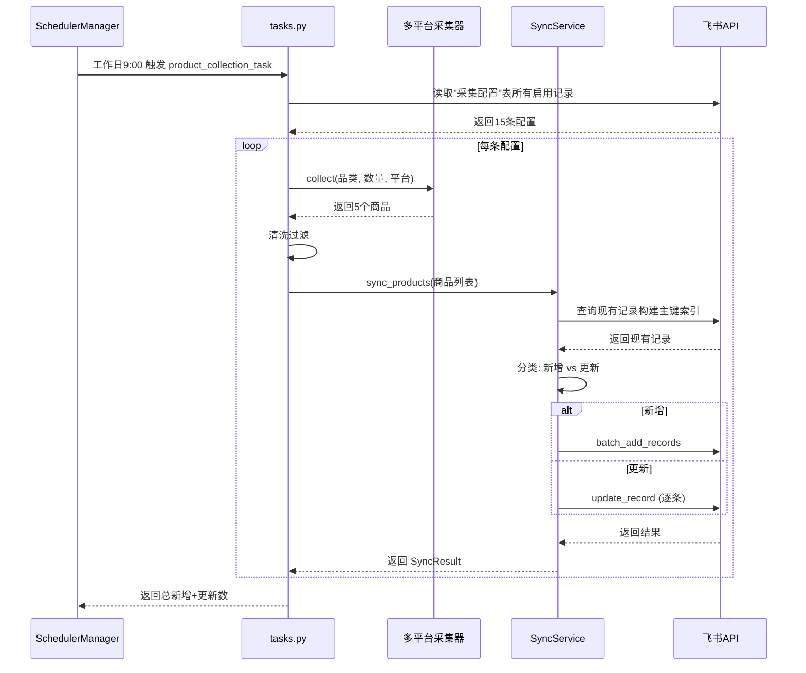
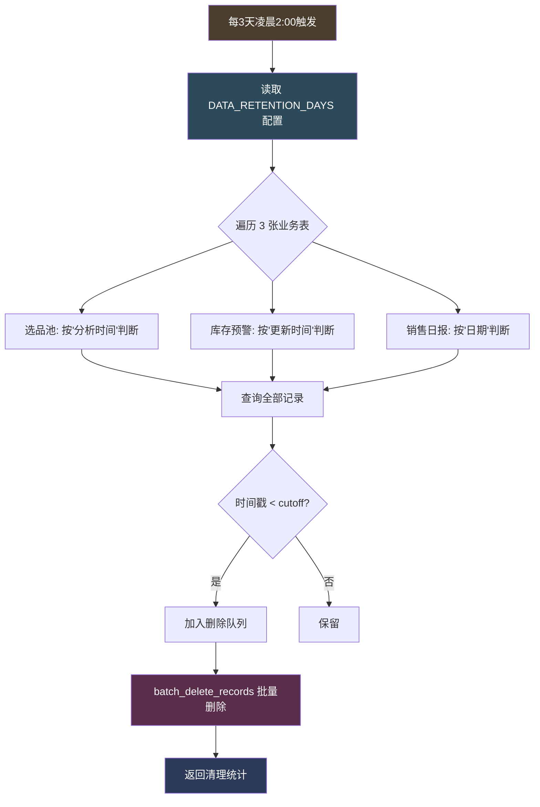
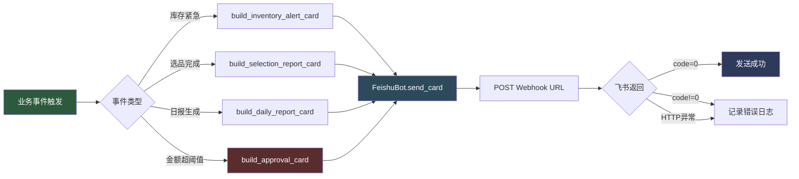
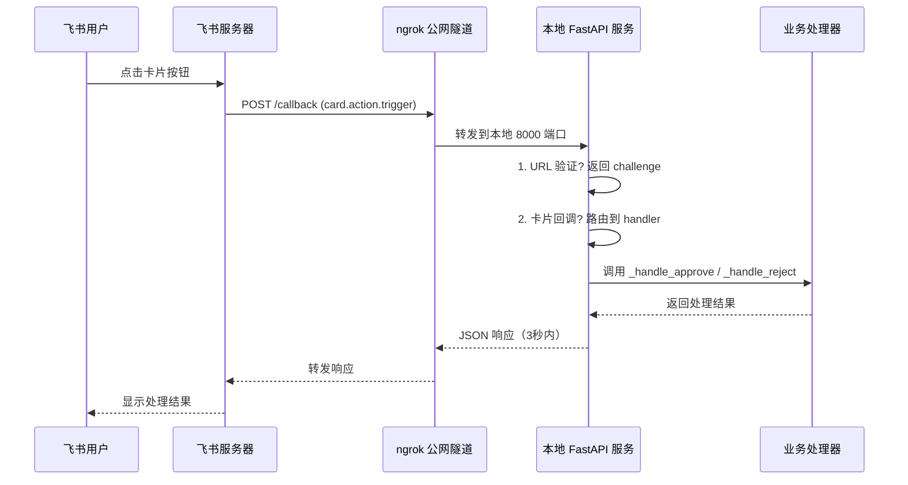
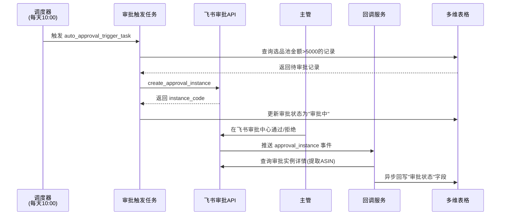
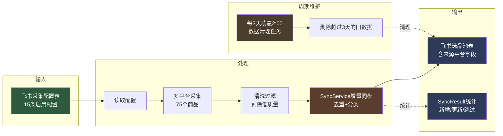

# 项目架构文档

> 跨境电商 AI 运营中台 - 多平台多品类选品采集 + 增量同步 + 自动清理系统

## 一、整体架构

## 二、核心模块说明

### 2.1 配置层（src/config.py + 飞书采集配置表）

**配置中心**：从 `.env` 读取飞书凭证、表 ID、业务参数。

**采集配置表**（飞书多维表格）：
- 字段：品类（文本）/ 平台（单选）/ 采集数量（数字）/ 优先级（数字）/ 启用状态（单选）/ 备注 / 更新时间
- 设计要点：品类字段使用文本类型而非单选，企业可自由填写经营范围（家具企业填"户外家具"，3C企业填"蓝牙耳机"），无需改代码

### 2.2 采集层（src/pipeline/collectors/）

**策略模式**：所有采集器实现 `BaseCollector` 接口，上层代码不关心数据源。

**多平台差异化设计**：

| 平台 | URL 格式 | ID 格式 | 价格系数 | 评论系数 | BSR |
|------|----------|---------|----------|----------|------|
| 亚马逊 | amazon.com/dp/{asin} | B0+8位 | 1.0 | 1.0 | 有 |
| 沃尔玛 | walmart.com/ip/{id} | 8-12位数字 | 0.85 | 0.6 | 无 |
| Wayfair | wayfair.com/.../pdp/{id} | 字母+数字 | 1.25 | 0.3 | 无 |

**品类开放设计**：
- 默认 5 个家具品类：家居收纳、厨房用品、户外家具、办公家具、卧室家具
- 未知品类自动回退到默认模板，保证企业自定义品类也能采集到合理数据

### 2.3 处理层（src/pipeline/ + src/feishu/sync_service.py）

**清洗器**（DataCleaner）：
- 过滤评分 < 3.8 的商品
- 过滤价格 < 10 美金 或 > 500 美金的商品
- 过滤 BSR 排名 > 30000 的商品

**同步服务**（SyncService）—— 增量同步核心：

**主键配置**（field_mapping.py 集中管理）：
| 表 | 主键 | 用途 |
|----|------|------|
| 选品池 | ASIN + 来源平台 | 同一商品在同一平台不重复 |
| 库存预警 | SKU | 同一 SKU 不重复 |
| 销售日报 | 日期 + 平台 | 同一天同平台只有一条日报 |

**字段映射**（field_mapping.py）：
- 集中管理所有表的字段名配置，避免硬编码散落
- 提供 `product_to_record()` 转换函数
- 提供 `extract_primary_values()` 主键提取函数（兼容多行文本/单选/数字/超链接等格式）

### 2.4 调度层（src/scheduler/）

**任务列表**：
| 任务 ID | 触发时间 | 功能 |
|---------|----------|------|
| product_collection | 工作日 9:00 | 多平台多品类增量同步采集 |
| inventory_check | 每 30 分钟 | 库存预警等级更新 |
| daily_report | 每天 18:00 | 日报生成（预留） |
| data_cleanup | 每 3 天 2:00 | 删除旧数据防止堆积 |

**数据清理任务**（cleanup_task.py）：

**清理策略**：
- 保留最近 3 天数据（可通过 `DATA_RETENTION_DAYS` 环境变量配置）
- 没有时间字段的记录保留（安全策略，不删未知数据）
- 飞书 API 单次最多删除 500 条，自动分批
- **不清理**：采集配置表（企业长期配置）/ Listing 库表（保留优化历史）

### 2.5 飞书中台（src/feishu/）

**BitableClient** 提供完整的飞书多维表格 API 封装：
- 表管理：create_table / list_tables / list_fields / add_field
- 记录管理：add_record / batch_add_records / query_records / update_record / delete_record / batch_delete_records
- 视图管理：list_views / create_view / patch_view（含字段隐藏配置）
- 错误处理：3 次重试 + 指数退避

**业务视图**（通过 scripts/init_views.py 创建）：

| 视图名 | 所属表 | 显示字段 |
|--------|--------|----------|
| 销售总览 | 销售日报 | 日期/平台/销售额/订单数/ACoS/异常标记/AI洞察 |
| 预警看板 | 库存预警 | ASIN/商品名称/SKU/平台/可售天数/预警等级/建议采购量/预估采购金额/审批状态 |
| 选品决策 | 选品池 | 商品名称/ASIN/品类/来源平台/价格区间/评分/评论数/市场容量/竞争强度/利润空间/推荐指数/状态 |

**表结构**（5 张表）：
1. **选品池**：商品名/ASIN/品类/来源平台/价格/评分/评论数/BSR/市场容量/竞争强度/利润空间
2. **Listing 库**：商品 Listing 优化记录
3. **销售日报**：每日销售数据 + AI 洞察
4. **库存预警**：库存监控与自动审批
5. **采集配置**：企业经营品类与采集平台配置

**Webhook 机器人**（feishu_bot.py）：

**FeishuBot 类**提供三种消息发送方法：
- `send_text(text)`：纯文本消息，最简通知
- `send_rich_text(title, content)`：富文本消息，支持加粗/链接
- `send_card(card)`：交互卡片，支持按钮和分栏

**卡片模板库**（card_templates.py）—— 4 类业务卡片：

| 卡片模板 | 用途 | 标题颜色 | 按钮行为 |
|----------|------|----------|----------|
| `build_inventory_alert_card()` | 库存预警通知 | red/orange/yellow/green | url 跳转多维表格 |
| `build_selection_report_card()` | 选品采集日报 | blue | url 跳转选品池表 |
| `build_daily_report_card()` | 销售日报 | green/orange | url 跳转销售日报表 |
| `build_approval_card()` | 审批通知 | orange | value 触发回调（通过/拒绝） |

**链接跳转优化**（build_table_url）：
- 使用企业租户域名（如 `ocndodd7lmyr.feishu.cn`）生成链接
- 飞书桌面端拦截本企业租户域名，直接在飞书内打开多维表格
- 避免跳转浏览器需重新登录的体验问题

**告警触发策略**：
- 仅"紧急"和"预警"等级触发机器人告警（避免告警疲劳）
- 等级未变化时不重复告警
- 机器人未配置时静默跳过，不影响表格更新

**卡片按钮回调服务**（card_callback.py，08-05 新增）：

**FastAPI 回调服务架构**：
- 端点：`POST /callback`（接收飞书回调）
- 端点：`GET /health`（健康检查，用于监控）
- 端点：`GET /`（服务说明）
- 支持 URL 验证（飞书首次配置回调 URL 时发送 challenge）
- 支持 `card.action.trigger` 事件（卡片按钮点击）
- 支持 `approval_instance` 事件（飞书审批流状态变更，08-06 新增）
- **兼容两种回调格式**：老格式（schema 1.0，顶层 `type` 字段）和新格式（schema 2.0，`header.event_type` 字段）
- 内置 2 个 action 处理器：`approve`（审批通过）/ `reject`（审批拒绝）
- 内置审批状态变更处理器（08-06 新增）：异步回写多维表格"审批状态"字段，失败时通过应用机器人发告警消息到飞书群

**飞书审批流自动化**（approval.py + approval_task.py，08-06 新增）：

**审批流模块**：
- `src/feishu/approval.py` — 飞书审批流 API 客户端（创建/查询审批实例）
- `src/scheduler/approval_task.py` — 自动触发任务（扫描选品池，金额>阈值自动创建审批）
- `scripts/query_approval_definition.py` — 查询审批定义表单结构工具

**部署要求**：
- 飞书服务器需要公网可访问的 HTTPS 地址
- 本地开发用 ngrok 内网穿透（`scripts/start_ngrok.py`）
- 生产环境部署到云服务器（第4周 Docker 化）

## 三、数据流

## 四、扩展性设计

### 4.1 添加新品类
- **不用改代码**：在飞书"采集配置"表中添加一行，填品类名+平台+数量
- 采集器自动用默认模板生成合理数据

### 4.2 添加新平台
- 在 `multi_platform_mock.py` 的 `_PLATFORM_DB` 中添加平台配置（URL模板/品牌池/价格系数）
- 在 `table_schema.py` 的"来源平台"和"平台"字段选项中添加新平台名

### 4.3 替换为真实采集器
- 实现 `BaseCollector.collect()` 接口
- 在 `tasks.py` 中替换 `MockMultiPlatformCollector` 为真实采集器
- 其他代码无需改动

## 五、测试覆盖

| 测试文件 | 覆盖范围 |
|----------|----------|
| test_collectors.py | ProductInfo / MockAmazonCollector / MockMultiPlatformCollector |
| test_cleaners.py | DataCleaner 过滤逻辑 |
| test_scheduler.py | InventoryAlert / SchedulerManager（5个任务注册） |
| test_feishu_auth.py | 飞书认证 |
| test_feishu_bitable.py | BitableClient |
| test_sync_service.py | SyncResult / 字段映射 / SyncService增量同步 / 数据清理任务 |
| test_feishu_bot.py | Webhook 机器人消息发送 / 库存预警卡片模板 |
| test_card_callback.py | 选品报告卡片 / 销售日报卡片 / 审批卡片 / FastAPI 回调服务 |
| test_approval.py | ApprovalClient / 表单构建 / 审批状态变更回调 / ASIN 提取 / 自动触发任务 |

**当前测试结果**：161 个测试全部通过，覆盖率 63%。

**test_approval.py 覆盖场景**（29 个测试，08-06 新增）：
- ApprovalClient 配置：全配置通过 / 缺 approval_code / 缺 approver_open_id / 缺 node_id
- 表单构建：5 个字段完整 / 字段 ID 正确 / 字段值正确 / 中文不转义
- 创建审批实例：成功返回 instance_code / 未配置返回空 / API 错误返回空
- 查询审批状态：成功返回详情 / 空 instance_code 返回空 / 中文状态文本 / 查询失败返回未知
- 状态码映射：包含所有状态码 / 值都是中文
- 审批状态变更回调：合法事件返回成功 / 缺字段返回失败 / 兼容新格式 schema 2.0
- ASIN 提取：成功提取 / 无 ASIN 字段返回空 / 查询失败返回空
- 自动触发任务：未配置返回 0 / 金额提取（数字/字符串/列表/空值/无效值）
