# 项目架构文档

> 跨境电商 AI 运营中台 - 多平台多品类选品采集 + 增量同步 + 自动清理系统

## 一、整体架构

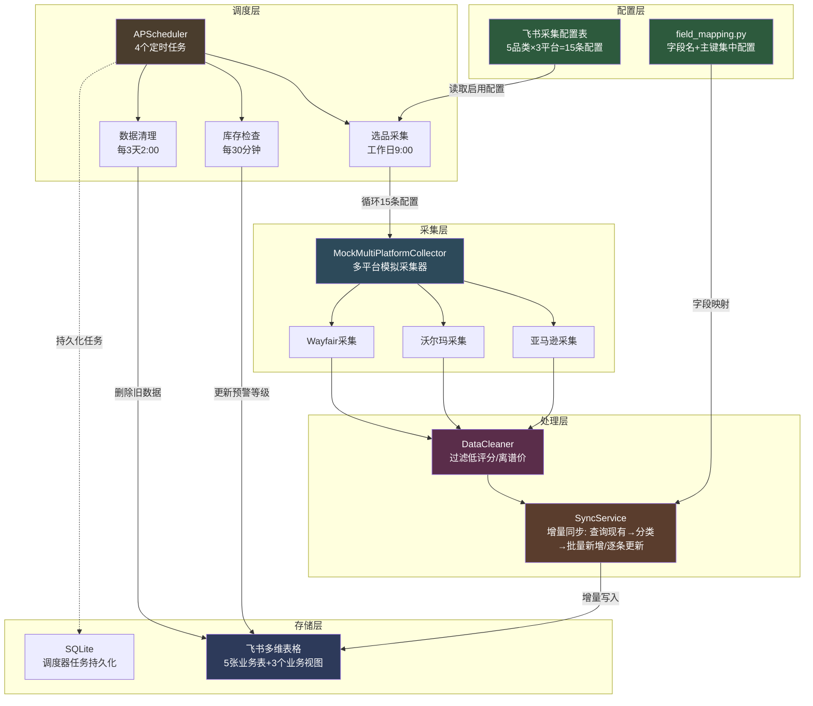

## 二、核心模块说明

### 2.1 配置层（src/config.py + 飞书采集配置表）

**配置中心**：从 `.env` 读取飞书凭证、表 ID、业务参数。

**采集配置表**（飞书多维表格）：
- 字段：品类（文本）/ 平台（单选）/ 采集数量（数字）/ 优先级（数字）/ 启用状态（单选）/ 备注 / 更新时间
- 设计要点：品类字段使用文本类型而非单选，企业可自由填写经营范围（家具企业填"户外家具"，3C企业填"蓝牙耳机"），无需改代码

### 2.2 采集层（src/pipeline/collectors/）

**策略模式**：所有采集器实现 `BaseCollector` 接口，上层代码不关心数据源。

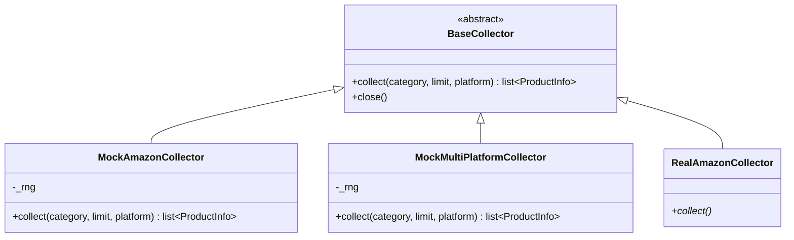

**多平台差异化设计**：

| 平台 | URL 格式 | ID 格式 | 价格系数 | 评论系数 | BSR |
|------|----------|---------|----------|----------|------|
| 亚马逊 | amazon.com/dp/{asin} | B0+8位 | 1.0 | 1.0 | 有 |
| 沃尔玛 | walmart.com/ip/{id} | 8-12位数字 | 0.85 | 0.6 | 无 |
| Wayfair | wayfair.com/.../pdp/{id} | 字母+数字 | 1.25 | 0.3 | 无 |

**品类开放设计**：
- 默认 5 个家具品类：家居收纳、厨房用品、户外家具、办公家具、卧室家具
- 未知品类自动回退到默认模板，保证企业自定义品类也能采集到合理数据

### 2.3 处理层（src/pipeline/ + src/feishu/sync_service.py）

**清洗器**（DataCleaner）：
- 过滤评分 < 3.8 的商品
- 过滤价格 < 10 美金 或 > 500 美金的商品
- 过滤 BSR 排名 > 30000 的商品

**同步服务**（SyncService）—— 增量同步核心：


**主键配置**（field_mapping.py 集中管理）：
| 表 | 主键 | 用途 |
|----|------|------|
| 选品池 | ASIN + 来源平台 | 同一商品在同一平台不重复 |
| 库存预警 | SKU | 同一 SKU 不重复 |
| 销售日报 | 日期 + 平台 | 同一天同平台只有一条日报 |

**字段映射**（field_mapping.py）：
- 集中管理所有表的字段名配置，避免硬编码散落
- 提供 `product_to_record()` 转换函数
- 提供 `extract_primary_values()` 主键提取函数（兼容多行文本/单选/数字/超链接等格式）

### 2.4 调度层（src/scheduler/）

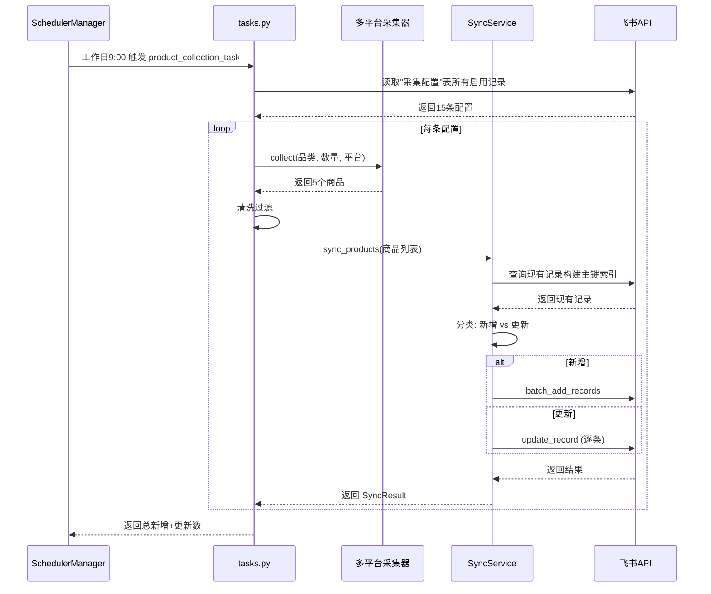

**任务列表**：
| 任务 ID | 触发时间 | 功能 |
|---------|----------|------|
| product_collection | 工作日 9:00 | 多平台多品类增量同步采集 |
| inventory_check | 每 30 分钟 | 库存预警等级更新 |
| daily_report | 每天 18:00 | 数据洞察 Agent 执行（拉数据→LLM 三维度分析→写回表格+推送卡片，v0.6.0） |
| data_cleanup | 每 3 天 2:00 | 删除旧数据防止堆积 |
| 双 Agent 联动 | GUI 手动触发 | 选品→Listing、洞察→选品复盘（v0.7.0，详见 2.9 节） |

**数据清理任务**（cleanup_task.py）：

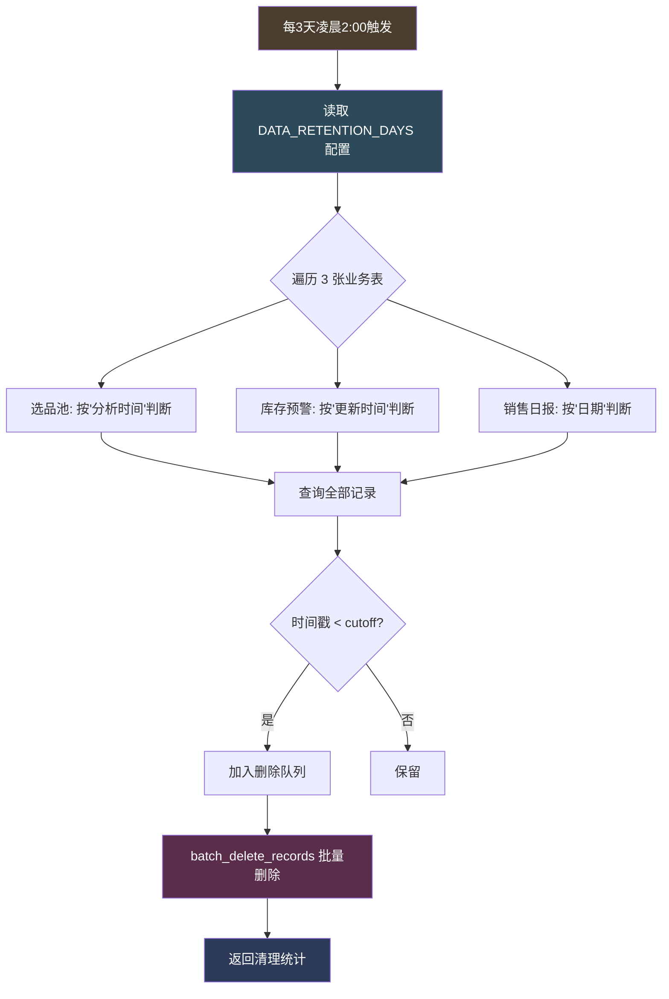

**清理策略**：
- 保留最近 3 天数据（可通过 `DATA_RETENTION_DAYS` 环境变量配置）
- 没有时间字段的记录保留（安全策略，不删未知数据）
- 飞书 API 单次最多删除 500 条，自动分批
- **不清理**：采集配置表（企业长期配置）/ Listing 库表（保留优化历史）

### 2.5 飞书中台（src/feishu/）

**BitableClient** 提供完整的飞书多维表格 API 封装：
- 表管理：create_table / list_tables / list_fields / add_field
- 记录管理：add_record / batch_add_records / query_records / update_record / delete_record / batch_delete_records
- 视图管理：list_views / create_view / patch_view（含字段隐藏配置）
- 错误处理：3 次重试 + 指数退避

**业务视图**（通过 scripts/init_views.py 创建）：

| 视图名 | 所属表 | 显示字段 |
|--------|--------|----------|
| 销售总览 | 销售日报 | 日期/平台/销售额/订单数/ACoS/异常标记/AI洞察 |
| 预警看板 | 库存预警 | ASIN/商品名称/SKU/平台/可售天数/预警等级/建议采购量/预估采购金额/审批状态 |
| 选品决策 | 选品池 | 商品名称/ASIN/品类/来源平台/价格区间/评分/评论数/市场容量/竞争强度/利润空间/推荐指数/状态 |

**表结构**（5 张表）：
1. **选品池**：商品名/ASIN/品类/来源平台/价格/评分/评论数/BSR/市场容量/竞争强度/利润空间
2. **Listing 库**：商品 Listing 优化记录
3. **销售日报**：每日销售数据 + AI 洞察
4. **库存预警**：库存监控与自动审批
5. **采集配置**：企业经营品类与采集平台配置

**Webhook 机器人**（feishu_bot.py）：

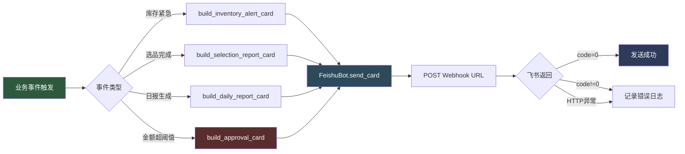

**FeishuBot 类**提供三种消息发送方法：
- `send_text(text)`：纯文本消息，最简通知
- `send_rich_text(title, content)`：富文本消息，支持加粗/链接
- `send_card(card)`：交互卡片，支持按钮和分栏

**卡片模板库**（card_templates.py）—— 4 类业务卡片：

| 卡片模板 | 用途 | 标题颜色 | 按钮行为 |
|----------|------|----------|----------|
| `build_inventory_alert_card()` | 库存预警通知 | red/orange/yellow/green | url 跳转多维表格 |
| `build_selection_report_card()` | 选品采集日报 | blue | url 跳转选品池表 |
| `build_daily_report_card()` | 销售日报 | green/orange | url 跳转销售日报表 |
| `build_approval_card()` | 审批通知 | orange | value 触发回调（通过/拒绝） |

**链接跳转优化**（build_table_url）：
- 使用企业租户域名（如 `ocndodd7lmyr.feishu.cn`）生成链接
- 飞书桌面端拦截本企业租户域名，直接在飞书内打开多维表格
- 避免跳转浏览器需重新登录的体验问题

**告警触发策略**：
- 仅"紧急"和"预警"等级触发机器人告警（避免告警疲劳）
- 等级未变化时不重复告警
- 机器人未配置时静默跳过，不影响表格更新

**卡片按钮回调服务**（card_callback.py，08-05 新增）：

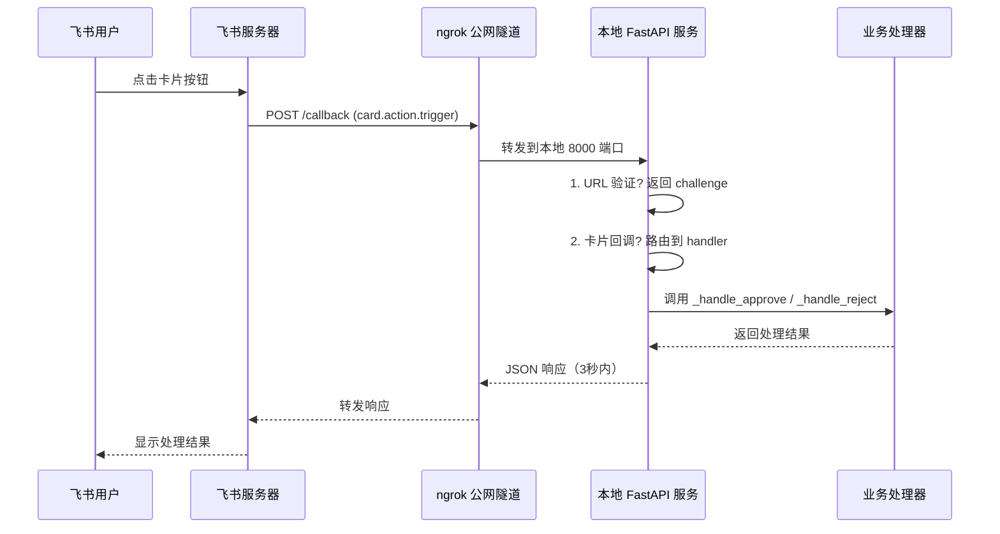

**FastAPI 回调服务架构**：
- 端点：`POST /callback`（接收飞书回调）
- 端点：`GET /health`（健康检查，用于监控）
- 端点：`GET /`（服务说明）
- 支持 URL 验证（飞书首次配置回调 URL 时发送 challenge）
- 支持 `card.action.trigger` 事件（卡片按钮点击）
- 支持 `approval_instance` 事件（飞书审批流状态变更，08-06 新增）
- **兼容两种回调格式**：老格式（schema 1.0，顶层 `type` 字段）和新格式（schema 2.0，`header.event_type` 字段）
- 内置 2 个 action 处理器：`approve`（审批通过）/ `reject`（审批拒绝）
- 内置审批状态变更处理器（08-06 新增）：异步回写多维表格"审批状态"字段，失败时通过应用机器人发告警消息到飞书群

**多审批流规则引擎**（approval_rules_service.py + approval_task.py）：

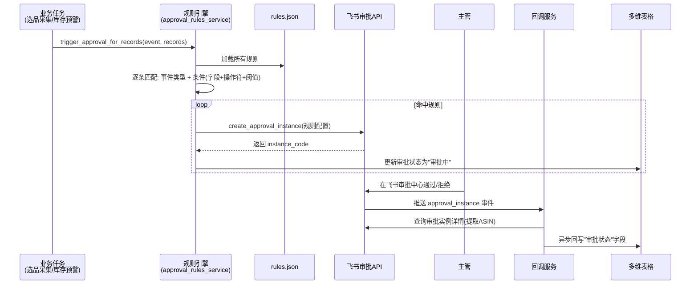

**触发方式**：
- **事件驱动**（主）：业务任务跑完后立即调用规则引擎，对本次记录匹配规则
- **每小时兜底**（辅）：补触发事件驱动遗漏的记录（手动新增的、规则新增后的历史记录）

**规则存储**：JSON 文件 `data/approval_rules.json`，每个规则独立配置：
- 审批定义（approval_code + 字段 ID + 节点 ID + 审批人）
- 触发事件（选品采集完成 / 库存预警触发）
- 触发条件（字段 + 操作符 + 阈值，如 `利润空间 > 5000`）

**审批流模块**：
- `src/feishu/approval.py` — 飞书审批流 API 客户端（支持动态传入 approval_code/node_id/字段ID）
- `src/scheduler/approval_task.py` — 事件驱动触发入口 + 每小时兜底扫描
- `src/gui/services/approval_rules_service.py` — 多审批流规则引擎（CRUD + 条件匹配 + 事件触发）
- `scripts/query_approval_definition.py` — 查询审批定义表单结构工具

**部署要求**：
- 飞书服务器需要公网可访问的 HTTPS 地址
- 本地开发用 ngrok 内网穿透（`scripts/start_ngrok.py`）
- 生产环境部署到云服务器（第4周 Docker 化）

### 2.6 桌面 GUI 层（src/gui/）

**PySide6 桌面应用**，业务用户无需接触代码即可完成所有操作。采用现代简约白底风格：卡片化布局、圆角阴影、蓝色主题、清晰视觉层次。

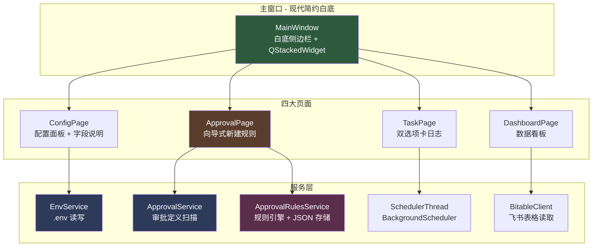

**GUI 模块结构**：
- `src/gui/main.py` — GUI 入口（QApplication + 全局样式：现代简约白底）
- `src/gui/main_window.py` — 主窗口（白底侧边栏 + 7 页面切换）
- `src/gui/pages/setup_wizard_page.py` — 部署向导（7 步引导业务用户完成部署，v0.4.0 新增）
- `src/gui/pages/config_page.py` — 配置面板（每字段带说明和获取指引 → .env）
- `src/gui/pages/approval_page.py` — 审批流管理（向导式新建规则 + 规则列表 CRUD + 扫描原理说明）
- `src/gui/pages/task_page.py` — 任务控制（双选项卡日志 + BackgroundScheduler + 回调服务 + 公网隧道 + HTML 指引卡片）
- `src/gui/pages/dashboard_page.py` — 数据看板（选品池 + 库存预警表格）
- `src/gui/pages/health_check_page.py` — 健康检查页（6 项配置就绪检测，v0.4.0 新增）
- `src/gui/pages/manual_page.py` — 操作手册页（内置业务用户操作手册，v0.4.0 新增）
- `src/gui/services/env_service.py` — .env 配置读写服务
- `src/gui/services/approval_service.py` — 审批定义扫描/查询服务
- `src/gui/services/approval_rules_service.py` — 多审批流规则引擎（JSON 存储 + 事件触发）
- `src/gui/services/callback_server_thread.py` — 飞书回调服务线程封装（FastAPI + uvicorn，v0.4.0 新增）
- `src/gui/services/cloudflare_tunnel_thread.py` — Cloudflare 公网隧道线程封装（自动下载 cloudflared，v0.4.0 新增）
- `src/gui/services/cloudflared_downloader.py` — cloudflared 二进制下载器（v0.4.0 新增）
- `src/gui/services/health_check_service.py` — 健康检查服务（6 项检测，v0.4.0 新增）
- `src/gui/services/init_data_service.py` — 一键初始化数据服务（建表 + 采集配置 + 视图 + 权限，v0.4.0 新增）
- `src/gui/services/approver_search_service.py` — 审批人搜索服务（按姓名查 open_id，v0.4.0 新增）
- `src/gui/services/chat_search_service.py` — 群聊搜索服务（按名称查 chat_id，v0.4.0 新增）
- `src/gui/widgets/approver_search_dialog.py` — 审批人搜索对话框组件（v0.4.0 新增）
- `src/gui/widgets/chat_search_dialog.py` — 群聊搜索对话框组件（v0.4.0 新增）

**审批流规则向导式创建**：

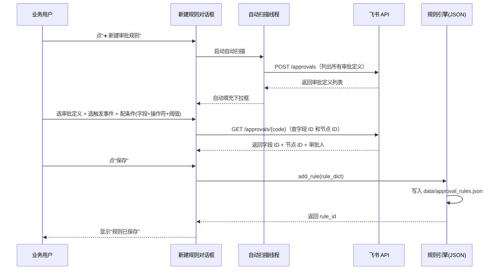

**双选项卡日志系统**：

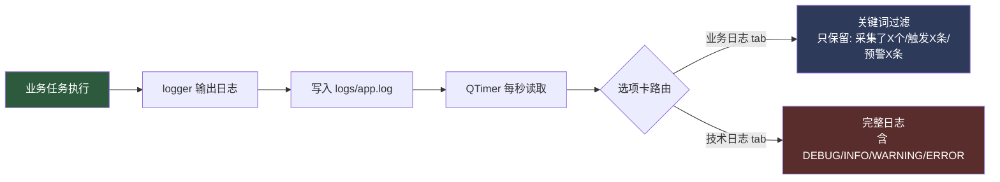

**多线程设计**：
- 所有飞书 API 调用都在 QThread 后台执行，避免阻塞 UI
- 调度器用 `BackgroundScheduler`（start() 立即返回）封装在 `SchedulerThread` 中，GUI 主线程保持响应
- 日志刷新用 QTimer 每秒读取日志文件
- 业务日志通过关键词过滤技术噪音，仅保留"采集了X个商品""触发X条审批"等大白话消息

### 2.7 AI 调度层 + 选品 Agent（src/ai/，v0.5.0 新增）

**AI 调度层**为 Agent 提供模型路由、Prompt 管理和工具注册三大基础能力，业务代码只关心"做什么任务"，不关心"用哪个模型"。

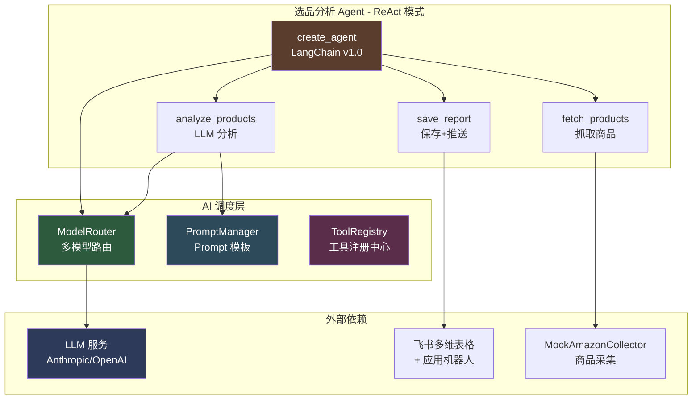

**ModelRouter 多模型路由**（`src/ai/model_router.py`）：
- 按任务复杂度自动选择模型：simple（便宜）/ standard（中等）/ complex（强模型）
- 优先 Anthropic（Claude），凭证缺失时回退 OpenAI
- 创建 LLM 时自动挂载 `llm_monitor` 回调（可观测性）

| 任务类型 | Anthropic 模型 | OpenAI 模型 | 适用场景 |
|----------|----------------|-------------|----------|
| simple | claude-haiku-4-5 | gpt-4o-mini | 分类、提取、摘要 |
| standard | claude-sonnet-4-6 | gpt-4o | 分析、生成、翻译 |
| complex | claude-opus-4-8 | gpt-4o | 多步推理、Agent 决策 |

**PromptManager 模板管理**（`src/ai/prompt_manager.py`）：
- 集中管理选品 Agent 的 3 个 Prompt：selection_system / selection_analysis / selection_report
- 基于 LangChain ChatPromptTemplate，支持变量渲染
- 模板硬编码在模块中（v0.6.0 计划支持从文件加载）

**MemoryStore 说明**：
- 原计划单独建 `memory_store.py` 模块管理 Agent 上下文记忆
- 实际采用 LangGraph 内置的 `messages` 状态管理（create_agent 自动维护消息历史）
- 功能等价：Agent 每轮工具调用的输入输出都自动保存在 graph state 的 messages 列表中
- 因此不单独建 MemoryStore 模块，避免过度设计

**Agent 工具调用限制**（v0.5.2 新增）：
- `recursion_limit=10`：LangGraph 图执行总步数上限
- 每轮工具调用约 2 步（agent 节点 + tools 节点），10 步 = 最多 5 轮工具调用
- 防止 Agent 死循环或无限调用工具消耗 token

**选品 Agent 工作流**（`src/ai/agents/selection_agent.py`）：

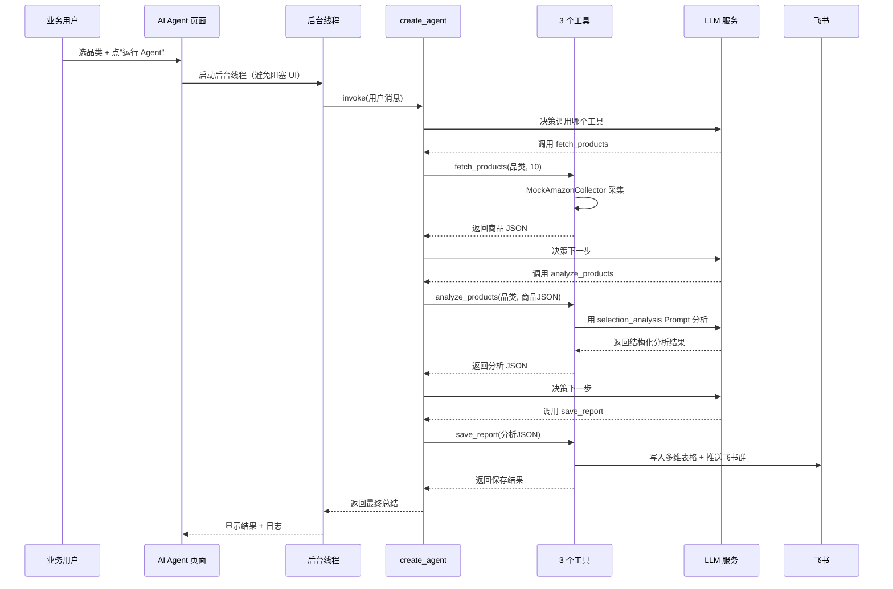

**GUI 入口**（`src/gui/pages/ai_agent_page.py`）：
- 品类下拉框（5 个默认品类，可自定义）+ 运行按钮
- 后台线程执行 Agent（避免 30-60 秒的 LLM 调用阻塞 UI）
- 实时日志显示（黑色背景，终端风格）
- 结果表格（自动解析 Agent 输出中的 top_picks）
- API Key 状态提示（未配置时橙色警告）

### 2.8 数据洞察 Agent（src/ai/agents/insight_*.py，v0.6.0 新增）

**数据洞察 Agent** 复用选品 Agent 的 ReAct 架构，每日 18:00 自动分析销售和库存数据，生成结构化日报推送到飞书群。业务用户也可在 GUI 手动重跑或补跑指定日期。

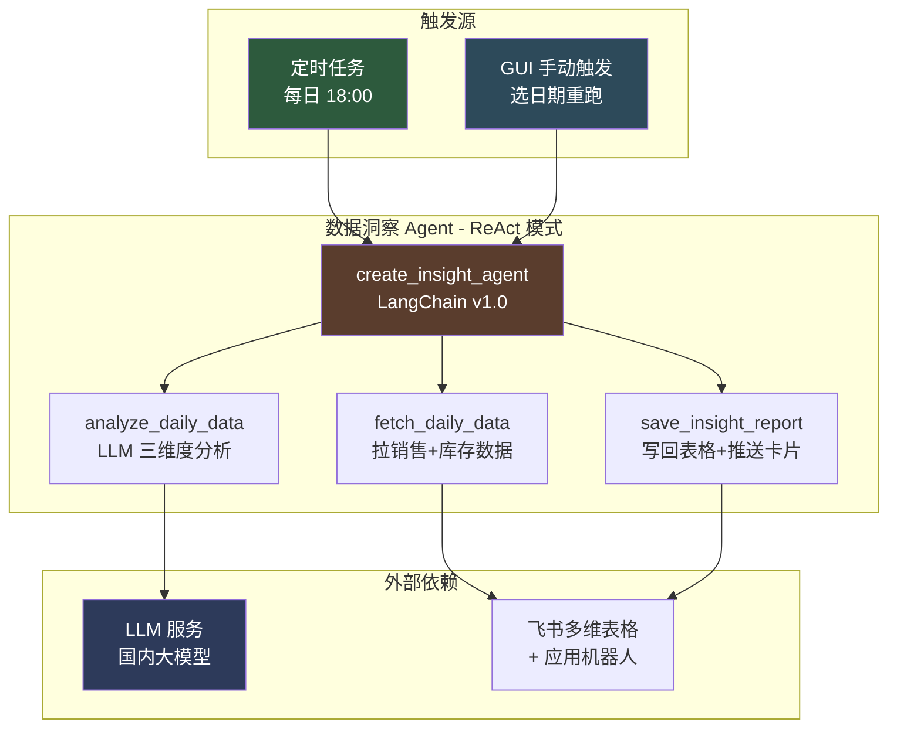

**三个工具**（`src/ai/agents/insight_tools.py`）：

| 工具 | 功能 | 输入 | 输出 |
|------|------|------|------|
| `fetch_daily_data` | 查询飞书销售日报表 + 库存预警表 | target_date（YYYY-MM-DD，留空=昨天） | JSON（含 sales_records + inventory_records） |
| `analyze_daily_data` | LLM 三维度分析（销量/广告/库存） | data_json（fetch_daily_data 返回值） | JSON（含 sales_insight + ad_insight + inventory_insight） |
| `save_insight_report` | 写回 AI 洞察字段 + 推送日报卡片 | analysis_json（analyze_daily_data 返回值） | JSON（含 updated_records + pushed_to_feishu） |

**LLM 三维度分析输出结构**：

```json
{
  "date": "2026-07-27",
  "sales_insight": {
    "summary": "销量较昨日上升 15%",
    "trend": "上升",
    "anomaly": ""
  },
  "ad_insight": {
    "acos_eval": "ACoS 18%，处于正常区间",
    "efficiency": "正常"
  },
  "inventory_insight": {
    "health": "关注",
    "suggestion": "SKU-A 可售天数不足 14 天，建议补货",
    "risk_items": ["SKU-A"]
  },
  "top_priority": "立即补货 SKU-A",
  "action_items": ["补货 SKU-A", "降低 ACoS", "优化广告投放"]
}
```

**PromptManager 数据洞察模板**（`src/ai/prompt_manager.py`）：
- 集中管理数据洞察 Agent 的 3 个 Prompt：insight_system / insight_analysis / insight_report
- insight_analysis 是核心模板，指导 LLM 从三维度生成结构化 JSON
- 与选品 Agent 共用 PromptManager 单例，避免重复初始化

**定时任务接入**（`src/scheduler/tasks.py`）：
- `daily_report_task` 函数调用 `run_insight_agent()`，每日 18:00 自动触发
- 失败时记录错误日志，不阻塞调度器
- 业务用户可在 GUI 数据洞察 Tab 手动重跑

**GUI 双 Tab 设计**（`src/gui/pages/ai_agent_page.py`）：
- Tab1「选品分析」：原有功能，输入品类一键运行
- Tab2「数据洞察」：选日期 + 立即运行（绿色主题区分）
- 共用 API Key 状态提示（顶部右侧）
- 数据洞察 Tab 默认日期为昨天，支持"📋 设为昨天"快速重置

**日报卡片模板**（`src/feishu/card_templates.py::build_ai_insight_card`）：
- 三维度概览：销量趋势/广告效率/库存健康（按状态配色 green/blue/orange/red）
- 异常预警区：销量异常 + 断货风险 SKU（前 3 条）
- 今日最紧急：单条最紧急事项
- 行动建议：按优先级排序的前 3 条建议
- 跳转按钮：点击跳转飞书销售日报表

#### 2.8.1 硬规则异常检测（v0.6.1 新增）

**设计动机**：LLM 可能漏判或夸大异常，硬规则提供可靠的兜底。检测结果同时供 LLM 分析（作为补充上下文）和预警卡片使用，做到「LLM 失败时也能告警」。

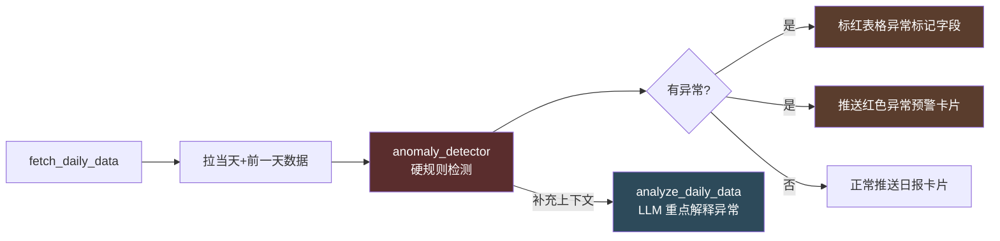

**异常检测模块**（`src/ai/agents/anomaly_detector.py`）：

| 检测维度 | 阈值 | 严重程度 | 触发动作 |
|----------|------|----------|----------|
| 销量跌幅 | 环比 > 30% | warning（30-50%）/ critical（≥50%） | 标红 + 推送红色卡片 |
| ACoS 过高 | > 50% | warning | 标红 + 推送红色卡片 |
| 库存紧急 | 可售天数 ≤ 7 | critical | 推送红色卡片 |

**异常预警卡片**（`src/feishu/card_templates.py::build_anomaly_alert_card`）：
- 红色模板（与日报卡片蓝色区分，强调严重性）
- critical 排在 warning 之前（按严重程度排序）
- 统计字段：严重异常数 + 警告异常数 + 总计
- 建议动作：3 条标准化处置建议
- 红色危险按钮：点击跳转飞书表格查看详情

**联调脚本**（`scripts/insight_agent_smoke_test.py`）：
- 生成 7 天模拟数据（21 条记录，含 2 条埋点异常）
- 验证异常检测、LLM 分析结构、卡片生成、表格洞察文本全流程
- 不消耗 API 额度（用 Mock LLM），可在 CI 中运行

**A/B 对比脚本**（`scripts/ab_compare_insight.py`）：
- 同一份数据分别调用 GPT-4o-mini 和 Claude，5 维度评分对比
- 评分维度：结构完整性 / 异常识别 / 建议可操作性 / 表达清晰度 / 业务价值
- 支持 Mock 模式（默认）和真实 API 模式（`--real` 参数）
- 生成 `docs/ab_compare_report.md` 对比报告

### 2.9 Agent 编排引擎（src/ai/orchestrator.py，v0.7.0 新增）

**Agent 编排引擎**基于纯 Python 实现的状态机管理双 Agent 联动工作流，把"选品 Agent"和"Listing 优化 Agent"串联起来，前一个的输出直接喂给后一个。业务用户在 GUI 点一个按钮即可跑通完整链路，无需手动切换。

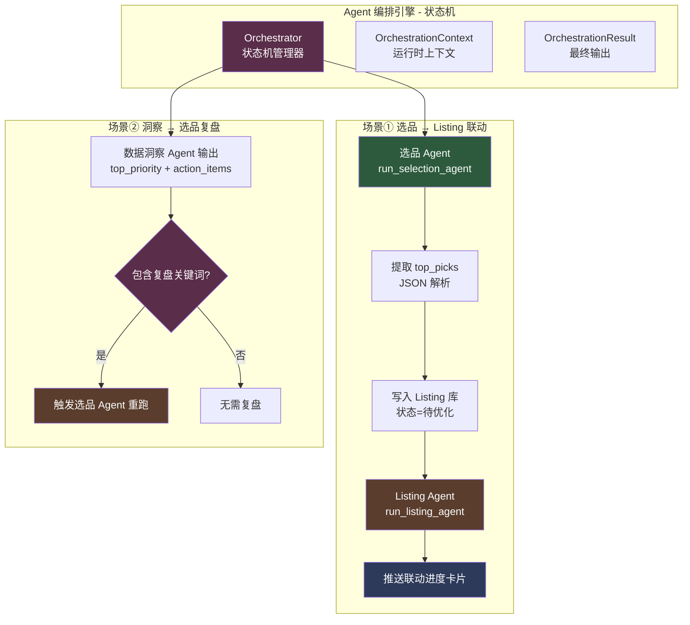

**状态机定义**（`OrchestratorState`）：

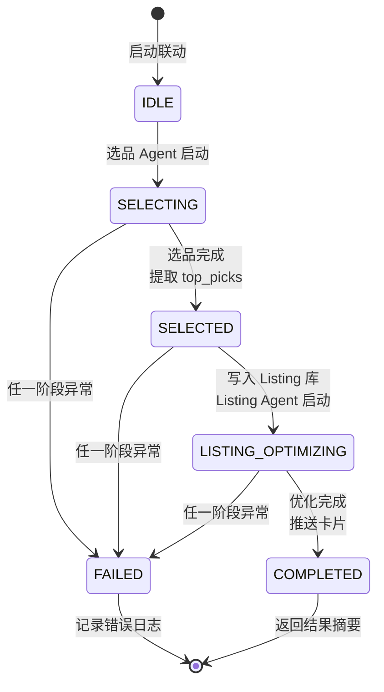

| 状态 | 含义 | 触发动作 |
|------|------|----------|
| IDLE | 空闲，等待启动 | 业务用户点按钮 |
| SELECTING | 选品 Agent 执行中 | 调用 `run_selection_agent` |
| SELECTED | 选品完成，准备触发 Listing | 提取 top_picks + 写入 Listing 库 |
| LISTING_OPTIMIZING | Listing Agent 执行中 | 调用 `run_listing_agent` |
| COMPLETED | 全部完成 | 推送联动进度卡片 |
| FAILED | 失败 | 记录错误，状态转为 FAILED |

**为什么不用 LangGraph StateGraph**：
- 联动流程状态明确、分支少，纯 Python 状态机更直观可控
- 便于测试（直接 mock `selection_runner` / `listing_runner` 函数）
- 不引入额外依赖，降低复杂度

**依赖注入设计**：
- `Orchestrator.__init__` 接受 `selection_runner` 和 `listing_runner` 可调用对象
- 默认绑定真实的 `run_selection_agent` / `run_listing_agent`
- 测试时注入 Mock 函数，避免真实 LLM 调用

**场景①：选品 → Listing 联动**

`run_selection_to_listing(category)` 完整流程：

1. 启动选品 Agent（state=SELECTING），输入品类名
2. 从 `agent_output` 文本中提取 `top_picks` JSON（支持 ` ```json ` 块和裸 JSON 两种格式）
3. 把 top_picks 转换为 Listing 库记录（`picks_to_listing_records`），按 ASIN 主键增量同步
4. 启动 Listing Agent（state=LISTING_OPTIMIZING），传入 `limit=created_count`
5. Listing Agent 自动拉取"待优化"记录 → LLM/Mock 生成优化文案 → 写回表格 + 推送卡片
6. 完成（state=COMPLETED），返回 `OrchestrationResult` 包含完整上下文

**场景②：洞察 → 选品复盘**

`run_insight_to_selection_review(top_priority, action_items)` 判断逻辑：

- 检查 `top_priority` 和 `action_items` 是否包含复盘触发关键词
- 关键词列表（`_REVIEW_TRIGGER_KEYWORDS`）：`复盘` / `选品` / `爆款` / `上升` / `增长`
- 命中关键词 → 触发选品 Agent 重跑对应品类（默认"家居收纳"）
- 未命中 → 返回"无需复盘"，状态直接转 COMPLETED

**Listing 优化 Agent**（`src/ai/agents/listing_agent.py` + `listing_tools.py`）：

| 工具 | 功能 | 输入 | 输出 |
|------|------|------|------|
| `fetch_pending_listings` | 查询 Listing 库"待优化"状态记录 | limit（默认 5） | JSON（含 record_id + ASIN + 名称 + 原始标题） |
| `optimize_listing` | LLM 生成优化文案（标题/五点描述/关键词/建议/CTR 预估） | listings_json | JSON（含每条记录的优化结果 + mode=llm/mock） |
| `save_listing` | 按 ASIN 主键更新 Listing 库 + 推送联动进度卡片 | optimizations_json | JSON（含 updated_records + pushed_to_feishu） |

**Mock LLM 兜底机制**（`listing_tools.py::_is_llm_configured`）：

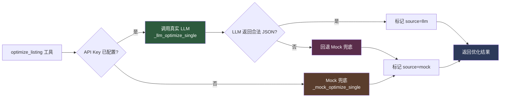

- 业务用户未配置 API Key 时联动流程仍可跑通（Mock 模板化优化）
- 接入 API Key 后**无需改代码**，`_is_llm_configured()` 自动返回 True，切换到真实 LLM
- LLM 调用失败或返回非法 JSON 时自动回退 Mock，保证流程不中断

**联动进度卡片**（`src/feishu/card_templates.py::build_orchestration_card`）：

| 阶段 | 颜色 | 用途 |
|------|------|------|
| `selection_started` | blue | 选品 Agent 启动通知 |
| `selection_done` | green | 选品完成通知 |
| `listing_started` | blue | Listing Agent 启动通知 |
| `listing_completed` | green | Listing 优化完成通知（含优化样本和统计） |
| `review_triggered` | orange | 洞察触发复盘通知 |
| `no_review_needed` | grey | 洞察未触发复盘通知 |
| `failed` | red | 联动失败告警 |

**Listing 库字段映射和同步**（`src/feishu/field_mapping.py` + `sync_service.py`）：

- `LISTING_FIELDS`：12 个字段映射（asin/name/original_title/optimized_title/optimized_bullets/backend_keywords/...）
- `LISTING_PRIMARY_KEYS = ["ASIN"]`：同一商品只有一条优化记录
- `picks_to_listing_records(top_picks)`：把选品 Agent 输出转换为 Listing 库可写入的记录格式
- `create_listing_sync_service()`：工厂函数创建 Listing 库同步服务（v0.7.0 新增）

**GUI 入口**（`src/gui/pages/ai_agent_page.py`）：
- 升级为三 Tab 设计：选品分析 + 数据洞察 + 双 Agent 联动
- Tab3「双 Agent 联动」提供两个场景的可视化操作入口
- 场景①：下拉选品类 + "🚀 启动联动"按钮 + 实时日志显示
- 场景②：粘贴洞察输出 + "🚀 触发选品复盘"按钮 + 触发结果反馈
- 后台线程执行编排引擎（`OrchestrationWorkerThread`），不阻塞 UI

### 2.10 可观测性模块（src/observability/，v0.5.0 新增）

**LLM 调用监控闭环**：自动记录每次 LLM 调用的耗时、Token、成本，失败率超阈值时飞书告警。

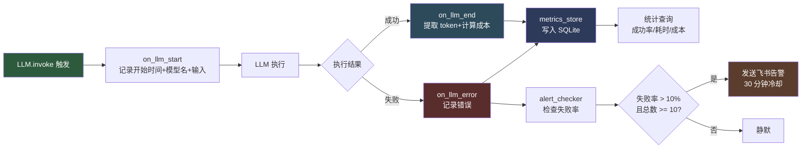

**三大组件**：

| 组件 | 文件 | 职责 |
|------|------|------|
| LLMCallMonitor | llm_monitor.py | LangChain Callback，自动拦截 LLM 调用 |
| MetricsStore | metrics_store.py | SQLite 持久化调用日志，支持统计查询 |
| AlertChecker | alert.py | 失败率 >10% 触发飞书告警，30 分钟冷却 |

**LLMCallMonitor 工作原理**：
- 继承 LangChain `BaseCallbackHandler`
- 在 `ModelRouter._create_anthropic_llm` / `_create_openai_llm` 中通过 `callbacks=[llm_monitor]` 挂载
- 业务代码零侵入，所有 LLM 调用自动被监控

**MetricsStore SQLite 表结构**：
- 数据库位置：`data/llm_metrics.db`（开发模式）/ exe 同目录（打包模式）
- 字段：call_id / model_name / input_summary / output_summary / duration_ms / input_tokens / output_tokens / cost_usd / success / error_message / created_at
- 查询接口：`get_stats(hours)` 返回成功率/失败率/平均耗时/总成本；`get_recent_calls(limit)` 返回最近记录
- 自动清理：`cleanup(days=30)` 删除超过 30 天的旧记录

**AlertChecker 告警阈值**：
- 触发条件（全部满足）：近 1 小时调用数 >= 10 且失败率 > 10%
- 冷却时间：30 分钟内同一告警只发送一次
- 告警通道：优先应用机器人（application_bot），失败回退 Webhook 机器人（feishu_bot）
- 告警内容：时间 / 统计窗口 / 总调用数 / 成功失败数 / 失败率 / 平均耗时 / 总成本

**成本估算表**（每 1K token 价格，美元）：

| 模型 | 输入价格 | 输出价格 |
|------|----------|----------|
| claude-haiku-4-5 | $0.001 | $0.005 |
| claude-sonnet-4-6 | $0.003 | $0.015 |
| claude-opus-4-8 | $0.015 | $0.075 |
| gpt-4o-mini | $0.00015 | $0.0006 |
| gpt-4o | $0.005 | $0.015 |

---

## 七、部署向导 + 回调服务架构（v0.4.0 新增）

### 7.1 部署向导（7 步引导业务用户完成部署）

业务用户首次使用软件时，跟着向导走 7 步即可完成部署，全程不接触代码。


**关键设计**：
- 每步只做一件事，说人话，给操作按钮
- 步骤⑤⑥用快递类比解释回调服务和公网隧道的作用（回调服务=快递接收员、公网隧道=门牌号、请求地址=收件地址）
- 步骤④一键初始化：建 4 张业务表 + 1 张采集配置表 + 3 个业务视图 + 表格权限，10-30 秒完成
- 步骤⑦健康检查：6 项配置就绪检测（凭证/表格/表配置/权限/回调服务/公网隧道）

### 7.2 回调服务 + 公网隧道（替代 ngrok，业务用户零配置）

```mermaid
flowchart LR
    A[飞书服务器] -->|推送事件| B[公网 URL<br/>xxx.trycloudflare.com]
    B -->|Cloudflare Tunnel| C[本地 8000 端口<br/>FastAPI 回调服务]
    C -->|解析事件| D{事件类型}
    D -->|URL 验证| E[返回 challenge]
    D -->|卡片按钮点击| F[异步回写多维表格]
    D -->|审批状态变更| G[异步回写审批状态]

    style A fill:#5a2d2d,color:#fff
    style B fill:#2d4a5a,color:#fff
    style C fill:#2d5a3d,color:#fff
    style F fill:#2d3a5a,color:#fff
    style G fill:#2d3a5a,color:#fff
```

**回调服务（`src/feishu/card_callback.py` + `src/gui/services/callback_server_thread.py`）**：
- 基于 FastAPI 实现，监听 `http://0.0.0.0:8000/callback`
- 封装为 `CallbackServerThread(QThread)`，GUI 点按钮即可启动/停止，无需开终端
- 用 `uvicorn.Config + uvicorn.Server` 方式，通过 `should_exit=True` 优雅停止
- 兼容飞书 schema 1.0 和 2.0 两种回调格式
- 支持 3 类事件：URL 验证、`card.action.trigger`（卡片按钮点击）、`approval_instance`（审批状态变更）
- 异步回写策略：用 `asyncio.create_task` + `run_in_executor` 避免飞书 3 秒超时

**公网隧道（`src/gui/services/cloudflare_tunnel_thread.py` + `cloudflared_downloader.py`）**：
- 用 Cloudflare Tunnel 替代 ngrok，免费且无需注册
- 首次使用自动下载 `cloudflared`（约 50MB）到 exe 同目录，无需手动安装
- 启动后自动提取公网 URL（形如 `xxx.trycloudflare.com`）
- 启动成功后**自动复制完整回调地址**（`公网 URL + /callback`）到剪贴板
- 在 GUI 渲染**蓝色 HTML 指引卡片**，列出飞书后台两处填写位置的完整路径：
  - ① 事件配置（接收审批状态变更）
  - ② 卡片回传交互（接收审批卡片按钮点击）

### 7.3 审批扫描机制（`src/gui/services/approval_service.py`）

业务用户在飞书审批后台创建审批定义后，GUI 自动扫描获取，无需手动复制 approval_code。

```mermaid
sequenceDiagram
    participant User as 业务用户
    participant GUI as 审批流管理页
    participant ScanThread as 扫描线程
    participant Auth as 飞书认证
    participant API as 飞书审批 API

    User->>GUI: 点"➕ 新建审批规则"
    GUI->>ScanThread: 启动自动扫描
    ScanThread->>Auth: 用 App ID/Secret 换 tenant_access_token
    Auth-->>ScanThread: 返回 token
    ScanThread->>API: POST /approval/v4/approvals（拉取所有已发布审批定义）
    API-->>ScanThread: 返回审批定义列表
    ScanThread-->>GUI: 显示列表供用户选择
    User->>GUI: 点选一个审批定义
    GUI->>API: GET /approval/v4/approvals/{code}（查字段 ID 和节点 ID）
    API-->>GUI: 返回表单字段 ID + 审批节点 ID
    GUI->>GUI: 写入 .env，规则保存生效
```

**扫描前置条件**（扫不到的 3 个常见原因）：
1. 审批定义已发布（草稿扫不到）
2. 应用拥有 `approval:approval` 权限
3. 凭证已保存（系统拿不到 token 就调不了 API）

**PyInstaller 打包**：
- `scripts/build_exe.py` — 打包脚本
- 输出 `dist/跨境电商AI运营中台.exe`（约 80-120MB）
- 用 `--onefile` 打包成单文件，用户双击即用
- 用 `--windowed` 隐藏控制台窗口
- 用 `--collect-submodules src` 收集所有 src 子模块

## 三、数据流

```mermaid
flowchart LR
    subgraph 输入
        I1[飞书采集配置表<br/>15条启用配置]
    end

    subgraph 处理
        P1[读取配置]
        P2[多平台采集<br/>75个商品]
        P3[清洗过滤<br/>剔除低质量]
        P4[SyncService增量同步<br/>去重+分类]
    end

    subgraph 输出
        O1[飞书选品池表<br/>含来源平台字段]
        O2[SyncResult统计<br/>新增/更新/跳过]
    end

    subgraph 周期维护
        M1[每3天凌晨2:00<br/>数据清理任务]
        M2[删除超过3天的旧数据]
    end

    I1 --> P1 --> P2 --> P3 --> P4 --> O1
    P4 -.->|统计| O2
    M1 --> M2 -.->|清理| O1

    style I1 fill:#2d5a3d,color:#fff
    style P4 fill:#5a3d2d,color:#fff
    style O1 fill:#2d3a5a,color:#fff
    style O2 fill:#2d3a5a,color:#fff
    style M1 fill:#4a3d2d,color:#fff
```

## 四、扩展性设计

### 4.1 添加新品类
- **不用改代码**：在飞书"采集配置"表中添加一行，填品类名+平台+数量
- 采集器自动用默认模板生成合理数据

### 4.2 添加新平台
- 在 `multi_platform_mock.py` 的 `_PLATFORM_DB` 中添加平台配置（URL模板/品牌池/价格系数）
- 在 `table_schema.py` 的"来源平台"和"平台"字段选项中添加新平台名

### 4.3 替换为真实采集器
- 实现 `BaseCollector.collect()` 接口
- 在 `tasks.py` 中替换 `MockMultiPlatformCollector` 为真实采集器
- 其他代码无需改动

## 五、测试覆盖

| 测试文件 | 覆盖范围 |
|----------|----------|
| test_collectors.py | ProductInfo / MockAmazonCollector / MockMultiPlatformCollector |
| test_cleaners.py | DataCleaner 过滤逻辑 |
| test_scheduler.py | InventoryAlert / SchedulerManager（5个任务注册） |
| test_feishu_auth.py | 飞书认证 |
| test_feishu_bitable.py | BitableClient |
| test_sync_service.py | SyncResult / 字段映射 / SyncService增量同步 / 数据清理任务 |
| test_feishu_bot.py | Webhook 机器人消息发送 / 库存预警卡片模板 |
| test_card_callback.py | 选品报告卡片 / 销售日报卡片 / 审批卡片 / FastAPI 回调服务 |
| test_approval.py | ApprovalClient / 表单构建 / 审批状态变更回调 / ASIN 提取 / 自动触发任务 |
| ai/test_model_router.py | 多模型路由（provider 检测/任务映射/国内大模型识别，v0.5.0+ v0.5.1） |
| ai/test_tool_registry.py | 工具注册中心（v0.5.0） |
| ai/test_selection_tools.py | 选品工具（抓取/分析/保存，v0.5.0） |
| ai/test_selection_agent.py | 选品 Agent 集成测试（v0.5.0） |
| ai/test_insight_tools.py | 数据洞察工具（拉数据/分析/保存，v0.6.0） |
| ai/test_insight_agent.py | 数据洞察 Agent 集成测试（v0.6.0） |
| ai/test_insight_card.py | 数据洞察日报卡片模板（v0.6.0） |
| ai/test_anomaly_detector.py | 硬规则异常检测器（销量跌幅/ACoS/库存三维度 + 严重程度分级，v0.6.1） |
| ai/test_anomaly_card.py | 红色异常预警卡片模板（颜色/排序/统计字段/按钮，v0.6.1） |
| ai/test_orchestrator.py | Agent 编排引擎（状态机/场景联动/JSON 提取/复盘判断，v0.7.0） |
| ai/test_listing_agent.py | Listing 优化 Agent + 工具（主流程/Mock 兜底/LLM 失败回退/状态写回，v0.7.0） |
| test_observability.py | LLM 监控 + SQLite 指标 + 告警阈值（v0.5.0） |

**当前测试结果**：415 个测试全部通过（含修复历史遗留 6 个失败：`_INSIGHT_SYSTEM_PROMPT` JSON 大括号未转义 + `_extract_amount` 函数未实现），AI 模块覆盖率 88-98%。

**test_approval.py 覆盖场景**（29 个测试，08-06 新增）：
- ApprovalClient 配置：全配置通过 / 缺 approval_code / 缺 approver_open_id / 缺 node_id
- 表单构建：5 个字段完整 / 字段 ID 正确 / 字段值正确 / 中文不转义
- 创建审批实例：成功返回 instance_code / 未配置返回空 / API 错误返回空
- 查询审批状态：成功返回详情 / 空 instance_code 返回空 / 中文状态文本 / 查询失败返回未知
- 状态码映射：包含所有状态码 / 值都是中文
- 审批状态变更回调：合法事件返回成功 / 缺字段返回失败 / 兼容新格式 schema 2.0
- ASIN 提取：成功提取 / 无 ASIN 字段返回空 / 查询失败返回空
- 自动触发任务：未配置返回 0 / 金额提取（数字/字符串/列表/空值/无效值）
