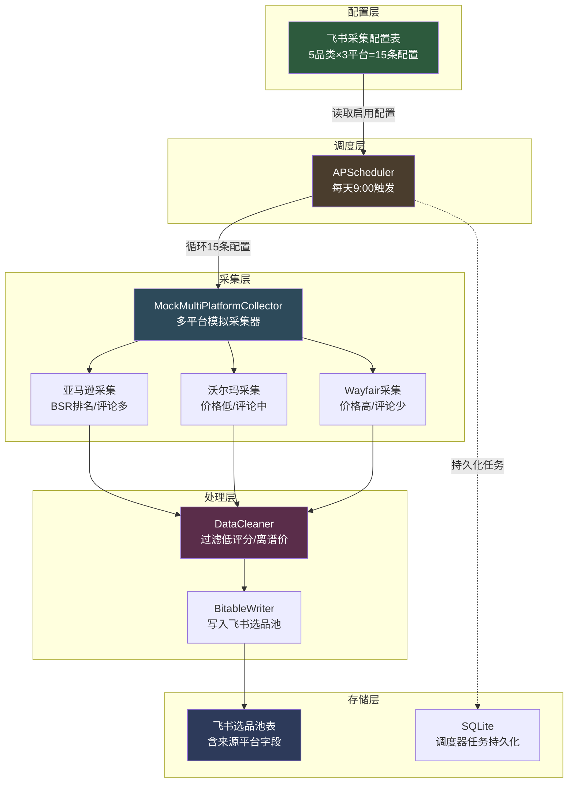
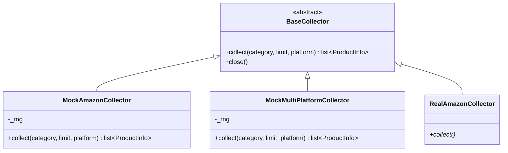
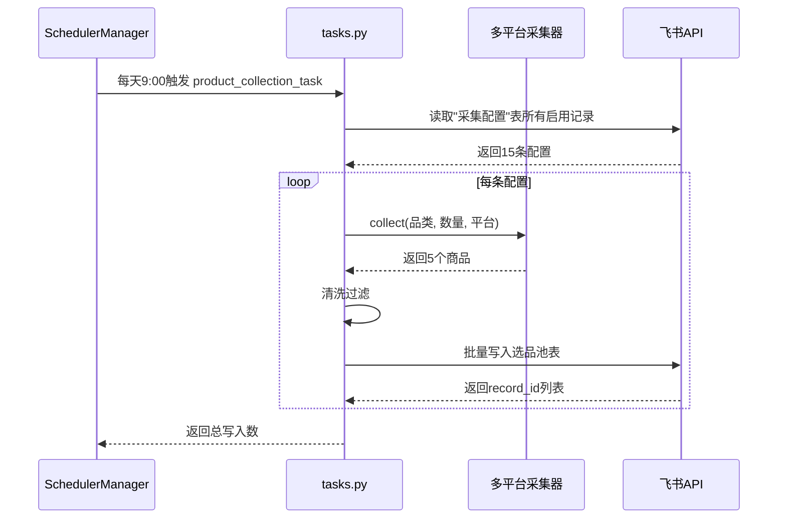
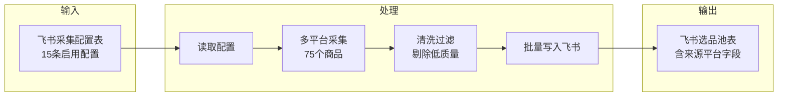

# 项目架构文档

> 跨境电商 AI 运营中台 - 多平台多品类选品采集系统

## 一、整体架构

## 二、核心模块说明

### 2.1 配置层（src/config.py + 飞书采集配置表）

**配置中心**：从 `.env` 读取飞书凭证、表 ID、业务参数。

**采集配置表**（飞书多维表格）：
- 字段：品类（文本）/ 平台（单选）/ 采集数量（数字）/ 优先级（数字）/ 启用状态（单选）/ 备注 / 更新时间
- 设计要点：品类字段使用文本类型而非单选，企业可自由填写经营范围（家具企业填"户外家具"，3C企业填"蓝牙耳机"），无需改代码

### 2.2 采集层（src/pipeline/collectors/）

**策略模式**：所有采集器实现 `BaseCollector` 接口，上层代码不关心数据源。

**多平台差异化设计**：

| 平台 | URL 格式 | ID 格式 | 价格系数 | 评论系数 | BSR |
|------|----------|---------|----------|----------|------|
| 亚马逊 | amazon.com/dp/{asin} | B0+8位 | 1.0 | 1.0 | 有 |
| 沃尔玛 | walmart.com/ip/{id} | 8-12位数字 | 0.85 | 0.6 | 无 |
| Wayfair | wayfair.com/.../pdp/{id} | 字母+数字 | 1.25 | 0.3 | 无 |

**品类开放设计**：
- 默认 5 个家具品类：家居收纳、厨房用品、户外家具、办公家具、卧室家具
- 未知品类自动回退到默认模板，保证企业自定义品类也能采集到合理数据

### 2.3 处理层（src/pipeline/）

**清洗器**（DataCleaner）：
- 过滤评分 < 3.8 的商品
- 过滤价格 < 10 美金 或 > 500 美金的商品
- 过滤 BSR 排名 > 30000 的商品

**写入器**（BitableWriter）：
- 批量写入飞书选品池表
- 字段映射由 `ProductInfo.to_bitable_record()` 完成

### 2.4 调度层（src/scheduler/）

**任务列表**：
| 任务 ID | 触发时间 | 功能 |
|---------|----------|------|
| product_collection | 每天 9:00 | 多平台多品类选品采集 |
| inventory_check | 每 30 分钟 | 库存预警等级更新 |
| daily_report | 每天 18:00 | 日报生成（预留） |

### 2.5 飞书中台（src/feishu/）

**BitableClient** 提供完整的飞书多维表格 API 封装：
- 表管理：create_table / list_tables / list_fields / add_field
- 记录管理：add_record / batch_add_records / query_records / update_record / delete_record
- 错误处理：3 次重试 + 指数退避

**表结构**（5 张表）：
1. **选品池**：商品名/ASIN/品类/来源平台/价格/评分/评论数/BSR/市场容量/竞争强度/利润空间
2. **Listing 库**：商品 Listing 优化记录
3. **销售日报**：每日销售数据 + AI 洞察
4. **库存预警**：库存监控与自动审批
5. **采集配置**：企业经营品类与采集平台配置

## 三、数据流

## 四、扩展性设计

### 4.1 添加新品类
- **不用改代码**：在飞书"采集配置"表中添加一行，填品类名+平台+数量
- 采集器自动用默认模板生成合理数据

### 4.2 添加新平台
- 在 `multi_platform_mock.py` 的 `_PLATFORM_DB` 中添加平台配置（URL模板/品牌池/价格系数）
- 在 `table_schema.py` 的"来源平台"和"平台"字段选项中添加新平台名

### 4.3 替换为真实采集器
- 实现 `BaseCollector.collect()` 接口
- 在 `tasks.py` 中替换 `MockMultiPlatformCollector` 为真实采集器
- 其他代码无需改动

## 五、测试覆盖

| 测试文件 | 覆盖范围 |
|----------|----------|
| test_collectors.py | ProductInfo / MockAmazonCollector / MockMultiPlatformCollector |
| test_cleaners.py | DataCleaner 过滤逻辑 |
| test_scheduler.py | InventoryAlert / SchedulerManager |
| test_feishu_auth.py | 飞书认证 |
| test_feishu_bitable.py | BitableClient |

**当前测试结果**：27 个测试全部通过，覆盖率 45%。
