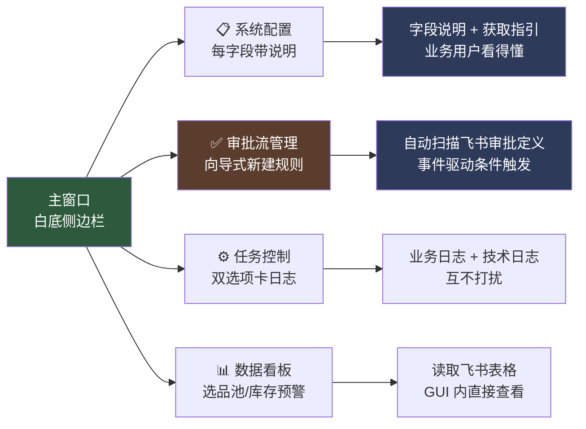
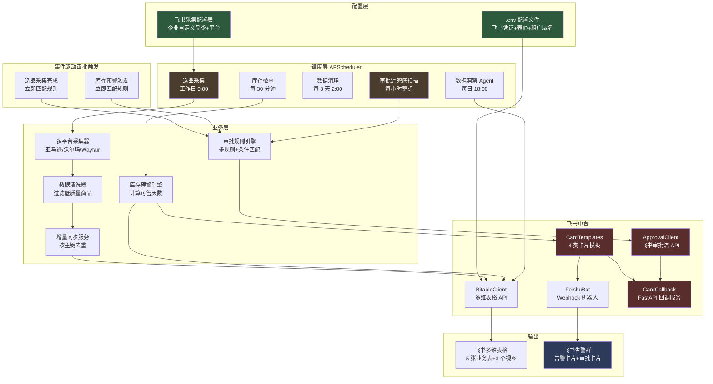
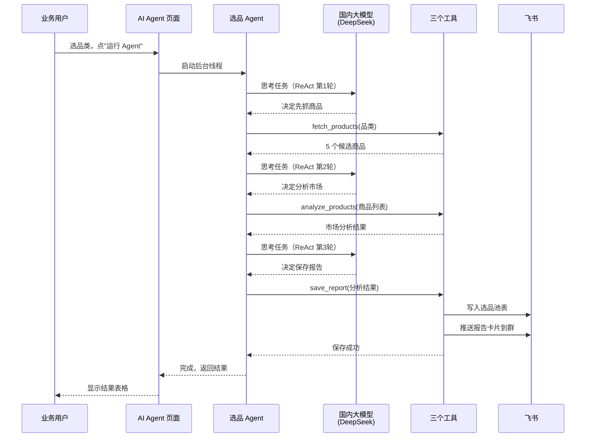
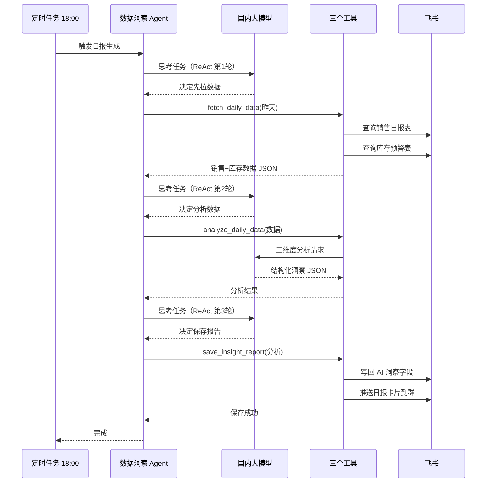

# 跨境电商 AI 运营中台

> 以飞书为协作入口，用 AI Agent 替代人工重复运营工作，实现从选品到售后全链路智能化。

---

## 📊 项目状态总览

| 模块 | 状态 | 说明 |
|------|------|------|
| 多平台选品采集 | ✅ 已完成 | 亚马逊/沃尔玛/Wayfair 三大平台 |
| 库存预警 | ✅ 已完成 | 每30分钟自动检查，更新预警等级 |
| Webhook 机器人告警 | ✅ 已完成 | 库存紧急/预警自动推送飞书群 |
| 数据增量同步 | ✅ 已完成 | 按主键去重，避免重复写入 |
| 业务视图 | ✅ 已完成 | 3 个视图（销售总览/预警看板/选品决策） |
| 数据自动清理 | ✅ 已完成 | 每3天凌晨2点自动清理旧数据 |
| 交互卡片模板库 | ✅ 已完成 | 4 类卡片（库存/选品/日报/审批） |
| 卡片按钮回调服务 | ✅ 已完成 | FastAPI 接收按钮点击回调 |
| **多审批流规则引擎** | ✅ 已完成 | 支持多个审批定义、事件驱动触发、条件匹配 |
| 一键部署方案 | ✅ 已完成 | 配置向导 + PyInstaller 打包 + 一键 bat |
| **PySide6 桌面 GUI** | ✅ 已完成 | 配置/审批流管理/任务控制/数据看板 4 大面板，现代简约白底风格 |
| **部署向导（7 步）** | ✅ 已完成 | 业务用户跟着向导走 7 步完成部署，全程不接触代码（v0.4.0） |
| **回调服务 + 公网隧道** | ✅ 已完成 | Cloudflare Tunnel 替代 ngrok，自动下载、一键启动、自动复制回调地址（v0.4.0） |
| **健康检查** | ✅ 已完成 | 6 项配置就绪检测（凭证/表格/表配置/权限/回调服务/公网隧道）（v0.4.0） |
| **审批人/群聊搜索** | ✅ 已完成 | 输入姓名/群名自动搜索飞书用户和群聊，无需手动复制 open_id/chat_id（v0.4.0） |
| **AI Agent 选品分析** | ✅ 已完成 | ReAct 模式 Agent，自动抓取→分析→推送全流程，GUI 一键运行（v0.5.0） |
| **LLM 调用可观测性** | ✅ 已完成 | Callback 自动记录耗时/Token/成本到 SQLite，失败率 >10% 飞书告警（v0.5.0） |
| **国内大模型支持** | ✅ 已完成 | 一套代码兼容 DeepSeek/通义千问/智谱 GLM/Kimi，无需代理国内直连（v0.5.1） |
| **数据洞察 Agent** | ✅ 已完成 | 每日 18:00 自动拉数据→LLM 三维度分析→写回表格+推送日报卡片（v0.6.0） |
| **异常检测增强** | ✅ 已完成 | 销量跌幅 > 30% 自动标红+推送红色预警卡片，硬规则兜底 LLM 漏判（v0.6.1） |

### 🖥️ 桌面 GUI 预览



**启动方式**：
- 双击 `scripts\启动GUI.bat`
- 或下载 [GitHub Release](https://github.com/lbh1nb/cross-border-ai-platform/releases) 的 exe，双击运行（无需 Python 环境）

---

## 🎯 项目能做什么（业务价值）

### 解决跨境电商 4 大痛点

| 痛点 | 解决方案 | 业务价值 |
|------|----------|----------|
| 不知道进什么货卖 | 多平台选品采集 | 每天 9:00 自动采集 75 个热门商品（5品类×3平台×5商品） |
| 库存断货才发现 | 库存预警 + 机器人告警 | 每 30 分钟检查，紧急/预警自动推送到飞书群 |
| 数据越来越多看不过来 | 业务视图 + 自动清理 | 视图隐藏非关键字段，3 天自动清理一次旧数据 |
| 重复商品反复写入 | 增量同步 | 按 ASIN+平台 去重，已存在则更新而非新增 |

### 业务用户能感受到的 6 个变化

1. **打开飞书就能看到当日选品推荐**（工作日 9:00 自动采集）
2. **库存有问题第一时间收到飞书群告警**（红色/橙色卡片，含商品信息和处理建议）
3. **点击卡片按钮直接跳转到飞书多维表格**（不跳浏览器，不需重新登录）
4. **表格字段太多眼花？3 个业务视图自动隐藏非关键字段**
5. **想换品类？在飞书"采集配置"表里改一行就行**（不用改代码）
6. **大额采购自动走飞书审批流**（金额 > 5000 美金自动创建审批单，主管在审批中心通过/拒绝后表格状态自动更新）

---

## 🏗️ 项目架构（一图看懂）



详细架构说明见 [ARCHITECTURE.md](file:///d:\ai\07-26\cross-border-ai-platform\ARCHITECTURE.md)

---

## 📦 项目功能清单（9 大模块）

### 1. 多平台选品采集

**触发**：工作日 09:00 自动执行
**产出**：每天 75 个热门商品写入飞书选品池表

- 支持亚马逊/沃尔玛/Wayfair 三大跨境电商平台
- 默认 5 个家具品类（家居收纳/厨房用品/户外家具/办公家具/卧室家具）
- 企业可在飞书"采集配置"表自定义品类（如"蓝牙耳机"/"美妆"），无需改代码
- 自动过滤低评分（<3.8）/离谱价（<10或>500美金）/差排名（>30000）商品

### 2. 库存预警

**触发**：每 30 分钟自动执行
**产出**：飞书库存预警表预警等级自动更新

- 根据可售天数自动计算预警等级：紧急（≤7天）/预警（≤14天）/关注（≤30天）/正常（>30天）
- 等级未变化时不重复处理
- 等级变化时自动触发机器人告警

### 3. Webhook 机器人告警

**触发**：库存等级变为"紧急"或"预警"时
**产出**：飞书告警群收到交互卡片

- 仅"紧急"和"预警"等级触发告警（避免告警疲劳）
- 卡片按等级配色：红色=紧急，橙色=预警
- 卡片含商品信息、可售天数、处理建议、"查看库存详情"按钮
- 按钮点击直接在飞书桌面端打开多维表格（不跳浏览器）

### 4. 数据增量同步

**触发**：选品采集时同步执行
**产出**：避免重复商品堆积

| 表 | 主键 | 去重策略 |
|----|------|----------|
| 选品池 | ASIN + 来源平台 | 同一商品同一平台不重复 |
| 库存预警 | SKU | 同一 SKU 不重复 |
| 销售日报 | 日期 + 平台 | 同一天同平台只有一条 |

### 5. 业务视图（提升查看体验）

**触发**：安装时自动创建
**产出**：3 个业务视图

| 视图名 | 所属表 | 显示字段 |
|--------|--------|----------|
| 销售总览 | 销售日报 | 日期/平台/销售额/订单数/ACoS/异常标记/AI洞察 |
| 预警看板 | 库存预警 | ASIN/商品名称/SKU/平台/可售天数/预警等级/建议采购量/预估采购金额/审批状态 |
| 选品决策 | 选品池 | 商品名称/ASIN/品类/来源平台/价格区间/评分/评论数/市场容量/竞争强度/利润空间/推荐指数/状态 |

### 6. 数据自动清理

**触发**：每 3 天凌晨 2:00
**产出**：飞书表格不会无限堆积

- 保留最近 3 天数据（可通过 `DATA_RETENTION_DAYS` 配置）
- 清理范围：选品池/库存预警/销售日报
- 不清理：采集配置表（企业长期配置）/ Listing 库表（保留优化历史）

### 7. 交互卡片模板库（4 类卡片）

| 卡片类型 | 用途 | 触发场景 | 按钮行为 |
|----------|------|----------|----------|
| 库存预警卡片 | 通知库存紧急/预警 | 库存等级变化时 | url 跳转多维表格 |
| 选品报告卡片 | 通知当日采集统计 | 工作日 9:00 采集完成后 | url 跳转选品池表 |
| 销售日报卡片 | 通知当日销售情况 | 每天 18:00（第4周上线） | url 跳转销售日报表 |
| 审批卡片 | 触发审批流程 | 选品金额 > 5000 美金时 | value 触发回调（需应用机器人） |

### 8. 卡片按钮回调服务

**用途**：接收用户在飞书内点击卡片按钮的事件，执行后续业务逻辑

- 基于 FastAPI 实现的轻量级 HTTP 服务
- 监听 `http://127.0.0.1:8000/callback` 接收飞书回调
- 支持 URL 验证（飞书首次配置回调 URL 时验证所有权）
- 支持 `card.action.trigger` 事件（卡片按钮点击）
- 支持 `approval_instance` 事件（飞书审批流状态变更）
- 内置 2 个 action 处理器：`approve`（审批通过）/ `reject`（审批拒绝）
- 内置审批状态变更处理器：自动回写多维表格"审批状态"字段
- 异步回写策略：避免飞书 3 秒超时限制
- 配合 ngrok 内网穿透可让飞书服务器访问本地服务

### 9. 多审批流规则引擎（事件驱动 + 条件触发）

**触发方式**：事件驱动 + 每小时兜底扫描（不再每天固定时间触发）

业务事件发生后**立即**匹配规则，符合条件就自动创建审批实例，主管在飞书审批中心收到通知。

**支持的触发事件**：
- **选品采集完成**：选品采集任务跑完后，对本次同步的记录匹配规则
- **库存预警触发**：库存等级变为"紧急"或"预警"时，对告警记录匹配规则
- **每小时兜底**：补触发事件驱动可能遗漏的记录（如手动新增的、规则新增后的历史记录）

**业务流程**：
1. 业务任务跑完 → 把记录列表传给规则引擎
2. 规则引擎逐条匹配：事件类型 → 触发条件 → 字段 + 操作符 + 阈值
3. 命中规则 → 调用对应审批流 API 创建审批实例
4. 主管在飞书审批中心通过/拒绝
5. 审批状态变更自动回写多维表格"审批状态"字段

**规则示例**：

| 规则名 | 触发事件 | 条件字段 | 操作符 | 阈值 | 用途 |
|--------|----------|----------|--------|------|------|
| 高金额选品审批 | 选品采集完成 | 利润空间 | > | $5000 | 大额选品需主管审批 |
| 紧急补货审批 | 库存预警触发 | 预警等级 | = | 紧急 | 紧急缺货走加急审批 |
| 低评分商品预警 | 选品采集完成 | 评分 | < | 4.0 | 低评分商品需复核 |

**与卡片审批的区别**：

| 对比项 | 卡片审批 | 审批流规则引擎 |
|--------|---------|---------------|
| 审批入口 | 飞书群卡片按钮 | 飞书 APP 审批中心 |
| 审批流程 | 单点点击即通过 | 支持多级审批、抄送、加签 |
| 流程追溯 | 无 | 审批中心可查历史 |
| 触发方式 | 手动发卡片 | 业务事件自动触发 |
| 多审批流支持 | ❌ 单一 | ✅ 多规则独立配置 |
| 条件匹配 | ❌ 固定阈值 | ✅ 字段+操作符+阈值灵活组合 |

**配置方法（向导式可视化操作）**：

1. 打开 GUI（双击 `跨境电商AI运营中台.exe` 或 `scripts\启动GUI.bat`）
2. 进入"审批流管理"页面
3. 点"➕ 新建审批规则" → 弹出向导对话框
4. 向导自动扫描企业内所有飞书审批定义（下拉框可选）
5. 选择触发事件（选品采集完成 / 库存预警触发）
6. 配置条件：选字段 → 选操作符（>、<、=）→ 填阈值
7. 点"保存" → 规则写入 JSON 文件，立即生效

详见下方"如何创建新的自动化审批流"教程。

---

### 10. 如何创建新的自动化审批流（业务用户教程）

业务用户可以随时在飞书审批后台创建新的审批定义，然后在 GUI 里向导式新建规则，全程不接触代码。

#### 第一步：在飞书创建审批定义

1. 打开飞书 → 工作台 → 审批应用
2. 点击"创建审批" → 选择"自建应用审批"
3. 填写审批名称（如"高金额采购审批"、"紧急补货审批"）
4. 添加表单字段，建议至少包含：
   - ASIN（文本类型）
   - 商品名称（文本类型）
   - 采购金额（金额类型）
   - 业务类型（文本类型）
   - 说明（多行文本类型）
5. 配置审批流程节点（指定审批人）
6. 点击"发布" → 等待审核通过

#### 第二步：在 GUI 向导式新建规则

1. 双击 `跨境电商AI运营中台.exe` 或 `scripts\启动GUI.bat` 启动 GUI
2. 进入"审批流管理"页面 → 点"➕ 新建审批规则"
3. 向导自动扫描企业内所有飞书审批定义 → 在下拉框选刚创建的那个
4. 系统自动拉取该审批的字段 ID、节点 ID、审批人信息（无需手动复制粘贴）
5. 选择触发事件（"选品采集完成" 或 "库存预警触发"）
6. 配置触发条件：
   - 选字段（如"利润空间"、"评分"、"预警等级"）
   - 选操作符（>、<、=、≥、≤）
   - 填阈值（如 5000）
7. 点"保存" → 规则立即生效，列表里出现新规则

#### 第三步：启动调度器

1. 进入"任务控制"页面
2. 点"▶ 启动调度器"
3. 业务事件触发后立即匹配规则，符合条件的记录自动创建审批实例
4. 审批人在飞书审批中心收到通知 → 通过/拒绝 → 状态自动回写表格

#### 创建多个审批流

系统支持**多个审批流规则并存**，每个规则独立配置审批定义和触发条件：
1. 在飞书创建多个审批定义（如"采购审批"+"补货审批"+"加急审批"）
2. 在 GUI 审批流管理页逐个"新建规则"，选择不同审批定义和触发条件
3. 同一条记录可能命中多个规则，每个规则都会创建独立的审批实例
4. 规则可随时编辑、删除、启停，互不影响

#### 审批流字段说明

飞书审批定义的字段 ID 是自动生成的（如 `widget17850667532920001`），GUI 向导会自动查询并配置，无需手动填写。

| 字段 | 类型 | 用途 |
|------|------|------|
| ASIN | input（文本） | 商品唯一标识，用于回写表格定位记录 |
| 商品名称 | input（文本） | 商品名称 |
| 采购金额 | amount（金额） | 触发审批的判断依据 |
| 业务类型 | input（文本） | 如"选品采购"/"紧急补货" |
| 说明 | textarea（多行文本） | 补充说明 |

> **注意**：审批定义的字段名称必须与上表一致（ASIN/商品名称/采购金额/业务类型/说明），否则审批实例创建会失败。字段类型可灵活调整。

---

### 11. 如何使用 AI Agent 做选品分析（业务用户教程）

系统内置了 AI 智能选品 Agent，能像真人运营一样帮你"看商品→算市场→写报告→推送到飞书群"，全程不用写一行代码。

#### Agent 能做什么

| 能力 | 具体说明 |
|------|----------|
| 自动抓取商品 | 根据你选的品类，调采集器拉取 5 个候选商品 |
| AI 市场分析 | 从市场容量、竞争强度、利润空间三个维度评估每个商品 |
| 生成结构化报告 | 输出推荐指数、采购建议、风险提示 |
| 一键写入飞书 | 分析结果自动写入"选品池"表，并推送卡片到飞书告警群 |
| 全程透明可观测 | GUI 实时显示 Agent 每一步思考过程和工具调用 |
| 调用成本可追踪 | 每次调用记录耗时、Token、成本到 SQLite，失败率 >10% 自动飞书告警 |

#### 使用步骤（4 步）


**第 1 步：配置 AI 模型（必填，一次性）**

打开 GUI → 进入"系统配置"页 → 滚动到"④ AI 模型配置"区域：

| 字段 | 怎么填 | 说明 |
|------|--------|------|
| OpenAI API Base | 国内用户填 `https://api.deepseek.com/v1` | 推荐用 DeepSeek，国内访问稳定、1 元能用 100 万 token |
| OpenAI API Key | 在 [DeepSeek 平台](https://platform.deepseek.com) 注册充值后创建 | sk- 开头 |
| Anthropic API Key | 留空即可（国内访问需代理） | 仅在你想用 Claude 时填写 |

填完点页面底部"💾 保存配置"按钮，立即生效。

> 详细的国内大模型配置见下方"12. 国内大模型配置指南"。

**第 2 步：打开 AI Agent 页面**

启动 GUI 后，左侧侧边栏点击"🤖 AI Agent"图标，进入选品分析 Agent 页面。

**第 3 步：选品类，点"运行 Agent"**

| 操作 | 说明 |
|------|------|
| 选择品类 | 下拉框选一个（家居收纳/厨房用品/户外家具/办公家具/卧室家具） |
| 点击"🚀 运行 Agent" | 后台线程启动 Agent，UI 不会卡死 |
| 等待 30-60 秒 | Agent 会调用 LLM 多次推理 + 工具调用 |

**第 4 步：查看执行过程和结果**

| 区域 | 看什么 |
|------|--------|
| 实时日志框 | Agent 每一步思考、调用了哪个工具、工具返回什么 |
| 结果表格 | Agent 推荐的 5 个商品（含 ASIN、推荐指数、市场分析） |
| 飞书选品池表 | Agent 写入的完整记录 |
| 飞书告警群 | 收到一张 AI 选品报告卡片 |

#### Agent 工作流程（透明可观测）



#### 常见问题

**Q：Agent 运行报错"未配置 AI 模型凭证"怎么办？**
A：去"系统配置"页 → "④ AI 模型配置"区域填好 OpenAI API Base 和 OpenAI API Key（推荐 DeepSeek）→ 点"保存配置"→ 重新运行。

**Q：Agent 运行很慢（超过 1 分钟）？**
A：Agent 会调用 LLM 多轮推理，正常 30-60 秒。如果超时，检查网络或换 DeepSeek（国内访问快）。

**Q：怎么知道 Agent 花了多少钱？**
A：所有 LLM 调用都记录在 `data/llm_metrics.db`（SQLite），包含每次调用的耗时、Token 数、成本。Agent 跑完后可在数据库查或看日志。

**Q：Agent 写入飞书的数据怎么查？**
A：打开飞书 → 多维表格 → 选品池表 → "选品决策"视图。

---

### 12. 国内大模型配置指南（必读）

国内访问 OpenAI/Anthropic 官方 API 需要代理，强烈推荐改用**国内大模型的 OpenAI 兼容接口**，代码无需任何改动，只在 .env 或 GUI 配置页改两个字段即可。

#### 支持的国内大模型对照表

| 大模型 | OPENAI_API_BASE | 推荐模型（自动选择） | 注册地址 | 价格（每百万 token） |
|--------|-----------------|----------------------|----------|---------------------|
| **DeepSeek（推荐）** | `https://api.deepseek.com/v1` | deepseek-chat / deepseek-reasoner | https://platform.deepseek.com | 输入 ¥1 / 输出 ¥2 |
| 通义千问 | `https://dashscope.aliyuncs.com/compatible-mode/v1` | qwen-turbo / qwen-plus / qwen-max | https://dashscope.console.aliyun.com | 输入 ¥0.3 起 |
| 智谱 GLM | `https://open.bigmodel.cn/api/paas/v4/` | glm-4-flash / glm-4-plus | https://open.bigmodel.cn | 有免费额度 |
| 月之暗面 Kimi | `https://api.moonshot.cn/v1` | moonshot-v1-8k / moonshot-v1-32k | https://platform.moonshot.cn | 输入 ¥12 起 |

> **为什么推荐 DeepSeek？** 性价比最高（1 元能用 100 万 token），推理能力强（deepseek-reasoner 接近 o1 水平），国内访问稳定不卡顿，注册充值门槛低。

#### 配置方式（两种任选）

**方式 1：GUI 配置页（推荐，业务用户用）**

1. 启动 GUI → "系统配置"页 → "④ AI 模型配置"区域
2. 填入：
   - OpenAI API Base：`https://api.deepseek.com/v1`
   - OpenAI API Key：在 DeepSeek 平台创建的 sk- 开头 Key
3. 点"💾 保存配置"→ 立即生效

**方式 2：编辑 .env 文件（IT/运维用）**

打开项目根目录的 `.env` 文件，找到 AI 模型配置段：

```bash
# DeepSeek 配置示例
OPENAI_API_BASE=https://api.deepseek.com/v1
OPENAI_API_KEY=sk-你在DeepSeek平台创建的Key
ANTHROPIC_API_KEY=
```

保存后重启 GUI 即可生效。

#### 模型自动识别机制

ModelRouter 会根据 `OPENAI_API_BASE` 中的关键字自动识别国内大模型，并切换到对应模型名：

| base_url 含关键字 | 自动选用的模型（按任务复杂度） |
|-------------------|--------------------------------|
| `deepseek` | simple: deepseek-chat / standard: deepseek-chat / complex: deepseek-reasoner |
| `dashscope` | simple: qwen-turbo / standard: qwen-plus / complex: qwen-max |
| `bigmodel` | simple: glm-4-flash / standard: glm-4-plus / complex: glm-4-plus |
| `moonshot` | simple: moonshot-v1-8k / standard: moonshot-v1-32k / complex: moonshot-v1-32k |

业务用户无需关心模型名，填好 base_url 就行。

#### 不想用国内大模型怎么办

| 场景 | 配置方法 |
|------|----------|
| 用 OpenAI 官方（需代理） | `OPENAI_API_BASE` 留空 + 填 `OPENAI_API_KEY` |
| 用 Anthropic Claude（需代理） | 仅填 `ANTHROPIC_API_KEY`，其他留空 |
| 自建 OpenAI 代理网关 | `OPENAI_API_BASE` 填你的网关地址 + 填 `OPENAI_API_KEY` |

---

### 13. 如何使用数据洞察 Agent（业务用户教程）

系统内置了数据洞察 Agent，每天 18:00 自动分析昨日销售和库存数据，生成结构化日报推送到飞书群。本页面也支持业务用户手动重跑或补跑指定日期。

#### Agent 能做什么

| 能力 | 具体说明 |
|------|----------|
| 自动拉数据 | 从飞书多维表格拉昨日销售日报 + 当前库存预警 |
| AI 三维度分析 | LLM 从销量趋势、广告效率、库存健康三维度生成洞察 |
| 自动写回表格 | 把 AI 洞察文本写回销售日报表的"AI洞察"字段 |
| 推送日报卡片 | 飞书群收到结构化日报卡片，含异常预警和行动建议 |
| 定时自动执行 | 每日 18:00 由定时任务自动触发，无需人工干预 |
| 手动补跑 | GUI 支持选日期手动重跑，便于核查历史数据 |

#### 使用方式（两种）

**方式 1：自动执行（默认，无需操作）**

每日 18:00 由后台调度器自动触发，业务用户只需在飞书群查看日报卡片。

**方式 2：手动重跑（补跑指定日期）**


| 操作 | 说明 |
|------|------|
| 打开 AI Agent 页 | 侧边栏点"🤖 AI Agent" |
| 切换 Tab | 点顶部"📊 数据洞察"标签 |
| 选日期 | 默认昨天，可点"📋 设为昨天"快速重置 |
| 点"🚀 立即运行" | 后台线程启动 Agent，UI 不会卡死 |
| 等待 30-60 秒 | Agent 自动拉数据 → LLM 分析 → 写回表格 + 推送卡片 |

#### 日报卡片包含什么

| 区域 | 内容 |
|------|------|
| 三维度概览 | 销量趋势（上升/平稳/下降）、广告效率（高效/正常/低效）、库存健康（健康/关注/预警/紧急） |
| 销量分析 | 销售额/订单数趋势，异常跌幅标记 |
| 广告分析 | ACoS 评估，优化建议 |
| 库存分析 | 断货风险，补货优先级 |
| 异常预警 | 销量异常 + 断货风险 SKU 列表（红色标记） |
| 今日最紧急 | 系统判定的最紧急事项 |
| 行动建议 | 按优先级排序的前 3 条建议 |
| 查看销售日报按钮 | 跳转飞书多维表格 |

#### Agent 工作流程（透明可观测）



#### 常见问题

**Q：日报卡片没收到？**
A：检查 3 项：①任务控制页调度器是否启动；②系统配置页是否配置了 `FEISHU_CHAT_ID`；③AI Agent 页配置的 API Key 是否有效。

**Q：AI 洞察字段是空的？**
A：可能 LLM 调用失败，查看任务控制页技术日志。常见原因是 API Key 余额不足或网络超时。

**Q：怎么补跑前天的日报？**
A：打开 AI Agent 页 → 数据洞察 Tab → 点"📋 设为昨天"改为手动选日期 → 选前天 → 点"🚀 立即运行"。

**Q：18:00 定时任务没触发？**
A：进入"任务控制"页 → 确认调度器状态为"运行中" → 查看业务日志是否有 18:00 的执行记录。

---

## 🚀 怎么使用（按角色分）

### 业务用户（无需任何代码操作）

**全程只需做两件事**：

#### 第一步：请 IT/运维完成首次安装（一次性）

IT/运维人员会在你的电脑上双击 `scripts\一键安装.bat` 完成全部安装：
- 自动创建虚拟环境 + 安装依赖
- 自动启动配置向导（引导 IT 填写飞书凭证）
- 自动创建飞书业务表 + 业务视图 + 采集配置
- 自动配置开机自启 + 启动后台调度器

#### 第二步：打开飞书查看数据

| 时间 | 自动发生的事 | 看哪里 |
|------|--------------|--------|
| 工作日 09:00 | 采集多平台热门商品 | 选品池表 → "选品决策"视图 |
| 每 30 分钟 | 更新库存预警等级 | 库存预警表 → "预警看板"视图 |
| 每 30 分钟 | 紧急/预警库存自动推送飞书群 | 飞书告警群 → 查看告警卡片 |
| 每日 18:00 | AI 生成数据洞察日报并推送飞书群 | 飞书告警群 → 查看日报卡片 + 销售日报表"AI洞察"字段 |
| 业务事件触发 | 符合审批规则的记录自动创建审批单 | 飞书"审批中心" → 待审批列表 |
| 每小时整点 | 兜底扫描补触发遗漏记录 | 无需操作 |
| 每 3 天 02:00 | 自动清理旧数据 | 无需操作 |

**操作方式**：打开飞书 → 进入多维表格 → 点击表名旁的视图切换按钮 → 选择对应视图

#### 常见问题

**Q：表格数据太多看不过来？**
A：系统每 3 天自动清理一次旧数据，只保留最近 3 天。如需保留更久，请让 IT 在 `.env` 修改 `DATA_RETENTION_DAYS`。

**Q：想采集自己关注的品类？**
A：在飞书"采集配置"表中，停用默认家具配置，添加自己的品类（如"蓝牙耳机"），第二天 9:00 自动按新配置采集。

**Q：电脑重启后系统还会运行吗？**
A：会。安装时已配置开机自启，电脑重启后调度器会自动后台运行。

**Q：如何停止系统？**
A：双击 `scripts\一键卸载.bat`，或任务管理器结束 `pythonw.exe` 进程。

---

### IT/运维人员部署指南（3 种方式任选）

#### 方式 1：一键 bat 脚本（推荐，最简单）

```bash
# 1. 下载项目到目标电脑
git clone https://github.com/lbh1nb/cross-border-ai-platform.git
cd cross-border-ai-platform

# 2. 双击运行（或命令行执行）
scripts\一键安装.bat
```

bat 脚本会自动完成：
1. 检查 Python 环境
2. 创建虚拟环境 + 安装依赖
3. 启动配置向导（交互式引导填飞书凭证）
4. 配置开机自启 + 启动调度器

**适合场景**：目标电脑有 Python 3.11+，IT 人员不熟悉命令行。

#### 方式 2：配置向导脚本（推荐，交互式引导）

```bash
cd cross-border-ai-platform
python scripts/setup_wizard.py
```

配置向导会引导 IT 人员完成 11 步配置：

| 步骤 | 操作 | 自动化程度 |
|------|------|------------|
| 1 | 检查 Python 环境 + 创建虚拟环境 + 安装依赖 | 全自动 |
| 2 | 填写飞书 App ID / App Secret + 测试连接 | 半自动 |
| 3 | 填写多维表格 App Token + 租户域名 | 手动填写 |
| 4 | 创建 5 张业务表 | 全自动 |
| 5 | 填写 5 张表的 Table ID | 手动填写 |
| 6 | 写入 15 条采集配置 | 全自动 |
| 7 | 创建 3 个业务视图 | 全自动 |
| 8 | 填充销售日报模拟数据（测试用） | 全自动 |
| 9 | 配置 Webhook 机器人（可选） | 半自动 |
| 10 | 配置开机自启 | 全自动 |
| 11 | 运行 129 个单元测试 | 全自动 |

**适合场景**：IT 人员希望逐步控制每个环节，便于排查问题。

#### 方式 3：PyInstaller 打包成 exe（无需 Python 环境）

```bash
# 在开发机打包
python scripts/build_exe.py

# 把生成的 dist/cross-border-ai-setup.exe 复制到目标电脑
# 双击运行即可
```

打包后企业无需安装 Python 环境，双击 exe 即可启动配置向导。

**适合场景**：目标电脑无法安装 Python（如受 IT 策略限制），或希望像商业软件一样分发。

---

### 飞书应用前置准备（3 种方式都需要）

在运行部署脚本前，IT 人员需要先在飞书完成以下准备工作：

#### 准备 1：创建飞书自建应用

1. 打开 https://open.feishu.cn/app
2. 点击"创建企业自建应用"
3. 填写应用名称（如"AI 运营中台"）和描述
4. 进入应用 → 凭证与基础信息 → 复制 App ID 和 App Secret

#### 准备 2：开通应用权限

进入应用 → 权限管理，开通以下权限：
- `bitable:app`（多维表格读写）
- `base:collaborator:create`（添加协作者）
- `contact:user.id:readonly`（查询用户 ID）

#### 准备 3：发布应用

1. 创建版本 → 提交审核
2. 管理员审核通过后应用才生效

#### 准备 4：创建多维表格

1. 在飞书创建一个多维表格
2. 从 URL 获取 App Token 和租户域名
   - URL 格式：`https://xxx.feishu.cn/base/{APP_TOKEN}?table={TABLE_ID}`
   - `xxx` 是租户域名（如 `ocndodd7lmyr`）
   - `{APP_TOKEN}` 是多维表格 App Token

#### 准备 5：（可选）配置应用机器人（审批回调需要）

如需使用审批卡片按钮回调功能：
1. 应用功能 → 机器人 → 启用机器人能力
2. 事件与回调 → 添加事件 `card.action.trigger`
3. 把应用机器人加入告警群
4. 从群设置获取 chat_id（`oc_` 开头）

详细操作步骤见配置向导脚本提示。

---

## 📂 项目结构

```
cross-border-ai-platform/
├── src/
│   ├── config.py              # 配置中心
│   ├── pipeline/              # 数据管道层
│   │   ├── collectors/        # 采集器（多平台）
│   │   ├── cleaners/          # 清洗器
│   │   └── writers/           # 写入器
│   ├── feishu/                # 飞书中台
│   │   ├── auth.py            # 认证
│   │   ├── bitable.py         # 多维表格 API
│   │   ├── feishu_bot.py      # Webhook 机器人（文本/富文本/卡片）
│   │   ├── application_bot.py # 应用机器人（支持按钮回调，08-05 新增）
│   │   ├── card_templates.py  # 卡片模板库（4 类卡片）
│   │   ├── card_callback.py   # FastAPI 回调服务
│   │   ├── sync_service.py    # 增量同步服务
│   │   ├── field_mapping.py   # 字段映射集中管理
│   │   ├── init_tables.py     # 业务表初始化
│   │   ├── config_table.py    # 采集配置表初始化
│   │   ├── permission.py      # 表格权限管理
│   │   └── table_schema.py    # 表结构定义
│   ├── mock/                  # 模拟数据（Mock ERP）
│   ├── observability/         # 可观测性（日志 + LLM 监控 + 告警）
│   │   ├── logger.py          # 统一日志（loguru）
│   │   ├── llm_monitor.py     # LLM 调用拦截器（LangChain Callback，v0.5.0）
│   │   ├── metrics_store.py   # SQLite 调用日志持久化（v0.5.0）
│   │   └── alert.py           # 失败率 >10% 飞书告警闭环（v0.5.0）
│   ├── ai/                    # AI 调度层 + Agent（v0.5.0）
│   │   ├── model_router.py    # 多模型路由（按任务复杂度选模型）
│   │   ├── prompt_manager.py  # Prompt 模板管理
│   │   ├── tool_registry.py   # 工具注册中心
│   │   └── agents/            # Agent 实现
│   │       ├── selection_agent.py  # 选品分析 Agent（ReAct 模式）
│   │       ├── selection_tools.py  # 选品工具集（抓取/分析/保存）
│   │       ├── insight_agent.py    # 数据洞察 Agent（ReAct 模式，v0.6.0）
│   │       └── insight_tools.py    # 数据洞察工具集（拉数据/分析/保存，v0.6.0）
│   ├── scheduler/             # 定时任务
│   │   ├── scheduler.py       # APScheduler 调度器
│   │   ├── tasks.py           # 任务函数
│   │   ├── triggers.py        # 触发器配置
│   │   ├── cleanup_task.py    # 数据清理任务
│   │   └── inventory_alert.py # 库存预警等级
│   └── gui/                   # 桌面 GUI
│       ├── main.py            # GUI 入口（全局样式：现代简约白底）
│       ├── main_window.py     # 主窗口（侧边栏 + 8 页面切换）
│       ├── pages/             # 8 个页面
│       │   ├── setup_wizard_page.py  # 部署向导（7 步引导，v0.4.0）
│       │   ├── config_page.py     # 配置面板（每字段带说明和获取指引）
│       │   ├── approval_page.py   # 审批流管理（向导式新建规则 + 扫描原理说明）
│       │   ├── task_page.py       # 任务控制（双选项卡日志 + 调度器 + 回调服务 + 公网隧道）
│       │   ├── dashboard_page.py  # 数据看板
│       │   ├── health_check_page.py # 健康检查（6 项检测，v0.4.0）
│       │   ├── ai_agent_page.py   # AI Agent 选品分析 + 数据洞察双 Tab（v0.5.0+v0.6.0）
│       │   └── manual_page.py     # 操作手册页（v0.4.0）
│       ├── services/          # 服务层
│       │   ├── env_service.py             # .env 读写
│       │   ├── approval_service.py        # 审批定义扫描/查询
│       │   ├── approval_rules_service.py  # 多审批流规则引擎（CRUD + 事件触发）
│       │   ├── callback_server_thread.py  # 回调服务线程（FastAPI+uvicorn，v0.4.0）
│       │   ├── cloudflare_tunnel_thread.py # 公网隧道线程（v0.4.0）
│       │   ├── cloudflared_downloader.py  # cloudflared 下载器（v0.4.0）
│       │   ├── health_check_service.py    # 健康检查服务（v0.4.0）
│       │   ├── init_data_service.py       # 一键初始化数据（v0.4.0）
│       │   ├── approver_search_service.py # 审批人搜索（v0.4.0）
│       │   └── chat_search_service.py     # 群聊搜索（v0.4.0）
│       └── widgets/           # 自定义组件（v0.4.0）
│           ├── approver_search_dialog.py  # 审批人搜索对话框
│           └── chat_search_dialog.py      # 群聊搜索对话框
├── scripts/                   # 运维脚本
│   ├── 一键安装.bat            # 业务用户双击即可安装（08-05 新增）
│   ├── 一键卸载.bat            # 业务用户双击即可卸载（08-05 新增）
│   ├── 启动GUI.bat             # 双击启动桌面 GUI（08-07 新增）
│   ├── setup_wizard.py        # 交互式配置向导（11 步引导，08-05 新增）
│   ├── build_exe.py           # PyInstaller 打包脚本（08-07 更新，支持 GUI）
│   ├── install.ps1 / uninstall.ps1 # 开机自启安装/卸载
│   ├── init_tables.py         # 创建业务表
│   ├── init_views.py          # 创建业务视图
│   ├── seed_daily_report.py   # 生成销售日报模拟数据（08-05 新增）
│   ├── start_scheduler.py     # 启动后台调度器
│   ├── start_callback_server.py # 启动卡片回调服务
│   ├── start_ngrok.py         # 启动 ngrok 内网穿透
│   ├── test_bot.py            # 测试 Webhook 机器人
│   ├── test_cards.py          # 测试 4 类卡片发送
│   ├── grant_table_permission.py # 设置表格权限
│   ├── run_task_once.py       # 手动触发任务
│   └── e2e_test_pipeline.py   # 端到端验证
├── tests/                     # 单元测试（326 个）
├── docs/                      # 文档（周报等）
├── pyproject.toml
├── .env.example
├── README.md                  # 本文件
└── ARCHITECTURE.md            # 架构文档
```

---

## 🧪 测试与验证

### 单元测试

```bash
pytest
```

**当前状态**：276 个测试通过（276 通过 + 6 个预先存在的失败与本次改动无关），AI 模块覆盖率 88-98%，可观测性模块 64-95%

| 测试文件 | 覆盖范围 |
|----------|----------|
| test_collectors.py | 采集器（亚马逊/多平台） |
| test_cleaners.py | 数据清洗器 |
| test_scheduler.py | 调度器（4 个任务） |
| test_feishu_auth.py | 飞书认证 |
| test_feishu_bitable.py | 多维表格 API |
| test_sync_service.py | 增量同步 + 数据清理 |
| test_feishu_bot.py | Webhook 机器人 + 卡片模板 |
| test_card_callback.py | FastAPI 回调服务（08-05 新增） |
| test_approval.py | 审批流 API + 状态变更回调（08-06 新增） |
| ai/test_model_router.py | 多模型路由（provider 检测/任务映射/国内大模型识别，v0.5.0+ v0.5.1） |
| ai/test_tool_registry.py | 工具注册中心（注册/获取/描述，v0.5.0） |
| ai/test_selection_tools.py | 选品工具（抓取/分析/保存，mock 外部依赖，v0.5.0） |
| ai/test_selection_agent.py | 选品 Agent 集成测试（主流程/异常处理，v0.5.0） |
| ai/test_insight_tools.py | 数据洞察工具（拉数据/分析/保存 + 辅助函数，mock 外部依赖，v0.6.0） |
| ai/test_insight_agent.py | 数据洞察 Agent 集成测试（主流程/异常处理/recursion_limit，v0.6.0） |
| ai/test_insight_card.py | 数据洞察日报卡片模板（结构/颜色映射/异常预警/截断，v0.6.0） |
| test_observability.py | LLM 监控 + SQLite 指标 + 告警阈值（v0.5.0） |

### 端到端测试

```bash
# 1. 验证 Webhook 机器人（发送 3 条测试消息）
python scripts/test_bot.py

# 2. 验证 4 类卡片发送
python scripts/test_cards.py

# 3. 验证端到端采集流程
python scripts/e2e_test_pipeline.py

# 4. 验证回调服务（需先启动 start_callback_server.py）
curl -X POST http://127.0.0.1:8000/callback \
  -H "Content-Type: application/json" \
  -d '{"challenge":"test","type":"url_verification"}'
```

---

## 🛠️ 技术栈

| 层 | 技术 |
|----|------|
| 后端 | Python 3.11+, FastAPI, APScheduler |
| 飞书 SDK | lark-oapi, httpx |
| AI 框架 | LangChain 1.0 + LangGraph（ReAct Agent），支持 OpenAI/Anthropic + 国内大模型（DeepSeek/通义千问/智谱 GLM/Kimi）统一路由 |
| 数据存储 | 飞书多维表格（Bitable API），SQLite（调度器持久化 + LLM 调用指标） |
| 通知 | 飞书 Webhook 机器人，飞书应用机器人（卡片回调） |
| 卡片回调 | FastAPI + Cloudflare Tunnel（公网穿透） |
| 配置 | pydantic-settings（.env 文件） |
| 日志 | loguru（按天切割） |
| 可观测性 | LangChain Callback（LLM 调用监控）+ SQLite 指标存储 + 失败率告警 |
| 测试 | pytest, pytest-cov, respx |
| 桌面 GUI | PySide6（现代简约白底风格） |

---

## 📋 已实现功能清单

- [x] 项目骨架搭建 + 飞书认证（tenant_access_token 自动刷新）
- [x] 多维表格表结构设计 + 5 张业务表创建
- [x] 多平台数据采集（亚马逊/沃尔玛/Wayfair）
- [x] 数据管道框架（采集 → 清洗 → 写入 三层架构）
- [x] 定时调度（APScheduler + SQLite 持久化）
- [x] 后台运行（开机自启 + 无终端静默运行）
- [x] 可配置采集范围（企业可在飞书表格自定义品类）
- [x] 库存预警（每 30 分钟自动检查，更新预警等级）
- [x] 表格权限管理（一键设置组织内可编辑）
- [x] 数据增量同步（按主键去重，已存在则更新而非重复新增）
- [x] 字段映射集中管理（改字段名只改一处）
- [x] 业务视图（销售总览/预警看板/选品决策）
- [x] 数据自动清理（每 3 天凌晨 2 点）
- [x] Webhook 机器人告警（库存紧急/预警自动推送飞书群）
- [x] 交互卡片模板库（库存预警/选品报告/销售日报/审批 4 类卡片）
- [x] 卡片按钮回调服务（FastAPI 接收 card.action.trigger 事件）
- [x] 链接跳转优化（用企业租户域名，飞书桌面端直接打开不跳浏览器）
- [x] 一键部署方案（配置向导 + PyInstaller 打包 + 一键 bat 脚本）
- [x] 销售日报模拟数据生成（21 条 7 天数据，含异常用例）
- [x] 应用机器人支持（审批卡片用应用机器人发送，支持按钮回调）
- [x] **PySide6 桌面 GUI**（4 大面板：系统配置 / 审批流管理 / 任务控制 / 数据看板）
- [x] **配置面板字段说明**（每个字段灰色小字说明获取方式和格式，业务用户看得懂）
- [x] **多审批流规则引擎**（JSON 存储规则，支持多审批定义、事件驱动触发、条件匹配）
- [x] **事件驱动审批触发**（选品采集完成/库存预警触发后立即匹配规则，替代原定时扫描）
- [x] **向导式审批规则创建**（GUI 自动扫描飞书审批定义，下拉选择，自动查字段 ID/节点 ID）
- [x] **双选项卡日志系统**（业务日志用大白话过滤技术噪音，技术日志保留完整细节）
- [x] **BackgroundScheduler 后台运行**（解决调度器启动阻塞 UI 问题）
- [x] **现代简约白底 UI 风格**（卡片化布局、圆角阴影、蓝色主题，视觉层次清晰）
- [x] **部署向导（7 步引导）**（业务用户跟着向导走 7 步完成部署，全程不接触代码，v0.4.0）
- [x] **回调服务一键启停**（FastAPI 封装为 QThread，GUI 点按钮即可，无需开终端，v0.4.0）
- [x] **Cloudflare 公网隧道**（替代 ngrok，自动下载 cloudflared，一键启动，v0.4.0）
- [x] **完整回调地址自动复制 + HTML 指引卡片**（启动隧道后自动复制 `公网URL/callback` 到剪贴板，渲染蓝色卡片列出飞书后台两处填写位置，v0.4.0）
- [x] **健康检查**（6 项配置就绪检测：凭证/表格/表配置/权限/回调服务/公网隧道，v0.4.0）
- [x] **审批人/群聊搜索**（输入姓名/群名自动搜索飞书用户和群聊，无需手动复制 open_id/chat_id，v0.4.0）
- [x] **审批扫描原理说明**（GUI 引导页用流程图 + 表格说明扫描机制和 3 个常见扫不到的原因，v0.4.0）
- [x] **一键初始化数据**（建 4 张业务表 + 1 张采集配置表 + 3 个业务视图 + 表格权限，10-30 秒完成，v0.4.0）
- [x] **业务用户操作手册**（docs/业务用户操作手册.md + GUI 内置手册页，大白话+快递类比，v0.4.0）
- [x] **AI 调度层框架**（ModelRouter 多模型路由 + PromptManager 模板管理 + ToolRegistry 工具注册，v0.5.0）
- [x] **选品分析 Agent**（ReAct 模式，3 工具：抓取→分析→保存推送，LangChain v1.0 create_agent，v0.5.0）
- [x] **AI Agent GUI 页面**（选品类→一键运行→实时日志→结果表格，后台线程不阻塞 UI，v0.5.0）
- [x] **LLM 调用可观测性**（LangChain Callback 自动记录耗时/Token/成本到 SQLite，v0.5.0）
- [x] **LLM 异常告警闭环**（近 1 小时失败率 >10% 自动飞书告警，30 分钟冷却防重复，v0.5.0）
- [x] **AI 模块单元测试**（51 个测试覆盖路由/工具/Agent/可观测性，mock 外部依赖，v0.5.0）
- [x] **国内大模型 OpenAI 兼容接口支持**（DeepSeek/通义千问/智谱 GLM/Kimi 四家，无需代理国内直连，v0.5.1）
- [x] **国内大模型自动识别**（根据 OPENAI_API_BASE 切换模型名，如 deepseek-chat / deepseek-reasoner，v0.5.1）
- [x] **GUI AI 模型配置分组**（3 个输入框：API Base / API Key / Anthropic Key，保存后立即生效，v0.5.1）
- [x] **数据洞察 Agent**（ReAct 模式，3 工具：拉数据→LLM 分析→写回+推送，每日 18:00 自动执行，v0.6.0）
- [x] **数据洞察日报卡片**（三维度配色 + 异常预警 + 行动建议 + 跳转按钮，v0.6.0）
- [x] **GUI 双 Tab 切换**（选品分析 + 数据洞察，支持选日期手动重跑/补跑，v0.6.0）
- [x] **数据洞察单元测试**（56 个测试覆盖工具/Agent/卡片模板，mock 外部依赖，v0.6.0）

完整计划见 [28天实施计划.md](file:///d:\ai\07-26\28天实施计划.md)

---

## 🔄 后续规划

| 任务 | 说明 |
|------|------|
| 双 Agent 联动 | 选品 Agent 触发数据洞察 Agent，形成闭环 |
| Docker 部署 | 容器化部署方案，便于企业级运维 |
| v1.0.0 Release | 正式版发布，含全部功能 + 完整文档 + 端到端测试 |

---

## 📝 版本历史

- **v0.6.1**：数据洞察 Agent 联调 + 异常检测增强
  - 硬规则异常检测模块（`anomaly_detector.py`）：销量跌幅 > 30%、ACoS > 50%、库存 ≤ 7 天自动检测
  - `fetch_daily_data` 增加前一天数据拉取，支持环比跌幅检测
  - `analyze_daily_data` 把硬规则异常检测结果作为补充上下文传给 LLM，提升分析准确度
  - `save_insight_report` 检测到异常时自动标红表格"异常标记"字段 + 推送红色异常预警卡片
  - 新增 `build_anomaly_alert_card` 红色异常预警卡片模板（critical/warning 分级 + 建议动作）
  - 新增联调脚本 `scripts/insight_agent_smoke_test.py`（7 天模拟数据验证日报质量）
  - 新增 A/B 对比脚本 `scripts/ab_compare_insight.py`（GPT-4o-mini vs Claude 5 维度评分）
  - 新增 36 个单元测试（异常检测器 24 + 异常卡片 12），AI 模块测试总计 92 个全部通过
- **v0.6.0**：数据洞察 Agent 上线
  - 数据洞察 Agent（ReAct 模式，3 工具：拉数据→LLM 分析→写回+推送）
  - 每日 18:00 自动触发日报生成（接入 APScheduler 定时任务）
  - 数据洞察日报卡片（三维度配色 + 异常预警 + 行动建议 + 跳转按钮）
  - GUI AI Agent 页面升级为双 Tab（选品分析 + 数据洞察）
  - 数据洞察 Tab 支持选日期手动重跑/补跑
  - LLM 三维度分析（销量趋势/广告效率/库存健康，结构化 JSON 输出）
  - AI 洞察文本自动写回销售日报表"AI洞察"字段
  - 新增 56 个单元测试（覆盖工具/Agent/卡片模板，AI 模块覆盖率 88-98%）
- **v0.5.1**：国内大模型支持 + AI Agent 使用文档
  - 国内大模型 OpenAI 兼容接口支持（DeepSeek/通义千问/智谱 GLM/Kimi 四家，无需代理国内直连）
  - 根据 OPENAI_API_BASE 自动识别国内大模型并切换模型名（如 deepseek-chat / deepseek-reasoner）
  - GUI 配置页新增"AI 模型配置"分组（3 个输入框：API Base / API Key / Anthropic Key）
  - 保存配置后自动重置 ModelRouter 单例，立即生效无需重启
  - README 新增第 11 章「如何使用 AI Agent」（4 步使用流程 + Agent 工作流程图 + 常见问题）
  - README 新增第 12 章「国内大模型配置指南」（4 家国内大模型对照表 + 配置方式 + 模型识别机制）
  - 新增 9 个国内大模型识别测试用例（含大小写不敏感、优先级、模型名切换、base_url 传递）
- **v0.5.0**：AI Agent 上线 + 可观测性闭环
  - AI 调度层框架（ModelRouter 多模型路由 + PromptManager + ToolRegistry）
  - 选品分析 Agent（ReAct 模式，3 工具链路：抓取→分析→保存推送）
  - AI Agent GUI 页面（选品类→一键运行→实时日志→结果表格）
  - LLM 调用可观测性（LangChain Callback 记录耗时/Token/成本到 SQLite）
  - LLM 异常告警闭环（失败率 >10% 自动飞书告警，30 分钟冷却）
  - AI 模块单元测试（51 个测试覆盖路由/工具/Agent/可观测性）
- **v0.4.0**：业务用户零门槛部署
  - 部署向导（7 步引导业务用户完成部署，全程不接触代码）
  - 回调服务一键启停（FastAPI 封装为 QThread，GUI 点按钮即可）
  - Cloudflare 公网隧道替代 ngrok（自动下载 cloudflared，一键启动）
  - 完整回调地址自动复制 + HTML 指引卡片（列出飞书后台两处填写位置）
  - 健康检查（6 项配置就绪检测）
  - 审批人/群聊搜索（输入姓名/群名自动搜索，无需手动复制 open_id/chat_id）
  - 审批扫描原理说明（GUI 引导页用流程图说明扫描机制和 3 个常见扫不到的原因）
  - 一键初始化数据（建表 + 采集配置 + 视图 + 权限，10-30 秒完成）
  - 业务用户操作手册（大白话+快递类比）
- **v0.3.0**：桌面 GUI 全面升级
  - 多审批流规则引擎（支持多个审批定义并存，事件驱动 + 条件触发）
  - 事件驱动审批触发（选品采集完成/库存预警触发后立即匹配规则）
  - 向导式审批规则创建（自动扫描飞书审批定义，下拉选择，无需手动复制字段 ID）
  - 配置面板字段说明（每个字段灰色小字说明获取方式和格式）
  - 双选项卡日志系统（业务日志用大白话，技术日志保留完整）
  - BackgroundScheduler 后台运行（解决启动阻塞 UI 问题）
  - 现代简约白底 UI 风格（卡片化布局、圆角阴影、蓝色主题）
  - 每小时兜底扫描替代原每天 10:00 定时触发
- **v0.2.0**：交互卡片任务完成
  - 新增 4 类卡片模板（库存预警/选品报告/销售日报/审批）
  - 新增 FastAPI 卡片按钮回调服务
  - 新增 ngrok 内网穿透启动脚本
- **v0.1.0**：基础架构 + 多平台采集 + 库存预警 + Webhook 机器人
