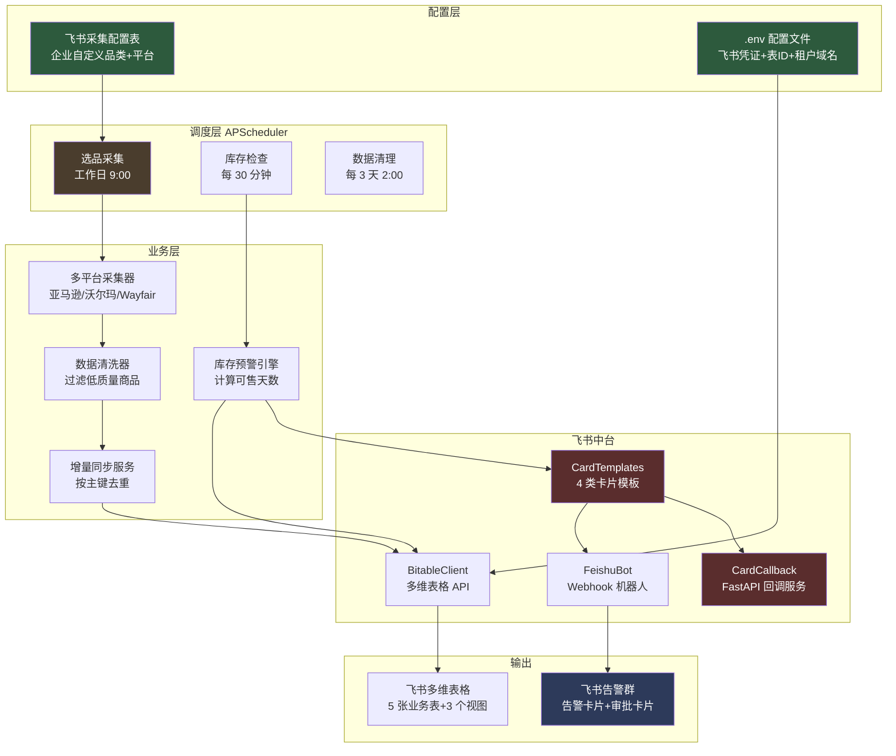

# 跨境电商 AI 运营中台

> 以飞书为协作入口，用 AI Agent 替代人工重复运营工作，实现从选品到售后全链路智能化。

---

## 📊 项目状态总览

**当前进度**：第 2 周第 2 天（08-05），已完成 8 大功能模块

| 模块 | 状态 | 说明 |
|------|------|------|
| 多平台选品采集 | ✅ 已完成 | 亚马逊/沃尔玛/Wayfair 三大平台 |
| 库存预警 | ✅ 已完成 | 每30分钟自动检查，更新预警等级 |
| Webhook 机器人告警 | ✅ 已完成 | 库存紧急/预警自动推送飞书群 |
| 数据增量同步 | ✅ 已完成 | 按主键去重，避免重复写入 |
| 业务视图 | ✅ 已完成 | 3 个视图（销售总览/预警看板/选品决策） |
| 数据自动清理 | ✅ 已完成 | 每3天凌晨2点自动清理旧数据 |
| **交互卡片模板库** | ✅ 已完成 | 4 类卡片（库存/选品/日报/审批） |
| **卡片按钮回调服务** | ✅ 已完成 | FastAPI 接收按钮点击回调 |

**测试覆盖**：129 个单元测试全部通过，覆盖率 62%

---

## 🎯 项目能做什么（业务价值）

### 解决跨境电商 4 大痛点

| 痛点 | 解决方案 | 业务价值 |
|------|----------|----------|
| 不知道进什么货卖 | 多平台选品采集 | 每天 9:00 自动采集 75 个热门商品（5品类×3平台×5商品） |
| 库存断货才发现 | 库存预警 + 机器人告警 | 每 30 分钟检查，紧急/预警自动推送到飞书群 |
| 数据越来越多看不过来 | 业务视图 + 自动清理 | 视图隐藏非关键字段，3 天自动清理一次旧数据 |
| 重复商品反复写入 | 增量同步 | 按 ASIN+平台 去重，已存在则更新而非新增 |

### 业务用户能感受到的 5 个变化

1. **打开飞书就能看到当日选品推荐**（工作日 9:00 自动采集）
2. **库存有问题第一时间收到飞书群告警**（红色/橙色卡片，含商品信息和处理建议）
3. **点击卡片按钮直接跳转到飞书多维表格**（不跳浏览器，不需重新登录）
4. **表格字段太多眼花？3 个业务视图自动隐藏非关键字段**
5. **想换品类？在飞书"采集配置"表里改一行就行**（不用改代码）

---

## 🏗️ 项目架构（一图看懂）



详细架构说明见 [ARCHITECTURE.md](file:///d:\ai\07-26\cross-border-ai-platform\ARCHITECTURE.md)

---

## 📦 项目功能清单（8 大模块）

### 1. 多平台选品采集

**触发**：工作日 09:00 自动执行
**产出**：每天 75 个热门商品写入飞书选品池表

- 支持亚马逊/沃尔玛/Wayfair 三大跨境电商平台
- 默认 5 个家具品类（家居收纳/厨房用品/户外家具/办公家具/卧室家具）
- 企业可在飞书"采集配置"表自定义品类（如"蓝牙耳机"/"美妆"），无需改代码
- 自动过滤低评分（<3.8）/离谱价（<10或>500美金）/差排名（>30000）商品

### 2. 库存预警

**触发**：每 30 分钟自动执行
**产出**：飞书库存预警表预警等级自动更新

- 根据可售天数自动计算预警等级：紧急（≤7天）/预警（≤14天）/关注（≤30天）/正常（>30天）
- 等级未变化时不重复处理
- 等级变化时自动触发机器人告警

### 3. Webhook 机器人告警

**触发**：库存等级变为"紧急"或"预警"时
**产出**：飞书告警群收到交互卡片

- 仅"紧急"和"预警"等级触发告警（避免告警疲劳）
- 卡片按等级配色：红色=紧急，橙色=预警
- 卡片含商品信息、可售天数、处理建议、"查看库存详情"按钮
- 按钮点击直接在飞书桌面端打开多维表格（不跳浏览器）

### 4. 数据增量同步

**触发**：选品采集时同步执行
**产出**：避免重复商品堆积

| 表 | 主键 | 去重策略 |
|----|------|----------|
| 选品池 | ASIN + 来源平台 | 同一商品同一平台不重复 |
| 库存预警 | SKU | 同一 SKU 不重复 |
| 销售日报 | 日期 + 平台 | 同一天同平台只有一条 |

### 5. 业务视图（提升查看体验）

**触发**：安装时自动创建
**产出**：3 个业务视图

| 视图名 | 所属表 | 显示字段 |
|--------|--------|----------|
| 销售总览 | 销售日报 | 日期/平台/销售额/订单数/ACoS/异常标记/AI洞察 |
| 预警看板 | 库存预警 | ASIN/商品名称/SKU/平台/可售天数/预警等级/建议采购量/预估采购金额/审批状态 |
| 选品决策 | 选品池 | 商品名称/ASIN/品类/来源平台/价格区间/评分/评论数/市场容量/竞争强度/利润空间/推荐指数/状态 |

### 6. 数据自动清理

**触发**：每 3 天凌晨 2:00
**产出**：飞书表格不会无限堆积

- 保留最近 3 天数据（可通过 `DATA_RETENTION_DAYS` 配置）
- 清理范围：选品池/库存预警/销售日报
- 不清理：采集配置表（企业长期配置）/ Listing 库表（保留优化历史）

### 7. 交互卡片模板库（4 类卡片）

| 卡片类型 | 用途 | 触发场景 | 按钮行为 |
|----------|------|----------|----------|
| 库存预警卡片 | 通知库存紧急/预警 | 库存等级变化时 | url 跳转多维表格 |
| 选品报告卡片 | 通知当日采集统计 | 工作日 9:00 采集完成后 | url 跳转选品池表 |
| 销售日报卡片 | 通知当日销售情况 | 每天 18:00（第4周上线） | url 跳转销售日报表 |
| 审批卡片 | 触发审批流程 | 选品金额 > 5000 美金时 | value 触发回调（需应用机器人） |

### 8. 卡片按钮回调服务

**用途**：接收用户在飞书内点击卡片按钮的事件，执行后续业务逻辑

- 基于 FastAPI 实现的轻量级 HTTP 服务
- 监听 `http://127.0.0.1:8000/callback` 接收飞书回调
- 支持 URL 验证（飞书首次配置回调 URL 时验证所有权）
- 支持 `card.action.trigger` 事件（卡片按钮点击）
- 内置 2 个 action 处理器：`approve`（审批通过）/ `reject`（审批拒绝）
- 配合 ngrok 内网穿透可让飞书服务器访问本地服务

---

## 🚀 怎么使用（按角色分）

### 业务用户（无需任何代码操作）

**全程只需做两件事**：

#### 第一步：请 IT/运维完成首次安装（一次性）

IT/运维人员会在你的电脑上双击 `scripts\安装.bat` 完成全部安装：
- 自动创建飞书业务视图
- 自动配置开机自启
- 自动启动后台调度器

#### 第二步：打开飞书查看数据

| 时间 | 自动发生的事 | 看哪里 |
|------|--------------|--------|
| 工作日 09:00 | 采集多平台热门商品 | 选品池表 → "选品决策"视图 |
| 每 30 分钟 | 更新库存预警等级 | 库存预警表 → "预警看板"视图 |
| 每 30 分钟 | 紧急/预警库存自动推送飞书群 | 飞书告警群 → 查看告警卡片 |
| 每 3 天 02:00 | 自动清理旧数据 | 无需操作 |

**操作方式**：打开飞书 → 进入多维表格 → 点击表名旁的视图切换按钮 → 选择对应视图

#### 常见问题

**Q：表格数据太多看不过来？**
A：系统每 3 天自动清理一次旧数据，只保留最近 3 天。如需保留更久，请让 IT 在 `.env` 修改 `DATA_RETENTION_DAYS`。

**Q：想采集自己关注的品类？**
A：在飞书"采集配置"表中，停用默认家具配置，添加自己的品类（如"蓝牙耳机"），第二天 9:00 自动按新配置采集。

**Q：电脑重启后系统还会运行吗？**
A：会。安装时已配置开机自启，电脑重启后调度器会自动后台运行。

**Q：如何停止系统？**
A：任务管理器 → 结束 `pythonw.exe` 进程。或双击 `scripts\卸载.bat` 彻底卸载。

---

### IT/运维人员部署指南

#### 1. 环境要求

- Python 3.11+
- 飞书开放平台开发者账号（已创建自建应用）

#### 2. 安装依赖

```bash
cd cross-border-ai-platform
python -m venv .venv
.venv\Scripts\activate        # Windows
# source .venv/bin/activate   # macOS/Linux
pip install -e ".[dev]"
```

#### 3. 配置环境变量

```bash
cp .env.example .env
# 编辑 .env
```

**必填配置项**：

| 配置项 | 说明 | 获取方式 |
|--------|------|----------|
| `FEISHU_APP_ID` | 飞书应用 App ID | 飞书开放平台 → 应用详情 → 凭证与基础信息 |
| `FEISHU_APP_SECRET` | 飞书应用 App Secret | 同上 |
| `FEISHU_BITABLE_APP_TOKEN` | 多维表格 App Token | 多维表格 URL 中 `/base/` 后的部分 |
| `FEISHU_TENANT_DOMAIN` | 飞书企业租户域名 | 多维表格 URL 中 `https://xxx.feishu.cn` 的 xxx 部分 |
| `FEISHU_TABLE_ID_*` | 5 张业务表的 Table ID | 多维表格 URL 中 `?table=` 后的部分 |

**可选配置项**：

| 配置项 | 默认 | 说明 |
|--------|------|------|
| `DATA_RETENTION_DAYS` | 3 | 数据保留天数 |
| `FEISHU_WEBHOOK_URL` | 空 | Webhook 机器人地址（用于告警通知） |

#### 4. 配置 Webhook 机器人（用于告警通知）

1. 飞书桌面端 → 创建告警通知群 → 群设置 → 群机器人 → 添加机器人 → 自定义机器人
2. 机器人名称：`AI 运营告警助手`
3. 安全设置：自定义关键词 `库存 预警 选品 日报 AI 告警`
4. 复制 Webhook 地址到 `.env` 的 `FEISHU_WEBHOOK_URL`

验证：`python scripts/test_bot.py`（看到 3 条测试消息即成功）

#### 5. 配置卡片按钮回调（用于审批按钮回调，可选）

如需让"审批卡片"的"通过/拒绝"按钮触发回调，需配置应用机器人 + ngrok：

**5.1 启用飞书应用机器人能力**：
1. 打开飞书开放平台 https://open.feishu.cn/app
2. 选择你的自建应用
3. 左侧菜单 → 应用功能 → 机器人 → 启用机器人能力
4. 创建版本并发布，等管理员审核通过

**5.2 订阅卡片回调事件**：
1. 左侧菜单 → 事件与回调 → 事件配置
2. 添加事件：`card.action.trigger`（卡片回传交互）
3. 请求地址先留空（下一步用 ngrok 获取公网 URL 后再填）

**5.3 启动本地回调服务**：
```bash
python scripts/start_callback_server.py
```
本地服务监听 `http://127.0.0.1:8000/callback`

**5.4 启动 ngrok 内网穿透**：
```bash
# 首次使用需安装 ngrok（https://ngrok.com/download）
# 首次使用需配置 token：ngrok authtoken <YOUR_TOKEN>

python scripts/start_ngrok.py
```
脚本会输出公网 URL，如 `https://xxxx.ngrok-free.app`

**5.5 配置飞书回调地址**：
- 回到飞书开放平台 → 事件与回调 → 事件配置
- 请求地址填：`https://xxxx.ngrok-free.app/callback`
- 点击"验证"，飞书会发送 challenge，本地服务返回后即验证通过

#### 6. 验证飞书连接

```bash
python -m src.feishu.auth
# 看到 ✅ tenant_access_token 获取成功 即配置正确
```

#### 7. 运行测试

```bash
pytest
# 看到 129 个测试全部通过即代码完整
```

#### 8. 交付给业务用户

将整个项目文件夹交付给业务用户，告知：**双击 `scripts\安装.bat` 即可**。

业务用户之后只需打开飞书表格查看数据，无需执行任何命令。

---

## 📂 项目结构

```
cross-border-ai-platform/
├── src/
│   ├── config.py              # 配置中心
│   ├── pipeline/              # 数据管道层
│   │   ├── collectors/        # 采集器（多平台）
│   │   ├── cleaners/          # 清洗器
│   │   └── writers/           # 写入器
│   ├── feishu/                # 飞书中台
│   │   ├── auth.py            # 认证
│   │   ├── bitable.py         # 多维表格 API
│   │   ├── feishu_bot.py      # Webhook 机器人
│   │   ├── card_templates.py  # 卡片模板库（4 类卡片）
│   │   ├── card_callback.py   # FastAPI 回调服务
│   │   ├── sync_service.py    # 增量同步服务
│   │   ├── field_mapping.py   # 字段映射集中管理
│   │   ├── init_tables.py     # 业务表初始化
│   │   ├── config_table.py    # 采集配置表初始化
│   │   ├── permission.py      # 表格权限管理
│   │   └── table_schema.py    # 表结构定义
│   ├── mock/                  # 模拟数据（Mock ERP）
│   ├── observability/         # 可观测性（日志）
│   └── scheduler/             # 定时任务
│       ├── scheduler.py       # APScheduler 调度器
│       ├── tasks.py           # 任务函数
│       ├── triggers.py        # 触发器配置
│       ├── cleanup_task.py    # 数据清理任务
│       └── inventory_alert.py # 库存预警等级
├── scripts/                   # 运维脚本
│   ├── 安装.bat / install.ps1 # 一键安装
│   ├── 卸载.bat / uninstall.ps1 # 一键卸载
│   ├── init_tables.py         # 创建业务表
│   ├── init_views.py          # 创建业务视图
│   ├── start_scheduler.py     # 启动后台调度器
│   ├── start_callback_server.py # 启动卡片回调服务
│   ├── start_ngrok.py         # 启动 ngrok 内网穿透
│   ├── test_bot.py            # 测试 Webhook 机器人
│   ├── test_cards.py          # 测试 4 类卡片发送
│   ├── grant_table_permission.py # 设置表格权限
│   ├── run_task_once.py       # 手动触发任务
│   └── e2e_test_pipeline.py   # 端到端验证
├── tests/                     # 单元测试（129 个）
├── docs/                      # 文档（周报等）
├── pyproject.toml
├── .env.example
├── README.md                  # 本文件
└── ARCHITECTURE.md            # 架构文档
```

---

## 🧪 测试与验证

### 单元测试

```bash
pytest
```

**当前状态**：129 个测试全部通过，覆盖率 62%

| 测试文件 | 覆盖范围 |
|----------|----------|
| test_collectors.py | 采集器（亚马逊/多平台） |
| test_cleaners.py | 数据清洗器 |
| test_scheduler.py | 调度器（4 个任务） |
| test_feishu_auth.py | 飞书认证 |
| test_feishu_bitable.py | 多维表格 API |
| test_sync_service.py | 增量同步 + 数据清理 |
| test_feishu_bot.py | Webhook 机器人 + 卡片模板 |
| test_card_callback.py | FastAPI 回调服务（08-05 新增） |

### 端到端测试

```bash
# 1. 验证 Webhook 机器人（发送 3 条测试消息）
python scripts/test_bot.py

# 2. 验证 4 类卡片发送
python scripts/test_cards.py

# 3. 验证端到端采集流程
python scripts/e2e_test_pipeline.py

# 4. 验证回调服务（需先启动 start_callback_server.py）
curl -X POST http://127.0.0.1:8000/callback \
  -H "Content-Type: application/json" \
  -d '{"challenge":"test","type":"url_verification"}'
```

---

## 🛠️ 技术栈

| 层 | 技术 |
|----|------|
| 后端 | Python 3.11+, FastAPI, APScheduler |
| 飞书 SDK | lark-oapi, httpx |
| 数据存储 | 飞书多维表格（Bitable API），SQLite（调度器持久化） |
| 通知 | 飞书 Webhook 机器人，飞书应用机器人（卡片回调） |
| 卡片回调 | FastAPI + ngrok（内网穿透） |
| 配置 | pydantic-settings（.env 文件） |
| 日志 | loguru（按天切割） |
| 测试 | pytest, pytest-cov, respx |

---

## 📋 已实现功能清单

- [x] 项目骨架搭建 + 飞书认证（tenant_access_token 自动刷新）
- [x] 多维表格表结构设计 + 5 张业务表创建
- [x] 多平台数据采集（亚马逊/沃尔玛/Wayfair）
- [x] 数据管道框架（采集 → 清洗 → 写入 三层架构）
- [x] 定时调度（APScheduler + SQLite 持久化）
- [x] 后台运行（开机自启 + 无终端静默运行）
- [x] 可配置采集范围（企业可在飞书表格自定义品类）
- [x] 库存预警（每 30 分钟自动检查，更新预警等级）
- [x] 表格权限管理（一键设置组织内可编辑）
- [x] 数据增量同步（按主键去重，已存在则更新而非重复新增）
- [x] 字段映射集中管理（改字段名只改一处）
- [x] 业务视图（销售总览/预警看板/选品决策）
- [x] 数据自动清理（每 3 天凌晨 2 点）
- [x] Webhook 机器人告警（库存紧急/预警自动推送飞书群）
- [x] 交互卡片模板库（库存预警/选品报告/销售日报/审批 4 类卡片）
- [x] 卡片按钮回调服务（FastAPI 接收 card.action.trigger 事件）
- [x] 链接跳转优化（用企业租户域名，飞书桌面端直接打开不跳浏览器）

完整计划见 [28天实施计划.md](file:///d:\ai\07-26\28天实施计划.md)

---

## 🔄 后续规划

| 周次 | 任务 |
|------|------|
| 第 2 周剩余 | 08-06 审批流自动化（飞书审批 API + 选品金额>5000 自动触发） |
| 第 2 周剩余 | 08-07 FeishuClient 统一封装 + 测试覆盖率 ≥ 70% |
| 第 3 周 | AI Agent 上线（选品 Agent + 数据洞察 Agent，LangChain + GPT-4o-mini） |
| 第 4 周 | 日报定时推送 + 双 Agent 联动 + Docker 部署 + v1.0.0 Release |

---

## 📝 版本历史

- **v0.2.0**（2026-07-26）：08-05 交互卡片任务完成
  - 新增 4 类卡片模板（库存预警/选品报告/销售日报/审批）
  - 新增 FastAPI 卡片按钮回调服务
  - 新增 ngrok 内网穿透启动脚本
  - 26 个新单元测试全部通过
- **v0.1.0**（2026-07-26）：第 1 周完成基础架构 + 多平台采集 + 库存预警 + Webhook 机器人
