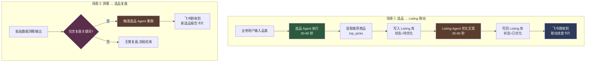

# 跨境电商 AI 运营中台 · 业务用户操作手册

> 📖 **这份手册教你怎么用这个系统**。完全不用写代码，全部在桌面端点击操作。
>
> 🎯 **新版亮点**：内置 AI 智能选品 Agent，30 秒帮你分析 5 个商品并推送到飞书群。

---

## 📑 目录

| 章节 | 内容 | 适合谁看 |
|------|------|----------|
| [1️⃣ 系统能干啥](#1-系统能干啥) | 7 大功能速览 | 所有人 |
| [2️⃣ 第一次使用：7 步部署](#2-第一次使用7-步部署) | 从零到能用 | IT/运维 |
| [3️⃣ 日常使用](#3-日常使用) | 每天要做的事 | 业务用户 |
| [4️⃣ AI Agent 选品分析](#4-ai-agent-选品分析) | AI 智能选品（新功能） | 业务用户 |
| [5️⃣ AI Agent 数据洞察](#5-ai-agent-数据洞察) | AI 自动生成日报（新功能） | 业务用户 |
| [6️⃣ AI Agent 双 Agent 联动](#6-ai-agent-双-agent-联动) | AI 接力赛（新功能） | 业务用户 |
| [7️⃣ 常见问题](#7-常见问题) | 11 个 FAQ | 所有人 |
| [8️⃣ 术语解释](#8-术语解释) | 名词大白话 | 所有人 |

---

## 1. 系统能干啥

系统每天自动帮你做 **7 件事**：

| 功能 | 说明 | 触发时间 |
|------|------|----------|
| 🛒 **自动采集商品** | 抓取亚马逊/沃尔玛/Wayfair 的热卖商品，写入飞书"选品池"表 | 每天早上 9:00 |
| ⚠️ **自动库存预警** | 检查库存可售天数，快卖完时告警，发飞书卡片到群 | 每 30 分钟 |
| ✅ **自动审批流** | 高金额选品/采购自动发飞书审批卡片，主管点按钮就通过/拒绝 | 事件触发 |
| 🤖 **AI Agent 选品分析** | AI 自主抓取→分析→推送全流程，30 秒生成选品报告 | 手动触发 |
| 📊 **AI Agent 数据洞察** | AI 自动分析昨日数据，生成三维度日报推送到飞书群 | 每日 18:00 |
| 🔗 **双 Agent 联动** | 选品 Agent 输出自动喂给 Listing Agent 优化文案，一键跑通 | 手动触发 |
| 🧹 **自动数据清理** | 每 3 天清理一次旧数据，防止表格堆积 | 每 3 天凌晨 2:00 |

> 💡 **所有数据都自动写入飞书多维表格**，业务用户可以在飞书里直接查看、编辑、做决策。

---

## 2. 第一次使用：7 步部署

### 准备工作

- 一台 Windows 电脑（Win10 及以上）
- 一个飞书企业管理员账号（用来创建应用）
- 飞书桌面端已安装

### 第 1 步：双击启动软件 🚀

找到 `跨境电商AI运营中台.exe`，**双击运行**。

第一次启动会自动生成一个空的 `.env` 配置文件（在 exe 同目录），不用管它。

### 第 2 步：跟着"部署向导"走 🧭

打开软件后，左侧侧边栏点 **🚀 部署向导**。这是专门为业务用户设计的引导流程，7 步走完即可。

#### 步骤 ①：欢迎页

点右下角"下一步"。

#### 步骤 ②：在飞书创建企业自建应用

按以下顺序操作（一次性工作，做完就不用再管）：

1. 打开 [飞书开放平台](https://open.feishu.cn/)，用**企业管理员账号**登录。
2. 点"**开发者后台**" → "**创建企业自建应用**"。
3. 填应用名称（如"AI 运营中台"）和描述，上传一个图标，点创建。
4. 进入应用后，左侧菜单点"**凭证与基础信息**"，记下两个关键凭证：
   - **App ID**（应用编号，`cli_` 开头）
   - **App Secret**（应用密钥，点"显示"后复制）

   > ⚠️ **App Secret 是保密的**，不要泄露给他人。

5. 左侧菜单点"**权限管理**"，逐一开通以下权限（在搜索框输入权限名 → 找到后点"**开通权限**"按钮）：

   | 分类 | 权限名（在搜索框输入这个） |
   |------|---------------------------|
   | 多维表格 | `base:app`、`base:table`、`base:record`、`base:collaborator:create` |
   | 通讯录 | `contact:user.id:readonly` |
   | 审批 | `approval:approval`、`approval:instance:readonly` |
   | 消息 | `im:message`、`im:chat:readonly` |

6. 左侧菜单点"**机器人**"，启用机器人能力（点"启用机器人"按钮）。
7. 左侧菜单点"**事件与回调**"，分**两处**配置：
   - **① 事件配置**（订阅审批状态变更事件）：
     - 点"事件配置" → "添加事件"
     - 搜索并订阅 `approval_instance`（审批状态变更）
     - **请求地址先空着**，等第 5 步启动公网隧道拿到网址后再回来填
   - **② 回调设置 → 卡片回传交互**（接收审批卡片按钮点击）：
     - 点"回调设置" → 找到"**卡片回传交互**"
     - 启用它，**回调地址同样先空着**，等第 5 步拿到公网网址后再填

   > 💡 两处填的是**同一个网址**（公网隧道网址 + `/callback`），第 5 步会教你复制。

8. 左上角点"**创建版本**" → 提交审核（企业自建应用通常秒过）。

#### 步骤 ③：在系统配置页填入凭证

1. 在向导页点"打开系统配置页"按钮，跳到系统配置页。
2. 按字段说明填入以下信息（每个字段下方都有灰色小字说明，告诉你从哪获取）：

   | 字段 | 填什么 | 格式 |
   |------|--------|------|
   | **App ID** | 应用编号 | `cli_` 开头 |
   | **App Secret** | 应用密钥 | 一串字母数字 |
   | **企业租户域名** | 从多维表格 URL 提取 | 如 `ocndodd7lmyr` |
   | **多维表格 App Token** | 表格凭证 | 如 `appXXXtokenYYY` |

3. 滚到页面下方找到 **④ AI 模型配置** 区域，**填入国内大模型配置**（详见下方说明）。
4. 点页面底部的"💾 保存配置"。

> 💡 **审批人 Open ID** 字段旁边有"🔍 搜索"按钮，输入姓名就能搜索飞书用户，自动填入。

##### 🤖 配置 AI 模型（运行 AI Agent 必填）

系统内置的 AI Agent 需要调用大模型。**国内用户强烈推荐用 DeepSeek**（国内访问稳定、性价比最高、1 元能用 100 万 token）。

**配置方法**（在系统配置页 → ④ AI 模型配置 区域）：

| 字段 | 怎么填 | 说明 |
|------|--------|------|
| **OpenAI API Base** | `https://api.deepseek.com/v1` | DeepSeek 的接口地址 |
| **OpenAI API Key** | 在 [DeepSeek 平台](https://platform.deepseek.com) 注册充值后创建 | `sk-` 开头 |
| **Anthropic API Key** | **留空** | 仅在你用 Claude 时填，国内访问需代理 |

> 💡 **为什么推荐 DeepSeek？** 国内访问稳定不卡顿、1 元能用 100 万 token、推理能力强。充值 10 元够用半年。

**其他国内大模型可选**（在 OpenAI API Base 字段填对应地址即可，系统自动识别）：

| 大模型 | OpenAI API Base | 注册地址 |
|--------|-----------------|----------|
| **DeepSeek（推荐）** | `https://api.deepseek.com/v1` | https://platform.deepseek.com |
| 通义千问 | `https://dashscope.aliyuncs.com/compatible-mode/v1` | https://dashscope.console.aliyun.com |
| 智谱 GLM | `https://open.bigmodel.cn/api/paas/v4/` | https://open.bigmodel.cn |
| 月之暗面 Kimi | `https://api.moonshot.cn/v1` | https://platform.moonshot.cn |

> ⚠️ **不配置 AI 模型也能用系统**，只是 AI Agent 功能跑不起来。其他功能（采集、预警、审批）不受影响。

#### 步骤 ④：一键初始化数据

回到向导页，点"下一步"到第 4 步，点"🚀 开始初始化"按钮。

系统会自动在飞书多维表格里创建：

- **4 张业务表**：选品池 / Listing 库 / 销售日报 / 库存预警
- **1 张采集配置表**：含 15 条默认家具品类配置（5 品类 × 3 平台）
- **3 个业务视图**：销售总览 / 预警看板 / 选品决策
- **表格权限**：自动设置为"组织内可编辑"

所有 table_id 自动写入配置，不用手动复制。等 10-30 秒看到"✅ 全部完成"即可。

#### 步骤 ⑤：启动回调服务

**为什么要启动这个服务？**（用快递类比）

想象飞书是一家快递公司，要给你家送包裹（审批消息）：
- 📦 **回调服务** = 你家门口的**快递接收员**，负责签收飞书发来的包裹
- 🏠 **公网隧道**（下一步）= 你家的**门牌号**，让快递员能找到你家
- 📍 **飞书后台请求地址**（下一步）= 你告诉快递公司的**收件地址**

这一步是**安排快递接收员上岗**。没有接收员，包裹送到了也没人签收。

**怎么做？**

点"下一步"到第 5 步，点"📂 打开任务控制页"按钮。

在任务控制页找到"服务控制"区块：

1. 点 **▶ 启动回调服务** 按钮。
2. 看到状态变成绿色"● 运行中"即可。

> 💡 这个服务**不需要填任何参数**，会自动读取已保存的配置。

> ⚠️ 这个服务**必须一直开着**，关掉就收不到飞书消息了（快递员下班了，包裹就送不到）。

#### 步骤 ⑥：启动公网隧道 + 填飞书请求地址

**为什么要启动公网隧道？**（继续用快递类比）

上一步安排了快递接收员（回调服务），但飞书快递员还**不知道你家在哪**。公网隧道就是给你家挂一个**门牌号**，让飞书能找到你电脑。

启动隧道后会得到一个公网网址（形如 `xxx.trycloudflare.com`），这就是你的"门牌号"。把这个门牌号告诉飞书，飞书才能把消息发过来。

**怎么做？（分 3 小步）**

**① 启动公网隧道，自动拿到"门牌号"和"收件地址"**

在任务控制页同一区块：

1. 点 **▶ 启动公网隧道** 按钮。
2. **首次使用会自动下载 cloudflared（约 50MB）**，看到"⏬ 下载中..."等待下载完成即可。
3. 下载完成后等 5-10 秒，看到"✅ 公网网址已就绪"提示。
4. **系统会自动做两件事**：
   - 把 **完整回调地址**（`公网网址 + /callback`）**自动复制到剪贴板**
   - 显示一个 **蓝色指引卡片**，列出飞书后台两处填写位置

> 💡 想再复制一次？点紫色 **📋 复制完整回调地址** 按钮即可。

**② 把"收件地址"告诉飞书（两处都要填同一个地址）**

回到飞书开放平台 → 你的应用 → 左侧菜单"**事件与回调**"，有**两个地方**要填这个地址：

| 位置 | 路径 | 接收什么 | 填什么 |
|------|------|----------|--------|
| **① 事件配置** | 事件与回调 → 事件配置 → 请求地址 | 审批状态变更（主管在审批中心通过/拒绝时推送） | `公网网址 + /callback` |
| **② 卡片回传交互** | 事件与回调 → 回调设置 → 卡片回传交互 → 回调地址 | 审批卡片按钮点击（用户在飞书群里点"通过/拒绝"按钮时推送） | **同一个地址** |

> ⚠️ **两处必须都填**，缺一处就会有一部分功能收不到。

**③ 验证地址是否有效**

两处都点"**验证**"或"**保存**"按钮，飞书会自动发一个验证码到你的回调服务。

> ⚠️ **临时隧道每次重启网址会变**（门牌号换了），需要重新填到飞书后台。

#### 步骤 ⑦：健康检查

回到向导页，点"下一步"到第 7 步，点"🔍 开始检查"按钮。

系统会自动检测 6 项：

| 检查项 | 说明 |
|--------|------|
| 飞书凭证 | App ID/Secret 是否有效 |
| 多维表格访问 | App Token 是否正确 |
| 业务表配置 | 5 张表的 table_id 是否都已写入 |
| 表格权限 | 是否设置为"组织内可编辑" |
| 回调服务 | 本地 8000 端口是否在跑 |
| 公网隧道 | 公网 URL 是否可达 |

**全绿 ✓ 就说明系统可以正式使用了**。如果有红色 ✗，按提示修复。

---

## 3. 日常使用

部署完成后，日常使用非常简单。

### 3.1 启动软件（每天要做）☀️

每天上班，双击 `跨境电商AI运营中台.exe` 启动软件，然后做三件事：

1. 侧边栏点 **⚙️ 任务控制**
2. 点 **▶ 启动调度器** → 所有定时任务开始后台运行
3. 点 **▶ 启动回调服务** → 飞书回调能正常接收
4. （可选）点 **▶ 启动公网隧道** → 如果飞书回调地址还没改

看到状态都变成绿色"● 运行中"就可以了，**软件可以最小化，不用管它**。

下班关电脑前，关掉软件即可。

### 3.2 查看数据 📊

打开飞书桌面端，进入你的多维表格，会看到 5 张表：

| 表名 | 看什么 |
|------|--------|
| **选品池** | 每天采集到的商品（含评分、价格、利润空间、推荐指数） |
| **Listing 库** | 已上架的商品清单 |
| **销售日报** | 每天的销售额、订单数、ACoS |
| **库存预警** | 库存快卖完的商品，含预警等级和建议采购量 |
| **采集配置** | 品类 × 平台的采集任务清单（可调整） |

每张表都有专门的**视图**（销售总览、预警看板、选品决策），只显示关键字段，看着清爽。

### 3.3 处理审批 ✅

当有高金额选品/采购时，飞书群会收到一张**审批卡片**：

1. 在飞书群里点开卡片。
2. 看商品信息（ASIN、名称、金额等）。
3. 点 **✅ 通过** 或 **❌ 拒绝** 按钮。
4. 多维表格"库存预警"表的"审批状态"字段会自动更新。

> 💡 审批通过/拒绝后，卡片按钮会自动隐藏，防止重复点击。

### 3.4 调整采集配置 ⚙️

如果你想改采集的品类或平台：

1. 飞书多维表格 → "采集配置"表。
2. 直接修改单元格：
   - **启用状态**：改成"停用"就不采集这条
   - **采集数量**：每天采集几个商品（默认 5）
   - **优先级**：1-5，数字越大越优先
3. 第二天 9:00 自动按新配置采集。

### 3.5 配置审批规则 📋

审批流管理用来配置"什么情况下自动发审批卡片给主管"。

#### 使用前必读：先在飞书创建"审批定义"

"审批定义"就是飞书审批中心里的审批表单模板。

**第 1 步：在飞书审批后台创建审批定义**

1. 打开 [飞书审批后台](https://www.feishu.cn/approval)（用企业管理员账号登录）。
2. 点"**创建审批**" → 选"**从空白创建**"。
3. 填审批名称（如"高金额选品审批"）和说明。
4. 设计表单，**必须包含以下字段**（字段名要完全一致）：

   | 字段名 | 控件类型 | 说明 |
   |--------|----------|------|
   | **ASIN** | 单行文本 | 商品 ASIN 编号 |
   | **商品名称** | 单行文本 | 商品标题 |
   | **采购金额** | 数字 | 单位：美金 |
   | **业务类型** | 单行文本 | 如"选品"/"采购" |
   | **说明** | 多行文本 | 备注信息 |

5. 配置审批流程：添加一个"**审批人**"节点，审批人建议先选"**自己**"（方便测试）。
6. 点"**发布**" → 审批定义发布成功。

> 💡 发布后**不需要手动提取 approval_code**，回到软件点"扫描"会自动列出。

#### 🔍 扫描原理（系统怎么自动找到你在飞书创建的审批）

你点"➕ 新建审批规则"时，系统会**自动调用飞书审批 API**，把你企业飞书里所有**已发布**的审批定义拉过来，列成一张表给你选。

**扫描流程**（系统自动完成，你只做第 1、6 步）：

| 步骤 | 谁在做 | 做什么 |
|------|--------|--------|
| 1 | 你 | 在飞书审批后台创建审批定义并**点"发布"**（草稿扫不到） |
| 2 | 你 | 回到本页面点"➕ 新建审批规则" |
| 3 | 系统 | 用 App ID / App Secret 换取 `tenant_access_token`（飞书 API 通行证） |
| 4 | 系统 | 调用飞书 API 拉取企业内所有已发布的审批定义 |
| 5 | 系统 | 把审批定义列表显示在弹窗里 |
| 6 | 你 | 在列表里点选一个审批定义 |
| 7 | 系统 | 自动查询该审批的**表单字段 ID** 和**审批节点 ID** |
| 8 | 系统 | 把配置写入 .env，规则保存生效 |

**扫不到审批定义的 3 个常见原因**：

1. **审批定义还没发布**：飞书审批后台创建后只是草稿，**必须点"发布"**才能被 API 扫到
2. **应用缺少审批权限**：去飞书开放平台 → 你的应用 → 权限管理 → 搜索 `approval:approval` → 点"开通权限"
3. **凭证没保存**：系统配置页的 App ID / App Secret 没点"💾 保存配置"

#### 第 2 步：在软件里创建审批规则

1. 软件侧边栏点 "✅ 审批流管理"。
2. 点上方 "**➕ 新建审批规则**" 按钮。
3. 在弹窗里：
   - 系统会**自动扫描**你刚创建的审批定义，列表里选一个即可
   - 选触发事件（选品采集完成 / 库存预警触发）
   - 配触发条件（如：采购金额 > 5000）
   - 填规则名称和审批人（或留空用系统配置页的默认审批人）
4. 点"**保存规则**"。

#### 第 3 步：规则自动生效

规则保存后默认是"已启用"状态。之后**符合条件的事件发生时自动触发审批**，不是定时扫描。

> 💡 可以创建多个规则，比如：选品金额 > 5000 用审批定义 A，库存预警等级 = 紧急用审批定义 B。

### 3.6 健康检查（每周做一次）🔍

侧边栏点 "🔍 健康检查" → 点 "🔍 开始检查"。

确认 6 项全绿，系统就是健康的。如果有红色 ✗，按提示修复。

---

## 4. AI Agent 选品分析

> 🆕 **v0.5.0 新功能**：内置 AI 智能选品 Agent，能像真人运营一样帮你"看商品→算市场→写报告→推送到飞书群"，全程不用写一行代码。

### 4.1 Agent 能做什么 🤖

| 能力 | 具体说明 |
|------|----------|
| 🛒 自动抓取商品 | 根据你选的品类，调采集器拉取 5 个候选商品 |
| 🧠 AI 市场分析 | 从市场容量、竞争强度、利润空间三个维度评估每个商品 |
| 📝 生成结构化报告 | 输出推荐指数、采购建议、风险提示 |
| 🚀 一键写入飞书 | 分析结果自动写入"选品池"表，并推送卡片到飞书告警群 |
| 👀 全程透明可观测 | GUI 实时显示 Agent 每一步思考过程和工具调用 |
| 💰 调用成本可追踪 | 每次调用记录耗时、Token、成本到 SQLite，失败率 >10% 自动飞书告警 |

### 4.2 使用前提 ✅

运行 AI Agent 前，**必须**完成以下配置：

- ✅ 系统已部署完成（飞书表格已初始化）
- ✅ 系统配置页填了 **OpenAI API Base** 和 **OpenAI API Key**（推荐 DeepSeek）
- ✅ 飞书告警群已配置（Agent 完成后会推送卡片到群）

> ⚠️ **没配 AI 模型怎么办？** 去系统配置页 → ④ AI 模型配置区域 → 填 DeepSeek 的 base_url 和 Key → 点"保存配置"。详见 [第 2 步部署 · 配置 AI 模型](#配置-ai-模型运行-ai-agent-必填)。

### 4.3 使用步骤（4 步） 🚀

```
第1步          第2步          第3步          第4步
配置 AI 模型 → 打开 AI Agent → 选品类点运行 → 看日志和结果
                                    ↓
                            飞书群收到 AI 选品报告
```

#### 第 1 步：配置 AI 模型（一次性）

如果已在第 2 步部署时配过，跳过这步。

1. 启动 GUI → 左侧"系统配置"页
2. 滚到下方"④ AI 模型配置"区域
3. 填入：
   - **OpenAI API Base**：`https://api.deepseek.com/v1`
   - **OpenAI API Key**：在 [DeepSeek 平台](https://platform.deepseek.com) 创建的 `sk-` 开头 Key
   - **Anthropic API Key**：留空
4. 点"💾 保存配置"→ 立即生效

#### 第 2 步：打开 AI Agent 页面

启动 GUI 后，左侧侧边栏点击 **🤖 AI Agent** 图标，进入选品分析 Agent 页面。

#### 第 3 步：选品类，点"运行 Agent"

| 操作 | 说明 |
|------|------|
| 选择品类 | 下拉框选一个（家居收纳/厨房用品/户外家具/办公家具/卧室家具） |
| 点击 **🚀 运行 Agent** | 后台线程启动 Agent，UI 不会卡死 |
| 等待 30-60 秒 | Agent 会调用 LLM 多次推理 + 工具调用 |

> 💡 运行过程中可以看日志框实时显示 Agent 的思考过程，像看 AI 在你面前工作一样。

#### 第 4 步：查看执行过程和结果

| 区域 | 看什么 |
|------|--------|
| 📜 实时日志框 | Agent 每一步思考、调用了哪个工具、工具返回什么 |
| 📊 结果表格 | Agent 推荐的 5 个商品（含 ASIN、推荐指数、市场分析） |
| 📋 飞书选品池表 | Agent 写入的完整记录 |
| 📨 飞书告警群 | 收到一张 AI 选品报告卡片 |

### 4.4 Agent 工作流程（透明可观测） 🔍

Agent 用 **ReAct 模式**工作（边思考边行动），整个过程在 GUI 日志框里实时显示：

| 轮次 | Agent 在做什么 | 调用什么 |
|------|----------------|----------|
| 第 1 轮 | 思考任务，决定先抓商品 | 调用 `fetch_products` 工具拉取 5 个候选商品 |
| 第 2 轮 | 拿到商品后，决定分析市场 | 调用 `analyze_products` 工具做 AI 分析 |
| 第 3 轮 | 分析完成，决定保存报告 | 调用 `save_report` 工具写入飞书 + 推卡片 |
| 完成 | 返回结果 | GUI 显示结果表格 |

**业务用户能看到什么**：

1. 日志框实时打印 Agent 每一步的思考（"我现在要抓商品"→"抓到了 5 个"→"现在分析市场"→...）
2. 结果表格显示 Agent 推荐的 5 个商品
3. 飞书群收到一张 AI 选品报告卡片
4. 飞书选品池表里有完整的分析记录

**Agent 三个工具的作用**：

| 工具 | 作用 | 类比 |
|------|------|------|
| `fetch_products` | 抓取 5 个候选商品 | 像采购员去市场选货 |
| `analyze_products` | AI 分析市场容量/竞争/利润 | 像运营经理评估值不值得卖 |
| `save_report` | 写入飞书 + 推卡片到群 | 像助理把报告归档并通知老板 |

### 4.5 常见问题 ❓

**Q：Agent 运行报错"未配置 AI 模型凭证"怎么办？**

A：去"系统配置"页 → "④ AI 模型配置"区域填好 OpenAI API Base 和 OpenAI API Key（推荐 DeepSeek）→ 点"保存配置"→ 重新运行。

**Q：Agent 运行很慢（超过 1 分钟）？**

A：Agent 会调用 LLM 多轮推理，正常 30-60 秒。如果超时，检查网络或换 DeepSeek（国内访问快）。

**Q：怎么知道 Agent 花了多少钱？**

A：所有 LLM 调用都记录在 `data/llm_metrics.db`（SQLite），包含每次调用的耗时、Token 数、成本。Agent 跑完后可在数据库查或看日志。用 DeepSeek 跑一次大约 0.01-0.05 元。

**Q：Agent 写入飞书的数据怎么查？**

A：打开飞书 → 多维表格 → 选品池表 → "选品决策"视图。

**Q：可以同时跑多个 Agent 吗？**

A：暂不支持。当前一个 Agent 跑完才能跑下一个。后续版本会支持并发。

**Q：换其他国内大模型怎么操作？**

A：去系统配置页 → ④ AI 模型配置区域 → 把 OpenAI API Base 改成其他大模型的地址（如通义千问的 `https://dashscope.aliyuncs.com/compatible-mode/v1`）→ 把 OpenAI API Key 换成对应平台的 Key → 保存即可。系统会自动识别并切换模型名。

---

## 5. AI Agent 数据洞察

> 🆕 **v0.6.0 新功能**：内置 AI 数据洞察 Agent，每天 18:00 自动分析昨日的销售和库存数据，生成三维度日报推送到飞书群。也支持手动重跑指定日期的日报。

### 5.1 Agent 能做什么 🤖

| 能力 | 具体说明 |
|------|----------|
| 📥 自动拉数据 | 从飞书多维表格拉昨日销售日报 + 当前库存预警数据 |
| 🧠 AI 三维度分析 | LLM 从销量趋势、广告效率、库存健康三维度生成结构化洞察 |
| ✍️ 自动写回表格 | 把 AI 洞察文本写回销售日报表的"AI洞察"字段 |
| 📨 推送日报卡片 | 飞书群收到结构化日报卡片，含异常预警和行动建议 |
| ⏰ 定时自动执行 | 每日 18:00 由定时任务自动触发，无需人工干预 |
| 🔄 手动补跑 | GUI 支持选日期手动重跑，便于核查历史数据 |

### 5.2 使用前提 ✅

数据洞察 Agent 自动执行需要以下条件（与选品 Agent 共用配置）：

- ✅ 系统已部署完成（飞书表格已初始化，销售日报表和库存预警表已创建）
- ✅ 系统配置页填了 **OpenAI API Base** 和 **OpenAI API Key**（推荐 DeepSeek）
- ✅ 飞书告警群已配置（Agent 完成后会推送日报卡片到群）
- ✅ 调度器已启动（任务控制页 → 启动调度器）

> 💡 **没有销售日报数据怎么办？** 系统提供了 21 条 7 天模拟数据（部署时自动填充），可用于测试。真实数据由业务系统每天写入销售日报表。

### 5.3 自动执行（默认方式） 🕕

每日 18:00 由后台调度器自动触发，业务用户无需操作：

1. 调度器在 18:00 自动调用 `run_insight_agent()`
2. Agent 自动拉昨日数据 → LLM 三维度分析 → 写回表格 + 推送卡片
3. 飞书告警群收到一张数据洞察日报卡片
4. 销售日报表的"AI洞察"字段被自动填充

> 💡 **18:00 这个时间点怎么选的？** 选在下班前，让业务用户下班路上能看一眼当天的数据洞察。

### 5.4 手动重跑（补跑指定日期） 🔄

如果定时任务失败、漏跑、或想重新分析某一天的数据，可在 GUI 手动触发：

```
第1步          第2步            第3步          第4步
打开 AI Agent → 切换到数据洞察 → 选日期点运行 → 看日志和飞书群
                                  ↓
                            飞书群收到数据洞察日报
```

#### 第 1 步：打开 AI Agent 页面

启动 GUI 后，左侧侧边栏点击 **🤖 AI Agent** 图标。

#### 第 2 步：切换到「数据洞察」Tab

页面顶部有两个标签页，点 **📊 数据洞察** 切换到数据洞察 Agent 页面（绿色主题区分）。

#### 第 3 步：选日期，点"立即运行"

| 操作 | 说明 |
|------|------|
| 选分析日期 | 默认昨天，可点"📋 设为昨天"快速重置 |
| 点击 **🚀 立即运行** | 后台线程启动 Agent，UI 不会卡死 |
| 等待 30-60 秒 | Agent 自动拉数据 → LLM 分析 → 写回表格 + 推送卡片 |

> 💡 运行过程中日志框会实时显示 Agent 的每一步操作，像看 AI 在你面前工作一样。

#### 第 4 步：查看执行结果

| 区域 | 看什么 |
|------|--------|
| 📜 实时日志框 | Agent 每一步思考、调用了哪个工具、工具返回什么 |
| 📨 飞书告警群 | 收到一张数据洞察日报卡片（含三维度概览+异常预警+行动建议） |
| 📋 飞书销售日报表 | "AI洞察"字段被自动填充了洞察文本 |

### 5.5 日报卡片包含什么 📨

| 区域 | 内容 |
|------|------|
| 三维度概览 | 销量趋势（上升/平稳/下降）、广告效率（高效/正常/低效）、库存健康（健康/关注/预警/紧急） |
| 📈 销量分析 | 销售额/订单数趋势，异常跌幅标记 |
| 💰 广告分析 | ACoS 评估，优化建议 |
| 📦 库存分析 | 断货风险，补货优先级 |
| 🚨 异常预警 | 销量异常 + 断货风险 SKU 列表（红色标记） |
| 🔥 今日最紧急 | 系统判定的最紧急事项 |
| 📋 行动建议 | 按优先级排序的前 3 条建议 |
| 📊 查看销售日报按钮 | 点击跳转飞书多维表格 |

### 5.6 Agent 工作流程（透明可观测） 🔍

Agent 用 **ReAct 模式**工作（边思考边行动），整个过程在 GUI 日志框里实时显示：

| 轮次 | Agent 在做什么 | 调用什么 |
|------|----------------|----------|
| 第 1 轮 | 思考任务，决定先拉数据 | 调用 `fetch_daily_data` 工具拉昨日销售+库存数据 |
| 第 2 轮 | 拿到数据后，决定分析 | 调用 `analyze_daily_data` 工具做 AI 三维度分析 |
| 第 3 轮 | 分析完成，决定保存报告 | 调用 `save_insight_report` 工具写回表格 + 推卡片 |
| 完成 | 返回结果 | 飞书群收到日报卡片 |

**Agent 三个工具的作用**：

| 工具 | 作用 | 类比 |
|------|------|------|
| `fetch_daily_data` | 从飞书拉昨日销售+库存数据 | 像助理去各部门收集数据 |
| `analyze_daily_data` | AI 三维度分析销量/广告/库存 | 像数据分析师评估业务健康度 |
| `save_insight_report` | 写回表格 + 推卡片到群 | 像助理把报告归档并通知老板 |

### 5.7 异常预警（v0.6.1 新增） 🚨

数据洞察 Agent 现在具备**硬规则异常检测**能力，不依赖 AI 也能自动告警，避免 AI 漏判。

#### 什么情况会触发异常预警？

| 异常类型 | 触发条件 | 严重程度 | 自动动作 |
|----------|----------|----------|----------|
| 🔴 销量大幅下跌 | 销售额环比跌幅 ≥ 50% | critical | 标红表格 + 推送红色卡片 |
| 🟡 销量下跌 | 销售额环比跌幅 30%-50% | warning | 标红表格 + 推送红色卡片 |
| 🟡 ACoS 过高 | ACoS > 50% | warning | 标红表格 + 推送红色卡片 |
| 🔴 库存紧急 | 可售天数 ≤ 7 天 | critical | 推送红色卡片 |

#### 异常预警卡片长什么样？

飞书群会收到一张**红色卡片**（与正常日报的蓝色卡片区分），包含：

- 日期 + 异常数量统计（critical / warning / 总计）
- 异常详情列表（按严重程度排序，critical 在前）
- 标准化建议动作（3 条）
- "🚨 查看异常详情"按钮（红色危险按钮，点击跳转飞书表格）

#### 表格里的"异常标记"字段会自动更新

| 场景 | 异常标记字段值 |
|------|----------------|
| 销量大幅下跌 | "销量下跌" |
| ACoS 过高 | "ACoS过高" |
| 正常 | "正常"（不变） |

> 💡 业务用户在飞书销售日报表的"销售总览"视图里，可以直接看到红色标记的异常记录。

#### 为什么需要硬规则检测？

AI（LLM）分析能力强但可能有偏差：
- **AI 可能漏判**：上下文不足时可能没识别出异常
- **AI 可能夸大**：把小波动说成大问题
- **硬规则兜底**：用确定性规则检测关键异常，确保不漏报

系统现在采用**双保险**：硬规则检测 + AI 深度分析，结果互相印证。

### 5.8 常见问题 ❓

**Q：18:00 没收到日报卡片怎么办？**

A：检查 4 项：
1. 任务控制页 → 调度器状态是否为"运行中"
2. 系统配置页 → 是否配置了 `FEISHU_CHAT_ID`（飞书群 ID）
3. 系统配置页 → AI 模型配置是否有效（API Key 余额是否充足）
4. 任务控制页 → 业务日志是否有 18:00 的执行记录（可能是 LLM 调用失败）

**Q：AI 洞察字段是空的？**

A：可能 LLM 调用失败，查看任务控制页技术日志。常见原因是 API Key 余额不足或网络超时。可在 AI Agent 页 → 数据洞察 Tab 手动重跑。

**Q：怎么补跑前天的日报？**

A：打开 AI Agent 页 → 数据洞察 Tab → 选日期改为前天 → 点"🚀 立即运行"。

**Q：销售日报表没有数据怎么办？**

A：数据洞察 Agent 依赖销售日报表的数据。如果表中没有昨日数据，Agent 会返回空数据并跳过分析。请确保业务系统每天写入销售日报数据，或用 `python scripts/seed_daily_report.py` 生成测试数据。

**Q：日报卡片推送失败但表格更新了？**

A：这是正常现象，系统设计为表格更新和卡片推送独立。卡片推送失败常见原因是飞书群 ID 配置错误或网络问题，不影响表格数据。可在 AI Agent 页 → 数据洞察 Tab 手动重跑尝试重新推送。

**Q：换其他国内大模型后洞察质量变差？**

A：不同大模型的分析能力有差异。推荐用 DeepSeek（性价比最高，分析能力强），如需更强推理可用 deepseek-reasoner 模型（系统会自动选择 complex 任务类型）。

---

## 6. AI Agent 双 Agent 联动

> 🔗 **联动是什么**：把两个 AI Agent 像接力赛一样串起来，前一个 Agent 跑完自动触发下一个，把结果直接喂给下一个 Agent 处理，业务用户只需要点一次按钮。

### 6.1 联动能做什么 🤖

| 联动场景 | 串联流程 | 业务价值 |
|----------|----------|----------|
| ① 选品 → Listing | 选品 Agent 推荐爆款候选 → 自动写入 Listing 库 → Listing Agent 生成优化标题/五点描述/关键词 | 从选品决策到上架文案一键打通 |
| ② 洞察 → 选品复盘 | 数据洞察 Agent 发现爆款关键词 → 自动触发选品 Agent 重跑对应品类 | 数据反向驱动选品策略迭代 |

### 6.2 使用前提 ✅

| 前提 | 说明 |
|------|------|
| 已完成 7 步部署 | 详见第 2 章 |
| 已配置 Listing 库表 ID | 系统配置页 → "Listing 库表 ID"字段已填 |
| 应用机器人已加入告警群 | 用于推送联动进度卡片 |
| 建议配置 AI 模型 | 未配置也能跑通（Mock 兜底），配置后文案质量更好 |

### 6.3 联动工作流（两个场景） 🔍



### 6.4 场景①：选品 → Listing 联动（4 步） 🚀


**第 1 步：打开 AI Agent 页面**

启动 GUI 后，左侧侧边栏点击"🤖 AI Agent"图标。

**第 2 步：切换到「双 Agent 联动」Tab**

页面顶部有 3 个标签，点"🔗 双 Agent 联动"切换到联动 Tab。

**第 3 步：选品类，点"🚀 启动联动"**

| 操作 | 说明 |
|------|------|
| 选择品类 | 下拉框选一个（家居收纳/厨房用品/户外家具/办公家具/卧室家具） |
| 点击"🚀 启动联动" | 后台线程启动编排引擎，UI 不会卡死 |
| 等待 1-3 分钟 | 选品 Agent（30-60 秒） + Listing Agent（30-60 秒） |

**第 4 步：查看执行过程和结果**

| 区域 | 看什么 |
|------|--------|
| 联动执行日志 | 实时显示每个阶段的进度（选品启动 → 选品完成 → 写入 Listing → Listing 优化启动 → 优化完成） |
| 飞书 Listing 库 | "已优化"状态的记录（含优化标题/五点描述/关键词/建议） |
| 飞书告警群 | 收到一张「🎯 双 Agent 联动 · Listing 优化完成」进度卡片 |

### 6.5 联动进度卡片包含什么 📨

| 区域 | 内容 |
|------|------|
| 标题 | 🎯 双 Agent 联动 · Listing 优化完成（绿色模板表示成功） |
| 优化模式 | LLM 真实调用 / Mock 兜底（取决于是否配置 API Key） |
| 优化统计 | 优化成功条数 / 失败条数 / 总处理条数 |
| 优化样本 | 前 3 条优化结果（含 ASIN、商品名、优化标题、模式标签） |
| 后续动作 | 1.查看 Listing 库 2.人工复核 3.状态改为「已上线」 |
| 跳转按钮 | 点击直接打开飞书 Listing 库 |

### 6.6 场景②：洞察触发选品复盘 🔄

数据洞察 Agent 完成后，业务用户可手动触发场景②复盘：

| 步骤 | 操作 |
|------|------|
| 1 | 打开 AI Agent 页 → 切换到「🔗 双 Agent 联动」Tab |
| 2 | 在场景②区域，把数据洞察 Agent 输出的 `top_priority` 和 `action_items` 粘贴到输入框 |
| 3 | 点"🚀 触发选品复盘"按钮 |
| 4 | 系统判断是否包含复盘关键词（"复盘"/"选品"/"爆款"/"上升"/"增长"） |
| 5 | 命中关键词 → 自动触发选品 Agent 重跑对应品类，飞书群收到新选品报告卡片 |
| 6 | 未命中 → 返回"无需复盘"提示，流程结束 |

### 6.7 未配置 API Key 也能跑通 💡

业务用户没配置 DeepSeek/Claude API Key 时，联动流程仍可跑通：

- **选品 Agent**：使用 Mock 数据生成 5 个候选商品（不调 LLM）
- **Listing Agent**：使用 Mock 模板化规则生成优化文案（不调 LLM）
- **完整链路**：状态机流转、Listing 库写入、卡片推送全部正常执行

接入 API Key 后**无需改任何代码**，自动切换到真实 LLM 生成优化文案，质量会大幅提升。

### 6.8 常见问题 ❓

**Q：联动执行报错"未配置 Listing 库表 ID"怎么办？**

A：去"系统配置"页 → 找到"Listing 库表 ID"字段填入 → 点"保存配置" → 重新运行联动。

**Q：联动跑完了，飞书 Listing 库里没看到优化结果？**

A：检查 3 项：①Listing 库表 ID 配置正确；②应用机器人有 Listing 库的写入权限；③查看任务控制页技术日志是否有 update_record 失败记录。

**Q：联动很慢（超过 3 分钟）？**

A：选品 Agent 和 Listing Agent 各调用 LLM 多轮推理，正常 1-3 分钟。如果超时，检查网络或换 DeepSeek（国内访问快）。未配置 API Key 时使用 Mock 模式，10 秒内即可完成。

**Q：Mock 模式生成的优化文案质量怎么样？**

A：Mock 模式是模板化占位实现，主要用来验证联动流程跑通。接入 API Key 后自动切换真实 LLM，生成质量会大幅提升。

**Q：场景②复盘关键词能改吗？**

A：当前关键词列表硬编码在 `src/ai/orchestrator.py` 的 `_REVIEW_TRIGGER_KEYWORDS` 中（复盘/选品/爆款/上升/增长）。如需调整，联系 IT 修改这一处即可。

---

## 7. 常见问题

### Q1：启动软件后，点"启动调度器"没反应？

**A**：等 2-3 秒，看状态是否变成"● 运行中"。如果一直是"启动中"，看技术日志 tab 是否有报错。常见原因：

- `.env` 配置文件没填或填错了 → 去"系统配置"页检查
- 飞书凭证无效 → 重新复制 App ID / Secret

### Q2：飞书群里收不到审批卡片？

**A**：检查以下几点：

1. **回调服务是否在跑**：任务控制页 → 服务控制 → 回调服务状态是否"● 运行中"
2. **公网隧道是否在跑**：同上，看隧道状态
3. **两处回调地址是否都填对**：飞书开放平台 → 事件与回调
   - "事件配置"的请求地址：`https://xxx.trycloudflare.com/callback`
   - "回调设置 → 卡片回传交互"的回调地址：同一个网址
4. **审批规则是否启用**：审批流管理页 → 规则状态是否"已启用"
5. **群聊 Chat ID 是否填了**：系统配置页 → "群聊 Chat ID" 字段

### Q3：多维表格里没有数据？

**A**：检查以下几点：

1. 调度器是否启动了（任务控制页 → 状态）
2. 看业务日志 tab，是否有"采集了 X 个商品"的消息
3. 如果日志显示"采集失败"，看技术日志的具体错误
4. 飞书多维表格的 App Token 是否正确（系统配置页）

### Q4：公网隧道网址变了怎么办？

**A**：临时隧道每次重启网址会变，需要：

1. 任务控制页 → 停止隧道 → 重新启动隧道
2. 复制新的公网网址
3. 飞书开放平台 → 事件与回调 → **两处都要更新**：
   - "事件配置"的请求地址
   - "回调设置 → 卡片回传交互"的回调地址
4. 两处都点"验证"

如果嫌麻烦，建议用 Cloudflare 固定隧道（需要注册 Cloudflare 账号，免费）。

### Q5：cloudflared 没装怎么办？

**A**：软件**首次启动公网隧道时会自动下载** cloudflared（约 50MB）到 exe 同目录，无需手动安装。

如果自动下载失败（如网络问题），可手动下载：

1. 打开 [cloudflared 下载页](https://github.com/cloudflare/cloudflared/releases)
2. 下载 `cloudflared-windows-amd64.exe`
3. 重命名为 `cloudflared.exe`
4. 放到 exe 同目录（即 `跨境电商AI运营中台.exe` 所在的文件夹）
5. 重启软件，再点"启动公网隧道"

### Q6：审批人 Open ID 怎么获取？

**A**：两种方式：

**方式 1（推荐）：用搜索按钮**

系统配置页 → 审批人 Open ID 字段旁边 → 点"🔍 搜索" → 输入姓名 → 选中 → 自动填入。

**方式 2：手动复制**

1. 飞书开放平台 → 通讯录 API 调试台
2. 输入姓名查询
3. 复制返回的 `open_id`（`ou_` 开头）

### Q7：群聊 Chat ID 怎么获取？

**A**：两种方式：

**方式 1（推荐）：用搜索按钮**

1. 系统配置页 → 群聊 Chat ID 字段旁边 → 点"🔍 搜索群聊"
2. 软件会自动列出机器人已加入的所有群聊
3. 点选目标群聊 → 点"确定" → chat_id 自动填入

> ⚠️ 前提：应用机器人必须已加入目标群聊，否则扫不到。

**方式 2：手动复制**

在飞书群聊设置里查找 chat_id（`oc_` 开头），手动填入。

### Q8：怎么改采集的品类？

**A**：直接在飞书多维表格的"采集配置"表里改：

- 改"品类"字段：如把"家居收纳"改成"蓝牙耳机"
- 改"启用状态"：改成"停用"就不采集这条
- 加新行：填新的品类 + 平台 + 数量

改完第二天 9:00 自动按新配置采集。

### Q9：怎么停用某个审批规则？

**A**：审批流管理页 → 找到规则 → 点"禁用"按钮。规则会保留但不再触发，需要时点"启用"恢复。

### Q10：数据看板里没数据？

**A**：数据看板是从多维表格读取数据的，如果多维表格里有数据但看板没显示：

1. 确认调度器跑过至少一次（任务控制页 → 业务日志）
2. 切换到数据看板页时会自动刷新
3. 检查 .env 里的 table_id 是否正确

### Q11：软件崩溃了怎么办？

**A**：

1. 看技术日志（任务控制页 → 技术日志 tab）的最后几行
2. 重启软件
3. 如果反复崩溃，到健康检查页跑一次，看哪项有问题
4. 联系技术支持时把技术日志截图发过去

---

## 8. 术语解释

| 术语 | 大白话解释 |
|------|------------|
| **App ID** | 飞书应用的"身份证号"，cli_ 开头 |
| **App Secret** | 飞书应用的"密码"，保密的 |
| **App Token** | 多维表格的"地址"，从 URL 里提取 |
| **Table ID** | 多维表格里某张表的"门牌号"，tbl 开头 |
| **Open ID** | 飞书用户的"工号"，ou 开头，每个用户唯一 |
| **Tenant Domain** | 企业租户域名，飞书 URL 前面那段 |
| **回调服务** | 接收飞书事件的服务，必须开着 |
| **公网隧道** | 让飞书能访问你电脑的"通道" |
| **调度器** | 管定时任务的总开关，启动后所有任务自动跑 |
| **审批规则** | "什么样的记录需要审批"的规则，可配多个 |
| **触发事件** | 什么时候检查审批规则（选品采集完成/库存预警） |
| **触发条件** | 字段 + 操作符 + 阈值（如：金额 > 5000） |
| **AI Agent** | AI 智能助手，能自主决策调用工具完成多步任务 |
| **ReAct 模式** | AI 边思考边行动的模式（Reason + Act） |
| **LLM** | 大语言模型，如 DeepSeek、GPT、Claude |
| **OpenAI API Base** | 大模型接口地址，填国内大模型地址即可切换 |
| **Token** | AI 处理文本的最小单位，约 1 个汉字 = 2 token |
| **双 Agent 联动** | 两个 AI Agent 像接力赛一样串起来，前一个的输出直接喂给后一个 |
| **编排引擎** | 管理联动流程的"指挥家"，基于状态机控制 Agent 调用顺序 |
| **状态机** | 用状态（IDLE/SELECTING/COMPLETED 等）管理工作流进度的机制 |
| **Listing 库** | 飞书多维表格中存储商品 Listing 优化记录的表 |
| **Mock 兜底** | 未配置 API Key 时用模板化规则生成结果，保证流程能跑通 |
| **复盘关键词** | 触发场景②选品复盘的关键词（复盘/选品/爆款/上升/增长） |

---

## 📞 联系支持

如果按这份手册操作还解决不了问题，请联系技术支持，并提供：

1. 软件版本号（看软件标题栏）
2. 技术日志截图（任务控制页 → 技术日志 tab）
3. 健康检查结果截图（健康检查页）
4. 具体操作步骤和报错信息

---

**祝你使用愉快！** 🎉

---

> 📌 **手册版本**：v0.7.0 · **最近更新**：2026-07-28 · **配套软件版本**：v0.7.0 及以上
>
> 💡 本手册会随软件版本同步更新。最新版本可在 [GitHub 仓库](https://github.com/lbh1nb/cross-border-ai-platform) 查看。
