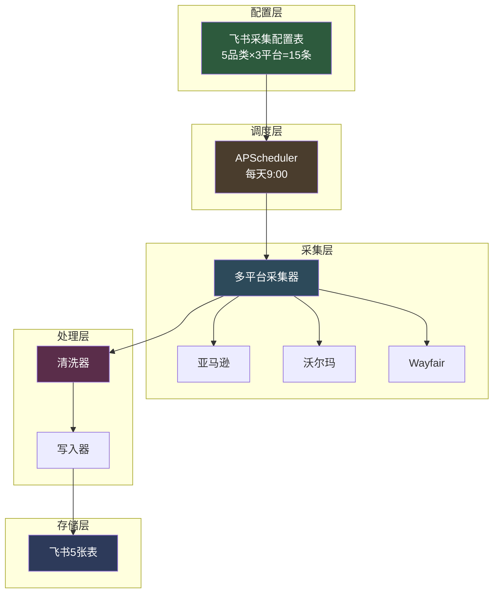
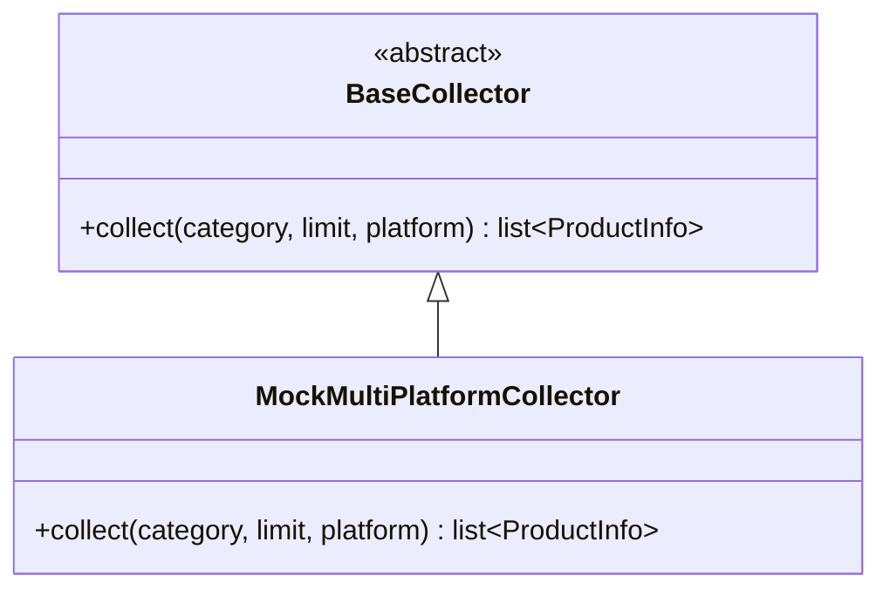

# 第1周周报（07-27 ~ 07-31）

> 跨境电商 AI 运营中台 - 基础设施层搭建

## 一、本周目标

搭建项目基础设施：飞书认证 + 多维表格 + 数据采集 + 定时调度，实现"定时采集商品数据 → 写入飞书表格"的端到端闭环。

## 二、完成情况

| 任务 | 状态 | 产出 |
|------|------|------|
| 飞书应用注册 + 权限配置 | ✅ 完成 | App ID/Secret + 5项API权限 |
| Python 项目骨架 + 虚拟环境 | ✅ 完成 | pyproject.toml + src目录结构 |
| 飞书认证模块（tenant_access_token） | ✅ 完成 | src/feishu/auth.py |
| 多维表格表结构设计 + 5张表创建 | ✅ 完成 | 选品池/Listing库/销售日报/库存预警/采集配置 |
| 多平台数据采集器（亚马逊/沃尔玛/Wayfair） | ✅ 完成 | multi_platform_mock.py |
| 数据管道框架（采集→清洗→写入） | ✅ 完成 | src/pipeline/ 三层架构 |
| APScheduler 定时调度 | ✅ 完成 | 每天9:00自动采集 |
| 可配置采集范围（企业自定义品类） | ✅ 完成 | 飞书采集配置表驱动 |
| 库存预警检查 | ✅ 完成 | 每30分钟自动更新预警等级 |
| 后台运行 + 开机自启 | ✅ 完成 | pythonw.exe + 启动文件夹快捷方式 |
| 表格权限管理 | ✅ 完成 | 手机号添加协作者 |
| 端到端联调 | ✅ 完成 | 75条商品写入飞书选品池 |
| 单元测试 | ✅ 完成 | 45个测试全部通过，覆盖率54% |

## 三、核心架构

## 四、关键技术决策

### 4.1 多平台采集器设计（策略模式）

**决策**：所有采集器实现统一接口，上层代码不关心数据源。
**收益**：未来替换为真实采集器时，只需新建实现类，无需改动其他代码。

### 4.2 可配置采集范围（飞书表格驱动）

**决策**：企业经营品类存飞书"采集配置"表，不硬编码在代码里。
**收益**：非家具企业也能直接用，在飞书表格里改品类即可，不用改代码。

### 4.3 平台差异化数据

| 平台 | 价格系数 | 评论系数 | BSR排名 | URL格式 |
|------|----------|----------|---------|---------|
| 亚马逊 | 1.0 | 1.0 | 有 | amazon.com/dp/{asin} |
| 沃尔玛 | 0.85 | 0.6 | 无 | walmart.com/ip/{id} |
| Wayfair | 1.25 | 0.3 | 无 | wayfair.com/.../pdp/{id} |

**决策**：不同平台生成差异化数据，更贴近真实业务。
**收益**：演示时数据真实可信，体现业务理解深度。

## 五、数据成果

- 飞书选品池：75条商品（5品类×3平台×5商品）
- 飞书库存预警：10条库存记录
- 飞书采集配置：15条默认配置
- 单元测试：45个全部通过

## 六、遇到的问题与解决

| 问题 | 原因 | 解决方案 |
|------|------|----------|
| Python 虚拟环境创建失败 | MySQL Workbench 内置 Python 冲突 | 安装 Python 3.12，配置正确的 PATH |
| 飞书 API 403 Forbidden | 应用未被授权为表格协作者 | 在飞书表格"添加应用"为协作者 |
| APScheduler Job 属性错误 | Job 对象无 next_run_time 属性 | 用 getattr 安全检查 |
| pythonw.exe 崩溃 | 无终端时 sys.stderr 不可写 | 条件判断 stderr 可写性 |
| 飞书表格无法手动编辑 | 用户无编辑权限 | 通过手机号查 open_id，添加为协作者 |
| 添加协作者参数无效 | batch_get_id 返回 open_id 而非 user_id | member_type 改为 openid |

## 七、下周计划

第2周：飞书中台 + 消息通知闭环
- 多维表格增量同步
- Webhook 机器人消息推送
- 交互卡片与按钮回调
- 审批流自动化
- FeishuClient 统一封装

## 八、简历加分点

- ✅ 飞书生态熟练度（Bitable API + 权限管理 + 多维表格设计）
- ✅ 工程架构能力（三层管道 + 策略模式 + 可配置化设计）
- ✅ 生产级思维（日志系统 + 错误重试 + 后台运行 + 开机自启）
- ✅ 质量意识（45个单元测试 + 54%覆盖率）
- ✅ 业务理解深度（多平台差异化 + 企业自定义品类）

---

> 周报版本：v1.0
> 编写日期：2026-07-26
